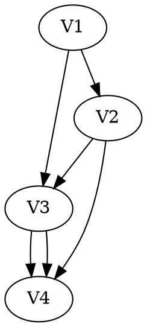
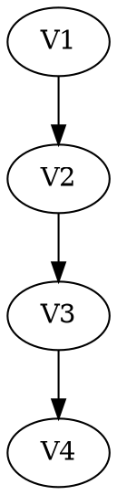

# 一些简称
* CPI：指令时钟周期
* RTT：往返时延
* MST：最小生成树
* MDR：主存数据寄存器
* MAR：地址寄存器
* PCB :进程管理块。页表、页目录表的起始地址存放在PCB(进程控制块)中
* MTTR：故障发生后平均修复时间（Mean Time To Repair）
* MTTF：平均无故障工作时间（Mean Time To Failure）
   * 可用性=MTTF/(MTTF+MTTR)
* MTBF：系统两次故障发生时间之间的时间段的平均值(Mean Time Between Failure)
   * MTBF=MTTR+MTTF
* AFR：平均故障率
* DRAM：动态随机存取存储器
* SRAM：静态随机存取存储器
* EPC：异常程序计数器
* PCB：进程控制块
* ACL：访问控制列表（Access-Control List）
* AMAT：平均存储器访问时间=命中时间+缺失率*缺失代价
# 数据结构

## 逻辑结构和存储结构
**数据的逻辑结构独立于存储结构；数据的存储结构由逻辑结构决定，不能独立于逻辑结构**

不同的数据结构，逻辑结构和物理结构可以都相同，但数据的运算不一致。**数据的运算**也是数据结构的一个重要方面。如二叉树和二叉排序树。

链式存储设计时，不同节点的存储空间可以不连续，但**结点内**的存储单元地址必须连续
### 如何判断某种结构是逻辑结构还是存储结构或数据结构？
当一个结构，如数组、链表、树、图，在逻辑结构中只有一种定义，而在物理结构中却有两种选择，那么这个结构就属于逻辑结构；

相反，当此结构在原有基础上加上了某种限定，使得其在物理结构中只有一种定义，那么这个结构就属于物理（存储）结构；

举例1：栈属于什么结构？

分析：栈在逻辑结构中只能属于线性结构，而在物理结构中它可以使用顺序存储（数组），也可以使用链式存储（链表），所以说栈是一种逻辑结构。

举例2：线索二叉树属于什么结构？

分析：首先，可以得到二叉树是一种数据结构，但是线索二叉树是加上线索后的链表结构（不能用顺序存储），也就是说，它是计算机内部的只有一种存储结构，所以是物理结构。

## 时间复杂度
相同规模n下，复杂度为O(n)的算法在时间上必然优于复杂度为$O(2^n)$的算法

# 线性表
线性表的顺序存储结构是一种随机存取的存储结构

# 栈
n个不同元素进栈，出栈元素不同排列的个数是$\frac{1}{n+1}C^n_{2n}$

# 队列
最适合用作链式队列的链表是带队首指针和队尾指针的非循环单链表（如果循环，则添加完数据后还要修改为循环的）

单链表实现队列，队头设在链表的链头位置，因为队头要出（删除）元素，而链表的链头方便删除。如果队头设在队尾，则不管是否有尾指针，删除元素都要遍历队列

# 树
哈夫曼树不一定是二叉树，也可能存在度为m>2的哈夫曼树，只存在度为m和0的节点。哈夫曼编码其实不只是针对二进制，可以说任何进制都能使用哈夫曼编码（详见信息与编码相关书籍）。但是在计算机领域由于使用二进制，在数据结构上只介绍了二进制的哈夫曼编码，构造出来的哈夫曼树是度为二的树。

树、森林、二叉树遍历对应的关系
树      |森林    |二叉树
-------|------  |-----
先根遍历|先序遍历|先序遍历
后根遍历|中序遍历|中序遍历

若二叉树中，m是n的祖先，则使用**后序遍历**可以找到从m到n的路径

先序序列（或中序序列）为a,b,c,d的不同二叉树个数，相当于入栈顺序为a,b,c,d，求出栈排列的个数：$\frac{1}{n+1}C^n_{2n}$

二叉中序线索树中，X有左子节点且不为根，则X的前驱为**X的左子树中最右节点**

后续线索二叉树找后继节点需要知道结点双亲（线序线索二叉树找前驱也是），因此后续现所属的遍历仍需要栈的支持
# 图

极大连通子图：包含连通子图中所有的边
极小连通子图：只有连通图有极小连通子图，是保持图连通，又要使边数最小的子图。连通图顶点集确定的生成树是该连通图的极小连通子图，不唯一

若一个图有n个顶点，且有大于n-1条边，则该图一定有环

图的邻接矩阵表示唯一，邻接表表示不唯一（边的次序可以不同）

若邻接表中有奇数个边表结点，则图为有向图

图的广度优先搜索，空间复杂度为为O(|V|)。采用邻接表，时间复杂度为O(|V|+|E|)。采用邻接矩阵，时间复杂度为O(|V|^2^)
图的深度优先搜索，空间复杂度为为O(|V|)。采用邻接表，时间复杂度为O(|V|+|E|)。采用邻接矩阵，时间复杂度为O(|V|^2^)

## 最小生成树算法
Prim算法：先取顶点。时间复杂度：O(|V|^2^)。适用于边稠密的图
Kruskal算法：先取边。时间复杂度：O(|E|log|E|)。适用于边稀疏而顶点较多的图

## 最短路径算法
### Dijkstra算法
时间复杂度O(|V|^2^)

不适用于于边上带有负权值的情况
### Floyd算法
时间复杂度O(|V|^3^)

适用于于边上带有负权值的情况
## 关键路径
AOV网无权值，AOE网有权值

深度优先遍历、拓扑排序可以判断图是否有环。求关键路径本身无法判断有环，但求关键路径的第一步-拓扑排序能判断

拓扑排序唯一不能唯一确定该图，例子：


## 排序
### 简单插入排序
在元素有序时效率可达O(n)

可能出现在最后一趟开始之前，所有元素都不在最终位置上

稳定

### 希尔排序
不稳定

首先它把较大的数据集合分割成若干个小组（逻辑上分组），然后对每一个小组分别进行插入排序，此时，插入排序所作用的数据量比较小（每一个小组），插入的效率比较高


每个分组进行插入排序后，各个分组就变成了有序的了（整体不一定有序）


然后缩小增量为上个增量的一半:2，继续划分分组，此时，每个分组元素个数多了，但是，数组变的部分有序了，插入排序效率同样比高


同理对每个分组进行排序（插入排序），使其每个分组各自有序


最后设置增量为上一个增量的一半：1，则整个数组被分为一组，此时，整个数组已经接近有序了，插入排序效率高


### 冒泡排序
每趟排序都会将一个元素放置到最终的位置上

稳定

### 选择排序
每一趟选一个最小的放到最前面

不稳定，因为放到最前面实际上是和第一个元素交换，第一个元素到后面去了，而在此中间可能有和第一个元素值相同的元素

### 归并排序
稳定

### 堆排序
不稳定

### 快速排序
如果每次都取第一个元素为枢轴，那么当要排序的表基本有序或基本逆序时，效率最差，时间复杂度为O(n^2^)

快速排序平均时间复杂度为$O(n\log_2n)$，是所有内部排序算法中平均性能最优的算法

不稳定

快速排序是递归的，需要辅助栈，栈的平均大小（空间复杂度）为$O(\log_2n)$

### 基数排序
假设对n个d位r进制数排序，总共需要d趟分配和收集，一趟分配需要O(n)，一趟收集需要O(r)，所以技术排序的时间复杂度为O(d(n+r))。 与序列的初始状态无关

稳定


## B树
### 为什么要用B树？   
二叉树和B树查找的时间复杂度相同，均为O(logN)。但二叉树查找时需要频繁切换节点，不同节点的读取会导致磁盘IO操作（最坏情况是读取树的高度次），效率低下。为了减少磁盘IO的次数，就必须降低树的深度，将“瘦高”的树变得“矮胖”。
### 和二叉树的区别
二叉树以2为最大基准向下延伸，而B树则没有标准，所以它可以变得矮矮胖胖的。
### B树的性质
B 树又叫平衡多路查找树

**阶的含义**：描述一颗B树时需要指定它的阶数，阶数表示了一个结点最多有多少个孩子结点，一般用字母M表示阶数

**根节点子节点个数最小值限制**：根结点至少有两个子节点

**除根节点以外的非叶子节点的子节点个数最小值限制**：除根节点和叶节点外，其余所有节点至少有m/2棵子树（向上取整）

**所有的叶子结点都位于同一层**
### B树根节点分裂
根节点在没有子树时最多包含M-1个关键字，再加入时需要分裂出两个子树
## 堆
堆具有以下的特点：
1）完全二叉树；
2）heap中存储的值是偏序；

小根堆: 父节点的值小于或等于子节点的值；
大根堆: 父节点的值大于或等于子节点的值；

### 构建大根堆
1.从最后一个非叶子节点为父节点的子树出发，从右往左，从下往上进行调整操作（怎么调整下面讲）。这里需注意的是：

a.是以该非叶子节点为父节点的子树，即该父节点以下的所有部分都进行调整操作。

b.由于是从右往左从下往上，则某一步进行调整时在调整它之前的那些子树已经是堆有序了，即走到某个非叶子节点时，它的子树已经是堆有序了（因为是从下往上）

2.即调整函数 :

a.如果该节点比它的两个孩子节点都大，则该节点不用调整了，因为它的孩子节点也是堆有序 （上面b已说明）

b.如果该节点比它的两个子节点中的较大节点小，即array[i]< max(array[2i],array[2i+1]），将array[i]赋给temp，以后每次都跟temp比较，好多博客说的是交换两个值，其实程序里是直接比较temp。将max(array[2i],array[2i+1])赋给array[i]。接着从max(array[2i],array[2i+1]) 对应的那个节点出发，继续进行该操作，直到该节点到达了n。当然每次判断边界条件为左子树的索引小于n，则右子树才有值


## 三元组表、十字链表
**都用于稀疏矩阵的存储**

三元组表：存储非零元素的行标、列标和元素值的线性表

十字链表：除了存放三元组表的三个元素，还要存放邻接矩阵中横向的下一个非零节点的地址（即出边指向的结点）和邻接矩阵中纵向的下一个非零节点的地址（即入边出发的结点），即每行为一个链表，每列为一个链表

## 图的边和顶点度数的关系、
有向图和无向图，边的两倍都是顶点度数的总和

## 图的边和顶点数的关系
记边数为e，顶点数为n

1、若G是无向图，则0≤e≤n(n-1)/2。

恰有n(n-1)/2条边的无向图称无向完全图(Undireet-ed Complete Graph)。

2、若G是有向图，则0≤e≤n(n-1)。

恰有n(n-1)条边的有向图称为有向完全图(Directed Complete Graph)。

## 折半查找判定树
实际上是一棵二叉排序树，它的中序序列是一个有序序列

构建时，取中间值时要么全部向上取整，要么全部向下取整。不能出现有的区间向上取整，有的区间向下取整的情况

## 树的遍历
### 中序遍历
```c
void InOrder(BiTree T) {
    if(T!=null){
        InOrder(T->lchild);     //递归遍历左子树
        visit(T);   //访问根结点
        InOrder(T->rchild);     //递归遍历右子树
    }
}
```
先序、后序类似可推，将visit的位置改变即可

## 最小生成树（MST）
最小生成树唯一的充分条件：任意一个环中所包含的边的权值均不相同 
## 和顺序存储相比，链式存储算法时间效率
插入排序、选择排序、冒泡排序不变，都是$O(n^2)$

希尔排序和堆排序都利用了顺序存储的随机访问特性，时间复杂度会增加
## C语言动态数组定义并赋初值0
假设要定义一个含有n个元素的数组A，并给所有元素赋初值位0，代码如下
```c
int *A;
A=(int *)malloc(sizeof(int)*n); 
memset(A,0,sizeof(int)*n);
```
## 排序
### 插入排序
#### 1. 直接插入排序
   * 特点：待排序数组一部分是有序的，另一部分是无序的。
   * 时间效率：当数组元素有序时，$f(n)=O(n)$。一般情况下，$f(n)=O(n^2)$。
  
  * 稳定
#### 2. 折半插入排序
  * 主要针对直接插入排序的定位算法进行优化。定位更快，插入不变。
  * 时间效率：$f(n)=O(n^2)$。

  * 稳定
#### 3. 希尔排序
   * 设置步长d将表分块，在不同块中使用直接插入排序，逐步缩小d指到1。
   * 不稳定的算法
   * 仅适用于顺序存储的线性表
   * 时间效率：较佳情况下$f(n)=O(n^{1.3})$，最坏情况$f(n)=O(n^2)$。

   * 不稳定
### 交换排序
#### 1. 冒泡排序
   * 时间效率：当数组元素有序时，$f(n)=O(n)$。一般情况下$f(n)=O(n^2)$。
   * 稳定
#### 2. 快速排序
   * 通过一趟排序将排序表划分为左右两部分，使得左边所有元素小于右边所有元素。 
   * 不稳定

   选择一个枢轴元素，再完成一趟划分之后，将待排序序列分割成两部分。左侧元素的关键字小于等于枢轴元素的关键字；右侧元素的关键字大于等于，枢轴元素的关键字。再分别对两部分元素重复上述过程，直到整个序列有序

   
   ```c
   void QuickSort(ElemType A[],int low,int high){
      if(low<high){
         int pivotpos=Partition(A,low,high);
         QuickSort(A,low,pivotpos-1);
         QuickSort(A,pivotpos+1,high);
      }
   }
   int Partition(ElemType A[],int low,int high){
      Elemtype pivot=A[low];
      while(low<high){
         while(low<high&&A[high]>=pivot) --high;
         A[low]=A[high];
         while(low<high&&A[low]<=pivot) ++low;
         A[high]=A[low];
      }
      A[low]=pivot;
      return low;
   }
   ```
   从前往后查看元素，标记为i；从后往前查看元素，标记为j。  
   先从j开始，如果a[j]>a[i],则j--；否则swap（a[i],a[j]）,并将主动权给到i。  
   从i开始后，如果a[j]>a[i],则i++；否则swap（a[i],a[j]）,并将主动权还给j。  
   最后直到满足一轮排序的要求。  

   * 效率：当数组元素有序时，$f(n)=O(n^2)$。一般情况下，$f(n)=O(n*log_2n)$
   * 在快排中，不会产生有序序列，但每趟排序会将一个元素放到最终位置上。

### 选择排序
#### 1. 简单选择排序
   * 每一趟选一个最小的放到最前面

   * 不稳定
#### 2. 堆排序
   * 堆的定义：n个关键字序列$L[1...n]$称为堆，当且仅当该序列满足其中一条：  
     1) $L(i)\leqslant L(2i)$且$L(i)\leqslant L(2i+1)$
     2) $L(i)\geqslant L(2i)$且$L(i)\geqslant L(2i+1)$
  
   * 小根堆：最小元素存放在根结点中，对任意非根结点，它的值$\geqslant$其双亲结点的值。
   * 堆排序：一种树形排序方法，将$L[1...n]$看作一棵完全二叉树的顺序存储结构。
   * 堆的构造：先按初始序列建造成完全二叉树的形式，再进行调整，**反复调整**。
    * 堆的删除：只能删除堆顶元素，删除前先将最后一个元素和堆顶元素交换，再向下调整。
    * 堆的插入：插入在堆的末端，再向上调整。
    * 空间复杂度：$O(1)$
    * 时间复杂度：建堆时间$O(n)$，调整时间$O(h)$。排序时间始终是$O(nlog_2n)$。

   * 不稳定
### 归并排序
  * 归并：将两个或两个以上的有序表组合成一个新的有序表。
  * 空间复杂度：$O(n)$
  * 时间复杂度：每趟归并$O(n)$，归并次数$log_2n$。最终时间$O(nlog_2n)$。

   * 稳定

优点：
* 归并排序的效率达到了巅峰：时间复杂度为O(nlogn)，这是基于比较的排序算法所能达到的最高境界
* 归并排序是一种稳定的算法（即在排序过程中大小相同的元素能够保持排序前的顺序，3212升序排序结果是1223，排序前后两个2的顺序不变），这一点在某些场景下至关重要
* 归并排序是最常用的外部排序方法（当待排序的记录放在外存上，内存装不下全部数据时，归并排序仍然适用，当然归并排序同样适用于内部排序）

### 基数排序
  * 多关键字排序思想。对单关键字采用“分配”和“收集”两种操作。
  * r是辅助存储空间，即r个队列。n是n个元素。
  * 空间复杂度：$O(r)$
  * 时间复杂度：$O(d(n+r))$

## 已知先序序列，有多少种不同的二叉树；n个元素进栈出栈序列的个数
先序序列和中序序列的关系相当于以先序序列为入栈次序，以中序序列为出栈次序。因为先序序列和中序序列能唯一确定一棵二叉树，所以已知先序序列求二叉树个数即求以先序序列为入栈次序，则出栈序列的个数为多少。

对于n个不同元素进栈，出栈序列为$\frac{1}{n+1}C^n_{2n}$个

# 计算机组成原理
## 编译、汇编、解释
编译、汇编、解释程序统称为“翻译程序”

编译程序将高级语言翻译为汇编语言（也可能直接翻译为机器语言），汇编程序将汇编语言翻译为机器语言

脚本类语言通过解释程序将源程序翻译为机器语言

## 机器字长
计算机进行一次顶点整数运算所能处理的二进制数据的位数

## 主要性能指标
* CPU时钟周期：主频的倒数，CPU中最小的时间单位
* 主频：内部主时钟的频率
* CPI：一条指令所需的时钟周期数

###### 从原码求补码、从补码求原码
对于正数，补码和原码相同

对于负数，原码符号位不变，数值部分按位取反，末尾加1（取反加1），得到补码。此规则同样适用于由补码求原码
## Amdahl定律
改进后的执行时间=受改进影响的执行时间/改进量+不受影响的执行时间
## 磁盘的最小读写单位
* 字节：从应用程序包括用户界面的角度来看，存取信息的最小单位是

* 扇区：从磁盘的物理结构来看存取信息的最小单位，一般一个扇区是512字节

* 簇：从操作系统对硬盘的存取管理来看，是存取信息的最小单位，即最小分配单位。

## 冒险
### 结构冒险
如果一条指令需要的硬件部件还在为之前的指令工作，而无法为这条指令提供服务，那就导致了结构冒险

使用流水线阻塞
分别设置数据存储器和指令存储器，使两项操作各自在不同的存储器中进行，这属于**资源重复配置**
### 数据冒险
因前一条指令无法提供后一条指令执行所需数据而导致指令不能在预定的时钟周期内执行的情况

使用旁路或流水线阻塞

### 控制冒险
如果现在要执行哪条指令，是由之前指令（条件转移类指令）的运行结果决定，而现在那条之前指令的结果还没产生，就导致了控制冒险

使用分支预测（假设某种情况发生，直接执行该种情况）或延迟决定（先干别的事）

## 控制器
### 硬布线控制器
控制信号由组合逻辑电路根据当前的指令码、状态和时序，即时产生

速度快

逻辑线路固定，难以扩充和修改

通常应用于RISC的CPU
### 微程序控制器
将微操作控制信号以微程序的形式存放在控制存储器中，一条机器指令对应一个微程序，执行指令时读出微程序，一个微程序对应多条微指令，一条微指令对应多个微命令，微命令最终转化为微操作执行

速度慢

通常应用于CISC的CPU
## 总线
* 片内总线
* 系统总线
   * 数据总线
   * 地址总线
   * 控制总线
* 通信总线
## DMA
DMA是指外部设备不通过CPU而直接与系统内存交换数据的接口技术


每类设备都配置一个设备驱动程序，设备驱动程序向上层用户提供一组标准接口，负责实现对设备发出各种具体操作指令，用户程序不能直接和DMA打交道。DMA的数据传送过程分为预处理、数据传送和后处理三个阶段

**预处理阶段**：由CPU完成必要的准备工作，数据传送前由DMA控制器请求总线使用权

**数据传送阶段**：DMA控制器直接控制总线完成

**传送结束后**：DMA控制器向CPU发送中断请求，CPU执行中断服务程序做DMA结束处理

CPU和DMA控制器同时要求使用存储器总线时，DMA的优先级更高，因为DMA请求如果得不到及时响应，I/O传输数据可能丢失
###  DMA传输过程
主机向内存写入DMA命令块，向DMA控制器写入该命令块的地址，启动IO设备。然后，CPU继续其他工作，DMA控制器则继续下去直接操作内存总线，将地址放到总线上开始传输。当整个传输完成后，DMA控制器中断CPU
## 通道
通道是一独立于CPU专管输入输出的处理器，它控制外存与内存之间的信息交换
### DMA和通道的区别
在DMA方式中，数据的传送方向、存放数据的内存始址以及传送的数据块长度等都由CPU控制，而在通道方式中，这些都由通道来进行控制。另外，DMA方式每台设备至少需要一个DMA控制器，一个通道控制器可以控制多台设备。

## 主存地址组成
主存标记 |组号 |块内地址

组号位数由组的个数决定。假设Cache总共64行，采用4路组相联。一个组含有几块称为几路组相联。则组数=64/4=16。2^4^=16，因此需要4位组号

块内地址位数由主存块大小决定。设主存块大小为64B。2^6^=64。因此需要6位块内地址

除去组号和块内地址，剩下的位数即为主存标记


## IEEE 754

单精度：
一位符号位，8位阶码，23位尾数
阶码是移码，偏置量为127。计算时取出阶码要减127才是阶数
尾数是原码，隐含了小数点左边的1

阶码全1，尾数全0表示无穷大
## 逻辑移位和算术移位
逻辑移位：左移和右移空位都补0，并且所有数字参与移动

算术移位：符号位不参与移动，右移空位补符号位，左移空位补0

## 周转时间和等待时间
周转时间=作业完成时间-进入作业队列时间

等待时间=作业开始时间-进入作业队列时间

## 物理地址和逻辑地址相关
物理地址位数=实页号位数+页内地址位数

## 半导体随机存取存储器
SRAM：不需要刷新。断电信息丢失。存取速度快，容量小
DRAM：需要定期刷新。断电信息丢失，存取速度比SRAM慢，容量大

ROM：只读存储器。非易失性存储器

### FLASH
1. 本质上还是属于EEPROM（电擦除）
2. 写入前必须先擦除，因此写比读慢
3. 支持随机存取

## cache-主存系统平均访问时间
$T_a=cache访问时间*命中率+(1-命中率)*未命中时的访问时间$

访问效率=cache访问时间/平均访问时间


## Cache地址结构
### 直接映射

Cache的存储空间得不到充分利用，但查询效率高，硬件简单

地址结构：

主存字块标记 | Cache字块标记 | 字块内地址
### 全相联映射

主存中的所有块可以放到cache中的任意位置

适合于小容量Cache采用

地址结构：

主存子块标记 | 字块内地址
### 组相联映射


几路组相联就是一个组里面有几个块

主存中的块映射到指定的组，只能放到cache该组中，但组内位置可以随意放

地址结构：

主存字块标记 | 组地址 | 字块内地址


## Cache地址做法
1. 根据主存大小求出主存地址位数
2. 根据块大小求出块内地址位数

全相联：
3. 标记位位数=主存地址位数-块内地址位数

直接相联：
3. 根据cache含有的块数求出Cache行号（索引）位数
4. 标记位位数=主存地址位数-Cache行号位数-块内地址位数

组相联：
3. 根据cache含有的组的数量（不要和每组多少块搞混）求出组地址位数
4. 标记位位数=主存地址位数-组地址位数-块内地址位数
## Cache标记阵列包含字段
有效位 **必须有**，1位

标记位 **必须有**，和地址结构中的主存字块标记位数相同，=地址位数-Cache字块标记位数（根据Cache中包含多少行得出）-字块内地址位数

一致性维护位（脏位） 如果使用回写，则需要1位；如果使用全写，则不需要

替换算法控制位：题目中提到替换算法则需要，没提到则不需要
## Cache写策略
### 1. 全写法（写直通法）
当CPU对Cache写命中时，必须把数据同时写入Cache和主存。当某一块需要替换时，不必把这一块写回主存，将新调入的块直接覆盖即可。这种方法实现简单，能随时保持主存数据的正确性。缺点是增加了访存次数，降低了Cache的效率
### 2. 写回法
当CPU对Cache写命中时，只修改Cache的内容，而不立即写入主存，只有当此块被换出时才写回主存。这种方法减少了访存次数，但存在不一致的隐患
## 页式虚拟存储器

页：进程中的块（进程被分成许多大小相同的块）
页框：内存中的块（内存被分成许多大小相同的块）
页的大小=页框大小
页表：存储进程中的每一页所对应的页框的位置（进程中的每一块对应在内存中的位置）

页表项： 页号（标记） | 页框号（虚页号）

页表项地址：指向页表中的元素（即页表项）

逻辑地址（页号，偏移量） （逻辑地址就是虚拟地址）
物理地址（页框号，偏移量）
###  TLB（快表）

**放在主存中的页表叫做慢表**

TLB采用全相联映射，采用SRAM实现

TLB是页表的子集，相当于页表的cache。TLB命中，页表一定命中；页表命中，TLB不一定命中

TLB每行都有有效位，有效位为1才能用

TLB命中，访问某个逻辑地址只需要一次访问内存；TLB没有命中，访问某个逻辑地址需要两次访问内存
###  虚拟地址结构
虚页号 | 页内地址

虚页号又可分为：页目录号 | 页号

### 单级页表的问题
页表必须连续存放，当页表很大时，需要占用很多个连续的页框
解决方案：多级页表

没有必要让整个页表中指向的所有页常驻内存，因为进程在一段时间内可能只需要访问几个特定的页面
解决方案：在需要访问的时候才把页面调入内存，为此在页表项中增加**标志位**表示页表项对应的页是否在内存中
### 两级页表
把页表项分组，变成多个小页表，存在内存不同的位置

对不同的小页表也要建立一张表用来检索，称为**页目录表**

地址结构：
一级页号+两级页号+页内地址

需要多一次访存

#### 多级页表
如果采用多级页表，那么各级页表的大小不能超过一个页面所能存储的最多页表项的数量。
原因：本来多级页表就是为了解决当页表很大时，需要占用很多个连续的页框的问题。如果一个页表超过了一个页框的空间，就失去了采用多级页表的意义

例题：
字节编址，40位逻辑地址，页面大小4KB，页表项大小4B，需要采用（3）级页表

解：页内地址12位
页号位数=40-12=28位
一页最多能存2^10^个页表项。所以每级页表的页表项地址的最大位数为10

28=10+10+8
所以采用3级页表
## 段式虚拟存储器

段的大小不固定

段表寄存器：存储了段表起始地址和段表长度（段表项个数）

段表项地址：指向段表中的元素（即段表项）
### 虚拟地址
段号+段内地址

段号决定了每个进程最多分多少个段
段内地址决定了每个段的最大长度是多少

物理地址按段为单位分配

### 段表
段表项包含：标志位、段号、段起点（段基址）和段长度

每个段表项的长度相同

问题求段地址，答案可能是越界
## 段页式虚拟存储器
把程序按逻辑分段，每段再分页，主存空间页划分为大小相等的页
程序对主存的调入调出仍以页为单位

每个程序对应一个段表，每段对应一个页表

虚拟地址：段号+段内页号+页内地址

需要检查页号是否越界（因为各个段所包含的页数不同）

需要三次访存
### 段表
段表项存放：页表长度+页表存放块号
### 页表
页表项存放：页号+内存块号

## 分页和分段比较
页对用户是不可见的；分段对用户是可见的，用户编程时需要给出段名

页的大小固定，段的大小不固定

分页的地址空间是一维的，只要给出一个记忆符即可表示一个地址；分段地址空间是二维的，既要给出段名，也要给出段内地址；段页式也是二维的

分段比分页更容易实现信息的共享和保护

程序正在运行时，由**操作系统**完成地址映射
## 请求分页
页表包含：
1. 标志位（状态位）：页面是否调入内存
2. 访问字段：记录最近访问几次，或上次访问时间，供置换算法使用
3. 修改位：页面调入内存后是否修改过

## CPU
* 运算器
   * ALU
   * ACC
   * 通用寄存器
   * PSW
   * DR
* 控制器
   * CU控制单元
   * PC
   * IR
   * 指令译码器
   * MAR
   * MDR

用户可见的寄存器
* 通用寄存器
* PSW
* PC
* ACC

用户不可见的寄存器
* IR
* DR
* MAR
* MDR
## 各种寄存器
### ACC（累加寄存器）
### MDR（主存数据寄存器）
### MAR（主存地址寄存器）
### PDBR（页目录基址地址寄存器）
其存储页目录表物理内存基地址。进程切换时，PDBR的内容会变化；同一进程的线程切换时，PDBR的内容不会变化。每个进程的地址空间、页目录和PDBR的内容存在一一对应的关系。进程切换时，地址空间发生了变化，对应的页目录及其起始地址也相应变化，因此需要用进程切换后当前进程的页目录起始地址刷新PDBR。同一进程中的线程共享该进程的地址空间，其线程发生切换时，线程使用的页目录不变，因此PDBR的内容也不变。

### DR（暂存寄存器）
### IR（指令寄存器）
用于存放当前从主存储器读出的正在执行的一条指令

### 移位寄存器
能在时钟信号的作用下使其中的数据依次左移或右移

### PC（程序计数器）
用于存放下一条指令所在单元的**地址**

执行地址转移操作时，以PC中的地址为基准，即需要将当前正在执行的指令地址加上地址长度，再算要转移的位数

### PSW 程序状态字寄存器
## 各种标志位
存放在PSW寄存器中

各标志位含义：

* CF（进位标志） =1 算术操作最高位产生了进位或借位 =0 最高位无进位或借位 ；

* PF（奇偶标志） =1 数据最低8位中1的个数为偶数 =0 数据最低8位中1的个数为奇数；

* AF（辅助进位标志） =1 D3→D4位产生了进位或借位 =0 D3→D4位无进位或借位；

* ZF（零标志） =1 操作结果为0 =0 结果不为0；

* SF（符号标志） =1 结果最高位为1 =0 结果最高位为0；

* OF（溢出标志） =1 此次运算发生了溢出 =0 无溢出。SF
## CD-ROM
不采用随机存取方式。机械硬盘也一样。

只有内存或ssd可以称为随机存取

## 系统总线
### 数据总线
双向传输总线。数据总线上传输的不一定是单纯的数据，也有可能是指令代码或状态信息，甚至可以是控制信息。位数与机器字长、存储字长有关
### 地址总线
单向传输总线，用来指出数据总线上的源数据或目的数据所在的主存单元或I/O端口的地址。位数与存储单元的个数有关
### 控制总线
传输控制信息，包括CPU送出的控制命令和主存（或外设）返回CPU的反馈信号
## 寻址
### 立即寻址
所提供的操作数紧跟在操作码后面，与操作码一起放在指令代码段中，不需要到其他地址单元中去取。这种寻址方式速度**最快**

访存次数：0
### 寄存器寻址
在指令中指出需要使用的寄存器，操作数有效地址在寄存器中

访存次数：0
### 直接寻址
操作数在内存中，指令直接包含有操作数的有效地址 

访存次数：1
### 一次间接寻址
指令给出一个内存块的地址，该内存块中包含了操作数的有效地址，再去该地址取数

访存次数：2
### 基址寻址
CPU中基址寄存器BR的内容加上指令字中形式地址A。BR的内容由操作系统决定，在程序执行过程中BR的内容不可变，而形式地址是可变的。基址寻址方式适合解决动态定位的问题

访存次数：1
### 变址寻址
有效地址是将CPU中变址寄存器IX的内容加上指令字中有效地址A。其指令字的形式地址作为一个基准地址，内容不可变，而CPU中变址寄存器IX在程序执行过程中根据使用情况发生改变。这样的寻址方式非常适合于循环问题，适合按下标顺序访问一维数组元素，指令提供数组首地址，由变址寄存器来定位数据中的各元素

访存次数：1
### 相对寻址
以PC为基地址，以指令中的地址为偏移量确定有效地址

目标地址=（PC）+偏移量

访存次数：1

## 访问局部性
CPU访问中的局部性原理
主要两点：时间与空间

* 时间局部性：理解的关键点在于“访问的时间间隔”，比如for循环实现sum求和，sum就是这次访问了，下次还被访问，体现的就是时间局部性。
* 空间局部性：理解的关键点“存储的位置”，相邻的数据很可能被一同访问到。cache的基本原理就体现了这一点。
数组和链表通常具有很好的空间局部性

## 控制存储器（CM）
在CPU内，存储微指令，

## 流水线
分为
* 取指（IF）
* 译码/取数（ID）
* 执行（EX）
* 存储器读（MEM）
* 写回（WB）

各个子系统通过数据总线连接形成的数据传送路径称为数据通路，包括程序计数器、算术逻辑运算部件、通用寄存器组、取指部件等，**不包括控制部件**
## DRAM芯片地址引脚和数据引脚计算
假设有一个4M*8位的芯片，则它的数据引脚数量为8，地址引脚数量为$\frac{\log_24M}{2}=11$，因为DRAM采用地址复用技术，地址线是原来的1/2

注意：问芯片的地址引脚和数据引脚只看单个芯片即可，不要被总容量干扰

## 突发传输、并行传输、串行传输、同步传输
突发传输是在一个总线周期中，可以传输多个存储地址连续的数据，即一次传输一个地址和一批地址连续的数据。

并行传输是指在传输中有多个数据位同时在设备之间进行的传输

串行传输是指数据的二进制代码在一条物理信道上以位为单位按时间顺序逐位传输的方式

同步传输是指传输过程由统一的时钟控制

## I/O接口相关
I/O接口中CPU可访问的寄存器称为I/O端口

状态端口和控制端口可以合用一个寄存器

采用统一编址时，CPU访存和访问I/O端口用的是一样的指令，所以访存指令可以访问I/O端口

采用独立编址方式时，I/O端口地址与存储器地址无关，但I/O端口地址和主存地址可能相同，因此需要设置专门的I/O指令来访问端口

## 程序员可见的寄存器
PC，通用寄存器

## MIPS指令体系
### R型指令

* OP：000000（R型指令固定为000000）
* func：决定指令的功能
* rs、rt：两个源操作数所在的寄存器号
* rd：目的操作数所在的寄存器号
* shamt：位移量，执行移位操作的时候指明需要移动的次数

### I型指令

* rs、rt：寄存器
* immediate：常量


不同的指令中，rs、rt、immediate的作用也不同

lw：rs表示存放内存基址的寄存器，immediate表示地址偏移量，rt表示取出数据后要存入的寄存器。运行时先从rs取出内存基址，加上immediate值，得到内存地址后从内存取值，取到的值存入rt
sw：rs表示存放内存基址的寄存器，immediate表示地址偏移量，rt表示将要存入内存的数据的来源寄存器。运行时先从rs取出内存基址，加上immediate值，得到内存地址，之后将rt的值存入内存中对应位置
beq，bne：rs，rt存放用来比较的值，若相等（不相等）则跳转到immediate指向的地址

### J型指令


## 流水线
### 吞吐率
单位时间内流水线所完成的任务数量，或输出结果的数量
$TP=\frac{n}{T_k}$
n是任务数，$T_k$是处理完n个任务所用的时间

k段流水线能在k+n-1个时钟周期内完成n个任务
$TP=\frac{n}{(k+n-1)\Delta t}$

### 加速比
完成同样一批任务，不使用流水线所用的时间与使用流水线所用的时间之比
$S=\frac{T_0}{T_k}$

### 时钟周期
非流水线时钟周期：每段数据通路的延迟加起来

流水线时钟周期：数据通路力最长的一段延迟

### 各个阶段
IF：取指阶段
ID：指令的移码或寄存器堆的读取阶段
EX：指令的执行阶段
MEM：数据存储器（内存）访问
WB：写回寄存器堆

### 不同类型指令所做的阶段不同
lw：所有阶段都有
sw：没有WB阶段（因为结果直接写回内存）
R型（add,sub,AND,OR,slt）：没有MEM阶段（因为计算结果只会存到寄存器）
分支（beq,bne,J型）：没有MEM和WB阶段（因为不需要从内存取值以及将结果写回寄存器）

## 磁盘与RAID
RAID 0:逻辑上相邻的两个扇区在物理上存到两个磁盘，提高了存取速度

RAID 1：存两份数据

RAID 2：采用海明码，可纠正一位错

## I/O接口
I/O总线类型
* 数据线
* 地址线
* 控制线

### I/0端口的编址
* 统一编址：内存的地址空间和I/O端口地址空间连续。任何访存指令都可以访问I/O端口。速度较慢
* 独立编址

## 程序中断方式
* 外中断：DMA传送结束
* 内中断：访存
### 中断处理流程
发生中断时，中断隐指令保存原程序的PC值，并让PC指向中断服务程序的第一条指令，进入中断服务程序

中断隐指令的主要任务
1. 关中断
2. 保存断点，包括保存PC的内容
3. 引出中断服务程序。实质就是查找出中断服务程序的入口地址并传送给程序计数器PC。常用的查找方法是硬件向量法，通过硬件产生中断向量地址

中断向量和中断向量地址的区别：
中断向量里面保存着中断服务程序的入口地址，中断向量地址是中断向量的地址

## DMA方式
DMA在外设与内存之间开辟一条“直接数据通道”（DMA总线），信息传送时DMA控制器从CPU完全接管对总线的控制，信息不再经过CPU，每次传送一整块的数据

分为预处理、数据传送和后处理3个阶段

# 操作系统
**并发**和**共享**是操作系统两个最基本的特征

用户可以通过**命令接口**和**系统调用**两种方式来使用计算机，系统调用也叫**广义指令**

系统调用只能通过用户程序间接使用

操作系统与用户通信接口通常不包括**缓存管理指令**，该指令对用户透明，用户感知不到

分时系统追求的目标是**比较快速响应用户**
## 系统调用过程
1. 传递系统调用参数
2. 执行陷入（trap）指令将用户态转化为内核态，并将返回地址压入堆栈以备后用
3. 执行相应的内核态服务程序
4. 返回用户态
## 中断
* 外部中断请求
* CPU内部异常

中断发生后，进入中断处理的程序属于操作系统程序

用户态到核心态的转换是由硬件完成的

只能在核心态下运行的指令是置时钟指令

处理外部中断时，关中断、保存PC的值、引出中断服务程序是由硬件自动（中断隐指令）完成的，通用寄存器的内容由操作系统保存

中断向量用于存放中断服务例行程序的入口地址，中断向量地址是该入口地址的存放地址
### 关中断
保护被中断进程现场时关中断，而在执行中断处理程序的时候则是开中断的

### 中断隐指令
中断隐指令并不存在于指令系统中，而是由硬件直接执行，其完成的操作如下所示
1. **关中断**。为了保护中断现场（即CPU主要寄存器中的内容）期间不被新的中断打断，必须关中断，从而保证被中断的程序在中断返回之后能继续正确地执行下去
2. **保存断点**。为了保证在中断服务程序执行完毕后能正确地返回到原来的程序，必须将原来程序的断点（即程序计数器（PC））的内容保存起来
3. **引出中断服务程序**。实质就是查找出中断服务程序的入口地址并传送给程序计数器（PC）。常用的查找方法是硬件向量法，通过硬件产生中断向量地址（中断类型号），而中断向量地址中存放着中断服务程序的入口地址

程序计数器PC由中断隐指令保存

### 内中断和外中断
#### 内中断
* 陷阱、陷入：有意为之的，如系统调用
* 故障：可能被故障处理程序恢复，如缺页中断
* 中止：不可恢复的致命错误

#### 外中断
* I/O中断请求
* 人工干预
##### 外部中断需要保存的
通用寄存器由操作系统保存


### 用户态和核心态
系统调用发生在用户态，被调用程序在核心态下执行

外部中断是用户态到核心态的“门”，也发生在用户态，在核心态完成中断过程

进程切换属于系统调用执行过程中的事件，只能发生在核心态

缺页发生后，在用户态发生缺页中断，然后进入核心态执行缺页中断服务程序
#### 不能在用户态执行的指令
关中断指令
### I/O软件的层次结构
从上到下依次为：

1. 用户层I/O软件
2. 设备独立性软件
3. 设备驱动程序
4. 中断处理程序
5. 硬件设备
### 用户级线程和内核级线程
内核级线程的调度由操作系统完成

多线程模型中用户级线程和内核级线程的连接方式分为多对一、一对一、多对多

用户级线程的切换可在用户空间完成，内核级线程的切换需要操作系统帮助进行调度，故**用户级线程的切换效率更高**

用户级线程的管理工作可以只在用户空间中进行，故可以在不支持内核级线程的操作系统上实现

## 进程和线程
进程的特征：
1. 动态性： 进程是执行中的程序。此外进程的动态性还体现在如下两个方面：首先，进程是动态产生、动态消亡的；其次，在进程的生存期内，其状态处于经常性的动态变化之中。
2. 并发性： 可以与其它进程一道在宏观上同时向前推进。
3. 独立性： 进程是调度的基本单位，它可以获得处理机并参与并发执行。
4. 异步性： 每个进程都以其相对独立、不可预知的速度向前推进。
5. 结构性： 每个进程有一个控制块PCB。


在支持线程的系统中，线程是调度的基本单位

不管系统是否支持线程，进程都是分配资源的基本单位

在用户级线程中，有关线程管理的所有工作都由应用程序完成，无须内核的干预

同一线程可被不同进程调用，如系统动态DLL库中的系统线程，被不同的进程所调用，但还是相同的线程

设备分配不需要创建新进程。用户登录成功、启动程序执行需要创建新进程
### PCB
进程实体由程序段、相关数据段和PCB三部分组成。PCB是进程存在的唯一标志

PCB的组织方式有链接方式和索引方式两种

### 进程间通信方式
1. 共享存储
2. 消息传递
3. 管道
管道只能采用半双工通信
管道为空时，进程读管道阻塞，管道满时，进程写管道阻塞

操作系统通过进程控制块（PCB）对并发执行的进程进行控制和管理

### 进程数据存储位置
1. 正文段
即代码和赋值数据段
一般存放二进制代码和常量

2. 数据堆段
动态分配的存储区在数据堆段

3. 数据栈段
临时使用的变量在数据栈段

## 处理机调度
周转时间=作业完成时间-作业提交时间

带权周转时间=作业周转时间/作业实际运行时间

等待时间=等处理机状态的时间之和

响应时间：用户提交请求到系统首次产生响应所用的时间

进程处于临界区时也可以进行处理机调度（比如调用打印机）

### FCFS
FCFS最简单，是非抢占式的

进程按照请求CPU的顺序排序

上述例子解决图


表格

### SJF
如果运行时间事先已知，可以每次挑选最短的任务以避免convoy effect(护航效应，即小进程等待大进程释放)

也是非抢占式的。

例子图

例子中A运行结束时间为3，这时只有B进程等待。所以A运行结束后直接运行B。B结束后时间点到9，CDE都在等待。这个时候就选择服务时间最少的E，然后是较少的C，最后是D。
以表格的形式展示：


#### SJF的优点
可以证明**SJF的平均周转时间最短**
避免了护航效应（convoy effect）
#### SJF的缺点
难以得知下次CPU请求的长度，只能预测。一般通过数学期望 $t_{n+1}=at_{n}+(1-a)t_{n}$ 来确定

### SRTF
SRTF是抢占式的，有时也被称为抢占式的SJF

* 当前剩余运行时间最短的进程被挑出来
* 如果新到达进程的CPU Burst time比当前执行进程的要短，则抢占

例子图


1. A先运行至2，B到达等待。
2. A运行到3结束，B开始运行。
3. B开始运行，运行到4时，C进程到达，且C只需要4，此时B还需要5。所以先运行C，B继续等待。
4. C运行时间点到达6时，D到达，D需要5，进入等待，排在B后。
5. C运行结束，此时时间点是8，E到达，运行时间只要2，小于等待的BD，直接运行。
6. C运行结束，B开始运行。
7. B运行结束，D开始运行。

表格形式：


### 高响应比优先调度算法
综合考虑任务长度和等待时间，满足短任务优先且不会发生饥饿现象

响应比=(等待时间+要求服务时间)/(要求服务时间)

1. 等待时间相同时，要求服务时间越短，响应比越高
2. 要求服务时间相同时，等待时间越长，响应比越高
3. 对于长作业，作业的响应比可以随等待时间的增加而提高

### 时间片轮转调度算法
遵循先来先服务的原则，但仅能运行一个时间片
先给定时间片的大小
* 如果在一个时间片内执行完就退出执行其他任务
* 如果在一个时间片内执行不完将该任务放到队尾

时间片过大变成FCFS，时间片过小，处理机在进程间过于频繁切换，开销增大

比SJF的平均周转时间长，但有更好的响应时间

### 多级反馈队列调度算法
时间片轮转算法和优先级调度算法的综合和发展

1. 设置多个就绪队列，为各个队列赋予不同的优先级，第1级最高，其余优先级逐次降低
2. 各个队列的时间片大小各不相同。优先级越高，时间片越小
3. 新进程进入内存后，先放到第1级队列末尾，按FCFS原则排队等待调度。轮到该进程执行时，如果它能在一个时间片内完成，便可撤离系统。如果在1个时间片结束时尚未完成，该进程转入第2级队列末尾，再按FCFS等待，如果在第2级队列时间片过后还未完成，转入第3级……
4. 仅当第1级队列为空时，调度程序才调度第2级队列中的进程运行。若处理及正在执行第i级队列中的某进程，这时又有新进程进入优先级较高的队列，则新进程将抢占正在运行进程的处理机

#### 多级反馈队列的优点
1. 终端型作业用户：短作业优先
2. 短批处理作业用户：周转时间较短
3. 长批处理作业用户：经过前面几个队列得到部分执行，不会长期得不到处理

## 进程同步
### 临界资源
一次仅允许一个进程使用的资源成为临界资源

在每个进程中，访问临界资源的那段代码称为**临界区**

可把临界资源的访问过程分成4个部分
1. 进入区
2. 临界区
3. 退出区
4. 剩余区

### 同步
同步亦称直接制约关系，是指为完成某种任务而建立的多个进程因为需要在某些位置上协调它们的工作次序而等待、传递信息所产生的制约关系

### 互斥
互斥也称间接制约关系。当一个进程进入临界区使用临界资源时，另一个进程必须等待，当占用临界资源的进程退出临界区后，另一进程才允许去访问此临界资源

#### 基本准则
为禁止两个进程同时进入临界区，互斥机制应当遵循以下准则：
1. **空闲让进**：临界区空闲时，可以允许一个请求进入临界区的进程立即进入临界区
2. **忙则等待**：已有进程进入临界区时，其他试图进入临界区的进程需要等待
3. **有限等待**：对请求访问的进程，应保证能在有限时间内进入临界区
4. **让权等待**：当进程不能进入临界区时，应立即释放处理器，防止进程忙等待

#### 实现临界区互斥的基本方法
##### 1. 软件实现方法
###### 1. 单标志法

同一时刻只允许一个进程访问临界区

如果刚开始允许进入临界区的是P0进程，但是P0进程一直不访问临界区，从而导致P1进程也一直无法访问临界区。所以单标志法存在的问题就是：**违背了空闲让进原则**

###### 2. 双标志先检查


算法思想：设置一个布尔类型的数组flag，数组中的各个元素用来标记各进程想进入临界区的意愿，每个进程进入临界区之前先检查当前有没有别的进程想进入临界区，如果没有，则把自己对应的标志flag[i]设为true，之后开始访问临界区。

进程并发访问时，如果按照①⑤②⑥⑦...的顺序执行，P0和P1进程将会同时访问临界区。所以双标志先检查法的主要问题是：违反了**忙则等待**的原则
原因在于：进入区的检查和上锁两个处理不是一气呵成的。检查后和上锁前可能发生进程切换

###### 3. 双标志位后检查


算法思想：双标志先检查法的改版。前一个算法先检查后上锁，该算法先上锁后检查。

如按照①⑤②⑥...顺序执行，P0和P1进程都无法进入临界区。因此，双标志后检查法虽然解决了忙则等待的问题，但是又违背了**空闲让进**和**有限等待**的原则，会因各进程长期无法访问临界资源而产生**饥饿**现象。

###### 4. Peterson算法
算法思想：对于双标志后检查法中，如果两个进程都争着进入临界区，那可以让进程尝试“孔融让梨”，主动让对方先使用临界区

Peterson算法可以很好的解决了前面3中算法的问题，无论何种顺序都可以保证同一个时刻只有一个进程访问临界区。但是当一个进程访问临界区时，另一个进程不会释放处理机，会一直循环等待条件满足访问临界区，违背了“**让权等待**”的原则。

##### 2. 硬件实现方法
通过硬件支持实现临界段问题的方法称为**低级方法**，或称**元方法**
###### 1. 中断屏蔽方法
当一个进程正在执行临界区代码时，防止其他进程进入临界区进行访问的最简方法是：禁止一切中断发生，或称之为屏蔽中断、关中断


优点：简单
缺点：不适用于多处理机；只适用于操作系统内核进程，不适合用户进程（因为开/关中断指令只能运行在内核态）
###### 2. 硬件指令方法
* TestAndSet指令
```c
// 布尔型共享变量 lock 表示当前临界区是否加锁
// true 表示枷锁，false 表示未加锁
bool TestAndSet (bool *lock) {
    bool old;
    old = *lock;  //old用于存放lock原来的值
    *lock = true;  // 无论之前是否加锁，都将lock设为true
    return old;  // 返回lock原来的值
}

// 以下是使用 TSL 指令实现互斥的算法逻辑
while(TestAndSet (&lock)); // 上锁并检查，
临界区代码...
lock = false;  // "解锁"
剩余区代码...
```

* Swap指令
操作两个数据，与指令TestAndSet一样原子执行
```cpp
void Swap(boolean *a,boolean *b) {
    boolean temp=*a;
    *a=*b;
    *b=temp;
}
```
初始化：
```cpp
// 布尔型共享变量 lock 表示当前临界区是否加锁
// true 表示枷锁，false 表示未加锁
boolean lock=false;
```
执行时：
```cpp
do {
    key=true;
    while(key==true)
        Swap(&lock, &key);
    //critical section
    lock=false;
    //remainder
} 
```
硬件方法的优点：适用于任意数目的进程；可以支持进程内有多个临界区，只需为每个临界区设立一个布尔变量
硬件方法的缺点：不能实现**让权等待**；从等待进程中随机选择一个进入临界区，有的进程可能一直选不上，导致饥饿现象

### 信号量
Dijkstra提出
**信号量 一个整形变量，只能通过两个标准原子操作：**
* <font color=red>wait()</font>
* <font color=red>signal()</font>

也可以记为“P操作”和“V操作”

#### 1. 整型信号量
整型信号量被定义为一个用于表示资源数目的整型量S
```c
wait(s):{
   while(s<=0);
   s--;
}
```

signal(s):
```c
signal(s){
   s++;
}
```

在wait()和signal()操作中，对信号量的修改必须是原子的，即当一个进程修改信号量值时，不能有其他进程同时修改同一信号的值

wait操作并未遵循让权等待的原则

#### 2. 记录型信号量
不存在“忙等”现象。

除需要一个用于代表资源数目的整型变量value外，再增加一个进程链表L，用于链接所有等待该资源的进程

```c
typedef struct{
   int value;
   struct process *L;
} semaphore;
```
```c
void wait(semaphore S){
   S.value--;
   if(S.value<0){
      add this process to S.L;
      block(S.L);
   }
}
```
wait操作，S.value--表示进程请求一个该类资源，当S.value<0时，表示该类资源已经分配完毕，因此进程应调用block原语，进行自我阻塞，放弃处理机，并插入该类资源的等待队列S.L，可见该机制遵循了让权等待的准则
```c
void signal(semaphore S){
   S.value++;
   if(S.value<=0){
      remove a process P from S.L;
      wakeup(P);
   }
}
```
signal操作，表示进程释放一个资源，使系统中可供分配的该类资源数增1，因此有S.value++。若加1后仍是S.value<=0，则表示在S.L中仍有等待该资源的进程被阻塞，因此还应调用wakeup原语，将S.L中的第一个等待进程唤醒
#### 总结PV操作在同步互斥中的应用
在同步问题中，若某个行为要用到某种资源，则在这个行为前面P这种资源一下；若某个行为会提供某种资源，则在这个行为后面V这种资源一下。
在互斥问题中，P，V操作要紧夹使用互斥资源的那个行为，中间不能有其他冗余代码

### 管程
在信号量机制中，每个要访问临界资源的进程都必须自备同步的PV操作，大量分散的同步操作给系统管理带来了麻烦，且容易因同步操作不当而导致系统死锁。管程的特性保证了进程互斥，无须程序员自己实现互斥，降低了死锁发生的可能性。同时管程提供了条件变量，可以让程序员灵活地实现进程同步

管程可以统一管理对共享资源的所有访问。

代表共享资源的数据结构，以及由对该共享数据结构实施操作的一组过程所组成的资源管理程序，称为**管程**

管程定义了一个数据结构和能为并发进程所执行（在该数据结构上）的一组操作，这组操作能同步进程和改变管程中的数据

管程由四部分组成
1. 管程的名称
2. 局部于管程内部的共享结构数据说明
3. 对该数据结构进行操作的一组过程
4. 对局部于管程内部的共享数据设置初始值的语句
```c
monitor Demo{
   共享数据结构S;
   init_code(){
      S=5;  //初始资源数为5
   }
   // 申请一个资源
   take_away(){
      对共享数据结构的一系列处理;
      S--;  //可用资源数-1
      ...
   }
   // 归还一个资源
   give_back(){
      对共享数据结构的一系列处理
      S++； //可用资源数+1
      ...
   }
}
```
管程的特点：
1. 管程把共享资源的操作封装起来
2. 每次仅允许一个进程进入管程，从而实现进程互斥

#### 条件变量
当一个进程进入管程后被阻塞直到阻塞的原因接触时，在此期间，如果该进程不释放管程，那么其他进程无法进入管程。为此，将阻塞原因定义为**条件变量condition**。通常，一个进程被阻塞的原因有多个，因此在管程中设置了多个条件变量。每个条件变量保存了一个等待队列，用于记录因该条件变量而阻塞的所有进程，对条件变量只能进行两种操作，即wait和signal

**x.wait：** 当x对应的条件不满足时，正在调用管程的进程调用x.wait将自己插入x条件的等待队列，并释放管程。此时其他进程可以使用管程
**x.signal：** x对应的条件发生了变化，则调用x.signal，唤醒一个因x条件而阻塞的进程

条件变量的定义和使用：
```c
monitor Demo{
   共享数据结构S;
   condition x;
   init_code(){...}
   take_away(){
      if(S<=0) x.wait();   //资源不够，在条件变量x上阻塞等待
      资源足够，分配资源，做一系列相应处理;
   }
   give_back(){
      归还资源，做一系列相应处理;
      if(有进程在等待) x.signal; //唤醒一个阻塞进程
   }
}
```
条件变量和信号量的比较：
相似点：条件变量的wait/signal操作类似于信号量的P/V操作，可以实现进程的阻塞/唤醒
不同点：条件变量是“没有值”的，仅实现了排队等待功能；而信号量是“有值”的，信号量的值反映了剩余资源数，而在管程中，剩余资源数用共享数据结构记录

### 经典同步问题
#### 生产者消费者问题
初始化变量：
```c
semaphore mutex=1; //临界区互斥信号量
semaphore empty=n;  //空闲缓冲区空间
semaphore full=0;  //缓冲区初始化为空
```

生产者进程：
```c
producer ()
{
    while(1)
    {
        produce an item in nextp;  //生产数据
        P(empty);  //获取空单元
        P(mutex);  //进入临界区.
        add nextp to buffer;  //将数据放入缓冲区
        V(mutex);  //离开临界区,释放互斥信号量
        V(full);  //满缓冲区数加1
    }
}
```

消费者进程：
```c
consumer ()
{
    while(1)
    {
        P(full);  //获取缓冲区数单元
        P(mutex);  // 进入临界区
        remove an item from buffer;  //从缓冲区中取出数据
        V (mutex);  //离开临界区，释放互斥信号量
        V (empty) ;  //空闲缓冲区数加1
        consume the item;  //消费数据
    }
}
```
#### 2. 读写者问题
##### 前提条件
1. 写者、读者互斥访问文件资源。
2. 多个读者可以同时访问文件资源。
3. 只允许一个写者访问文件资源。
4. 写者执行写操作前，应该让所有读者和写者退出；写者完成写操作前，不允许其他读者或写者工作

##### 两种情况
###### 1. 读者优先
* 当存在读进程时，写操作将被延迟
* 除非有一个写者在访问临界区，其他情况下，读者不应该等待
###### 2. 写者优先
如果一个写者等待访问对象，那么不会有新读者开始读操作

##### 读者优先的实现
初始化变量
```c
BINARY_SEMAPHORE wrt=1;
BINARY_SEMAPHORE mutex=1;
int readcount=0;
```

读者:
```c
reader() {
    P(mutex);    //互斥访问readcount变量
    if(readcount==0) //当第一个进程读共享文件时
        P(wrt);  //阻止写进程写
    readcount=readcount+1;   //读者计数器加1
    V(mutex);  //释放互斥变量count
    reading;   // 读取
    P(mutex);  //互斥访问count变量
    readcount=readcount-1; //读者计数器减1
    if(readcount==0) //当最后一个读进程读完共享文件
        V(wrt);    //允许写进程写
    V(mutex);  //释放互斥变量count
}
```

写者:
```c
writer() {
    P(wrt); // 互斥访问共享文件
    writing;   //写入
    V(wrt); // 释放共享文件
}
```

##### 写者优先的实现
若希望写进程优先，即当有读进程正在读共享文件时，有写进程请求访问，这时应禁止后续读进程的请求，等到已在共享文件的读进程执行完毕，立即让写进程执行。只有在无写进程执行的情况下才允许读进程。
```c
// 初始化变量
BINARY_SEMAPHORE read=1;    //使有写者进行操作时读者等待
BINARY_SEMAPHORE file=1;    //使多个写操作之间以及读写操作之间互斥
BINARY_SEMAPHORE mutex1=1;  //使改变readcount的方法互斥
BINARY_SEMAPHORE mutex2=1;  //使改变writecount的方法互斥
int readcount=0;
int writecount=0;
```

读者:
```c
reader() {
    P(read); //等待直至读者队列没有阻塞，即全部写者都退出，同时自身进入后再次上锁，使后来的读者等待，因为接下来要进行一系列互斥的操作
    P(mutex1);
    readcount++;
    if(readcount==1)    //第一个读者进入
        P(file);     //后来的写者无法操作文件，但对后来的读者的文件操作不造成影响
    V(mutex1);
    V(read);   //释放
        //read operation
    P(mutex1);
    readcount--;
    if(readcount==0)
        V(file);
    V(mutex1);
}
```

写者:
```c
writer() {
    P(mutex2);
    writecount++;
    if(writecount==1)   //第一个写者进入
        P(read); //阻塞读者队列
    V(mutex2);
    P(file);
        //write operation
    V(file);
    P(mutex2);
    writecount--;
    if(writecount==0)   //最后一个写者退出
        V(read);   //释放读者队列
    V(mutex2);
}
```
#### 3. 哲学家就餐问题
解决方法：一是让他们同时拿起两根筷子；二是对每名哲学家的动作制定规则

使用制定规则的方法来解决问题：

初始算法（错误算法）：
```c
semaphore chopstick[5]={1,1,1,1,1};
Pi(){
   do{
      P(chopstick[i]);  //取左边筷子
      P(chopstick[(i+1)%5]);  //取右边筷子
      eat;  //进餐
      V(choptick[i]);   //放回左边筷子
      V(chopstick[(i+1)%5]);  //放回右边筷子
      think;   //思考
   } while(1);
}
```
当5名哲学家同时拿起左边的筷子时，筷子已被拿光，当他们再想拿右边的筷子时，就全被阻塞，因此出现了死锁

制定正确的规则如下：假设采用第二种方法，当一名哲学家左右两边的筷子都可用时，才允许他抓起筷子

```c
semaphore chopstick[5]={1,1,1,1,1}; //初始化信号量
semaphore mutex=1;   //设置取筷子的信号量
Pi(){
   do{
      P(mutex);   //在取筷子前获得互斥量
      P(chopstick[i]);  //取左边筷子
      P(chopstick[(i+1)%5]);  //取右边筷子
      V(mutex);   //释放取筷子的信号量
      eat;  //进餐
      V(chopstick[i]);  //放回左边筷子
      V(chopstick[(i+1)%5]);  //放回右边筷子
      think;   //思考
   } while(1);
}
```
#### 错题
若一个系统中共有5个并发进程涉及某个相同的变量A，则变量A的相关临界区是由5个临界区构成的

管程外过程调用管程内数据结构的说明不是管程的组成部分

管程的signal操作与信号量基址中的V操作不同，信号量机制中的V操作一定会改变信号量的值S=S+1。而管程中的signal操作是针对某个条件变量的，若不存在因该条件而阻塞的进程，则signal不会产生任何影响

PV操作是一种低级进程通信原语，不是系统调用

## 死锁
### 死锁产生的原因
1. 系统资源的竞争
2. 进程推进顺序非法
3. 死锁产生的必要条件
   1. **互斥条件**
   2. **不剥夺条件**：进程获得的资源在未使用之前，不能被其他进程强行夺走，只能主动释放
   3. **请求并保持条件**：进程已经保持了至少一个资源，但又提出了新的资源请求，而该资源已被其他进程占有，此时请求进程被阻塞，但对自己已获得的资源保持不放
   4. **循环等待条件**

循环等待只是死锁的必要条件

### 死锁预防
1. 破坏互斥条件
2. 破坏不剥夺条件
3. 破坏请求并保持条件
4. 破坏循环等待条件

### 死锁避免
#### 系统安全状态
系统在进行资源分配之前，应当先计算此次分配的安全性。若此次分配不会导致系统进入不安全状态，则允许分配；否则让进程等待


并非所有的不安全状态都是死锁状态；只要系统处于安全状态，系统即可避免进入死锁状态

#### 银行家算法
* 每个新进程必须声明它所需每种资源的最大实例数
* 进程请求时，系统必须确认是否分配资源会让系统不安全
* 当一个进程得到所有所需资源后，它必须在有限时间内归还

例子：

问：
1. 该状态是否安全？
2. 若进程P2提出请求Request（1，2，2，2）后，系统能否将资源分配给它？

答：
1. 利用安全性算法对上面的状态进行分析（见下表），找到了一个安全序列{P0,P3,P4,P1,P2}，故系统是安全的。

2. P2发出请求向量Request(1,2,2,2),系统按银行家算法进行检查：
    1. Request2(1,2,2,2)<=Need2(2,3,5,6)
    2. Request2(1,2,2,2)<=Available(1,6,2,2)
    2. 系统先假定可为P2分配资源，并修改Available，Allocation2和Need2向量：
    Available=(0,4,0,0)
    Allocation2=(2,5,7,6)
    Need2=(1,1,3,4)
    此时再进行安全性检查，发现	Available=(0,4,0,0) 不能满足任何一个进程，所以判定系统进入不安全状态，即不能分配给P2相应的Request(1,2,2,2)。

### 死锁检测和解除
#### 资源分配图
用圆圈表示一个进程，用框代表一个一类资源，用框中的一个圆代表一类资源中的一个资源。从进程到资源的有向边称为**请求边**，表示该进程申请一个单位的该类资源；从资源到进程的边称为**分配边**，表示该类资源已有一个资源分配给了进程


#### 从资源分配图上找是否会有死锁
无环一定没有死锁，有环不一定有死锁  
**<font color=darkblue>如果有环，且环上有资源只有一个实例，则必有死锁；有多个实例，可能有死锁，可以用化简的方法看</font>**

如果化简能消去图中所有的边，则称该图是可完全简化的

S为死锁的条件是当且仅当S状态的资源分配图是不可完全简化的，该条件为**死锁定理**

#### 死锁解除
1. 资源剥夺法：挂起某些死锁进程，并抢占它的资源，将这些资源分配给其他的死锁进程
2. 撤销进程法：强制撤销部分甚至全部死锁进程并剥夺这些进程的资源
3. 进程回退法：让一个或多个进程回退到足以回避死锁的地步，进程回退时自愿释放资源而非被剥夺

### 错题
系统资源不足不是造成死锁的原因，系统资源不足只会对进程造成“饥饿”

系统死锁的可能原因分为时间上和空间上的。时间上由于进程推进顺序不当；空间上是因为对独占资源分配不当（**独占资源就是临界资源**）

死锁预防会限制用户申请资源的顺序，从而破坏循环等待条件，死锁避免不会

银行家算法不能判断系统当前是否处于死锁状态，而是判断系统是否处于安全状态，从而避免死锁

当系统出现死锁时，必然有两个或两个以上的进程处于阻塞态

## 内存管理
内存管理的功能有：
* 内存空间的分配与回收
* 地址转换
* 内存空间的扩充
* 存储保护

### 程序装入和链接
将用户源程序变为可在内存中执行的程序，通常需要以下步骤
1. 编译：**形成目标模块逻辑地址**
2. 链接：**形成装入模块逻辑地址**
3. 装入

程序的链接有以下三种方式
* 静态链接：在程序运行之前，先将各目标模块及它们所需的库函数链接成一个完整的可执行程序，以后不再拆开
* 装入时动态链接：对用户源程序编译后得到的一组目标模块，在装入内存时，采用边装入边链接的方式
* 运行时动态链接：在程序执行中需要该目标模块时才进行链接

装入有以下三种方式
1. 绝对装入：程序的逻辑地址与实际地址完全相同。只适用于单道程序环境
2. 可重定位装入：多道程序环境，多个目标模块的起始地址通常都从0开始，程序中的其他地址都是相对于起始地址的。地址变换在装入时一次完成，又称静态重定位。特点：一个作业装入内存时，必须给它分配要求的全部内存空间。作业一旦进入内存，整个运行期间就不能在内存中移动，也不能再申请内存空间
3. 动态运行时装入：也称动态重定位。装入程序把模块装入内存后，并不立即把装入模块中的相对地址转换为绝对地址，而是推迟到程序真正要执行时才进行。装入内存后的所有地址均为相对地址。需要一个重定位寄存器的支持。特点：可以将程序分配到不连续的存储区中

通过地址转换将逻辑地址转换成物理地址的过程称为**地址重定位**

### 内存保护
采用**重定位寄存器（或基址寄存器）** 和 **界地址寄存器（又称限长寄存器）**来实现。重定位寄存器含最小的物理地址值，界地址寄存器含逻辑地址的最大值。每个逻辑地址值必须小于界地址寄存器；内存管理机构动态地将逻辑地址与界地址寄存器进行比较，若未发生地址越界，则加上重定位寄存器的值后映射成物理地址，再送交内存单元

重定位寄存器是用来“加”的，界地址寄存器是用来“比”的

### 覆盖与交换
#### 覆盖
把用户空间分成一个固定区和若干覆盖区。将经常活跃的部分放在固定区，其余部分按调用关系分段。首先将那些即将要访问的段放入覆盖区，其他段放在外存中，再需要调用前，系统再将其调入覆盖区，替换覆盖区中原有的段。覆盖结构需要由程序员给出

特点：打破了必须将一个进程的全部信息装入主存后才能运行的限制，但当同时运行程序的代码量大于主存时仍不能运行

#### 交换
把处于等待状态的程序从内存移到辅存，这一过程称为**换出**；把准备好竞争CPU运行的程序从辅存移到内存，这一过程称为**换入**

#### 两者的对比
1. 交换技术主要在不同进程之间进行，覆盖则用于同一个程序或进程中
2. 与覆盖技术相比，交换技术不要求程序员给出程序段之间的覆盖结构


### 连续分配管理方式
#### 1. 单一连续分配
内存分为系统区和用户区。内存中永远只有一道程序。只能用于单用户、单任务的操作系统，有内部碎片，利用率低

#### 2. 固定分区分配
将用户内存空间划分为固定大小的区域，每个分配只装入一道作业。当有空闲分区时，从外存的后备作业队列中选择适当大小的作业装入该分区

分区内的碎片称为**内部碎片**
#### 3. 动态分区分配
分区的大小和数目是可变的

分区外的碎片称为**外部碎片**

##### 动态分区分配算法
1. 首次适应（First Fit）算法：顺序查找内存，找到大小能满足要求的第一个空闲分区
2. 最佳适应（Best Fit）算法：找到最小的能满足要求的空闲分区
3. 最坏适应（Worst Fit）算法。又称最大适应（Largest Fit）算法：找到最大的能满足要求的空闲分区
4. 邻近适应（Next Fit）算法。又称循环首次适应算法，由首次适应算法演变而成，分配内存时从上次查找结束的位置开始继续查找

**首次适应算法最简单、最快、最好**

**最佳适应算法最容易产生内存碎片**

**最大适应法效果最差**

###### 拼接技术
在动态分区管理方式下，系统运行一段时间后，内存中会出现相当一部分的碎片，拼接技术将存储器中所有已分配分区移动到主存的一端，使本来分散的多个小空闲区连成一个大的空闲区

### 非连续分配管理方式
#### 分页
不产生外部碎片，每个进程平均只产生半个块大小的内部碎片（页内碎片）

详情见计算机组成原理
#### 分段
#### 段页式
段表只有一个，页表有多个

### 错题
在经过编译后会形成的目标模块，目标模块的地址可以称之为逻辑地址；在链接时，会将编译形成的多个目标模块和他们运行时需要的库函数链接在一起，形成装入模块，装入模块的地址也可以称之为逻辑地址
如果问的是“将逻辑地址变为物理地址“时候的逻辑地址，指的是装入模块的逻辑地址，即发生在链接过程。

使用交换技术时，若一个进程正在**I/O操作**则不能交换出主存。处于临界段的进程可以交换出主存

分页和分段提供的物理地址空间谁大不确定

程序如何分段是在**用户编程**时决定的

操作系统实现分区存储管理的代价最小

段式存储管理方式不能满足方便操作的要求，可以满足方便编程、共享和保护、动态链接和增长

分页存储管理方式中，要求每个进程拥有一张页表。多个进程并发执行时，所有进程的页表驻留在内存中。系统中只设置一个页表寄存器（PTR），存放页表在内存中的始址和长度。进程未执行时，页表的始址和页表长度存放在本进程的PCB中

## 虚拟内存管理
传统存储管理方式特征：
1. 一次性：作业必须一次性全部装入内存后，才能开始运行
2. 驻留性：作业被装入内存后，就一直驻留在内存中，任何部分都不会被换出，直至作业运行结束

### 局部性原理
* 时间局部性
* 空间局部性

### 虚拟存储器的定义和特征
在程序的执行过程中，当所访问的信息不在内存时，由操作系统将所需要的部分调入内存，然后继续执行程序。操作系统将内存中暂时不使用的内容换出到外存上，从而腾出空间存放将要调入内存的信息。这样，系统好像为用户提供了一个比实际内存大得多的存储器，称为虚拟存储器

主要特征：
1. 多次性：无须在作业运行时一次性全部装入内存
2. 对换性：无须在作业运行时一直常驻内存
3. 虚拟性：从逻辑上扩充内存的容量

虚拟内存的实现必须要用一定的**硬件支持**

### 请求分页管理方式
页表项中增加
* 状态位：指示该页是否已调入内存
* 访问字段：记录本页在一段时间内的访问次数
* 修改位：该页在调入内存后是否被修改过
* 外存地址：该页在外存上的地址

缺页中断属于内部中断

### 页面置换算法
### 最佳（OPT）置换算法
被淘汰页面是以后永不使用的页面，或是在最长时间内不再被访问的页面。但人们无法预知未来的使用情况，因此该算法无法实现。

最佳置换算法可用来评估其他算法

### 先进先出（FIFO）页面置换算法
会产生所分配的物理块数增大而页故障数不减反增的异常现象，称为Belady异常。

只有FIFO会出现Belady异常

### 最近最久未使用（LRU）置换算法
选择最近最长时间未被访问过的页面予以淘汰。它认为过去一段时间内未访问过的页面，在最近的将来可能也不会被访问
### 简单的CLOCK置换算法
需要一个**附加位**，也叫**使用位**

主要思想：当某一页装入主存时，将使用位置成1；如果该页之后又被访问到，使用位也还是标记成1。对于页面置换算法，候选的帧集合可以看成是一个循环缓冲区，并且有一个指针和缓冲区相关联。遇到页面替换时，指针指向缓冲区的下一帧。若所有页面的使用位均为1，那么这时候从指针开始循环一个缓冲区，将之前的使用位都清0，并且留在最初的位置上，换出该帧对应的页。若存在使用位为0的元素，则当有新元素要进入时，置换离指针最近的使用位为0的元素。

### 改进型CLOCK置换算法
在之前的CLOCK算法上面除了使用位(used bit)，还增加了一个**修改位**(modified bit)，有些地方也叫做**脏位**（dirty bit）。现在每一页有两个状态，分别是(使用位，修改位)，可以分以下四种情况：

* (0,0)：最近没有使用使用也没有修改，最先被置换
* (0,1)：修改过但最近没有使用，将会被写
* (1,0)：使用过但没有被修改，下一轮将再次被用
* (1,1)：使用过也修改过，下一轮页面置换最后的选择

页面替换的顺序：  
从指针当前的位置开始寻找主存中满足(使用位，修改位)为(0,0)的页面；
如果第1步没有找到满足条件的，接着寻找状态为(0,1)页面，选则遇到的第一个这样的帧用于替换。在这个扫描过程中，对每个跳过的帧，把它的使用位设置成0
如果依然没有找到，指针回到最初的位置，将集合中所有页面的使用位设置成0。重复第1步，并且如果有必要，重复第2步，这样一定可以找到将要替换的页面。

改进型算法的优点：替换时首选没有修改过的页，因为修改过的页在被替换之前必须写回，所以这样做会节省时间

### 页面分配策略
#### 驻留集
给一个进程分配到物理页框的集合就是这个进程的驻留集

#### 三种置换策略
1. **固定分配局部置换**：为每个进程分配一定数目的物理块，在整个运行期间都不改变。若进程在运行中发生缺页，则只能从该进程在内存的页面中选出一页换出，然后调入需要的页面
2. **可变分配全局置换**：为系统中的每个进程分配一定数目的物理块，操作系统自身也保持一个空闲物理块队列。进程发生缺页时，系统从空闲物理块队列中取出一个物理块分配给进程
3. **可变分配局部置换**：每个进程分配一定数目的物理块，某个进程发生缺页时，只允许从该进程在内存的页面中选出一页换出。若进程在运行中频繁地缺页，则系统再为该进程分配若干物理块，直至该进程缺页率趋于适当程度；反之，若进程运行中的缺页率特别低，则可适当减少分配给该进程的物理块

#### 调入页面的时机
1. 预调页策略：一次调入若干相邻的页。主要用于进程的首次调入，由程序员指出应先调入哪些页
2. 请求调页策略：进程在运行中需要访问的页面不在内存时提出请求，由系统将所需页面调入内存。每次只调入一页

预调入实际上是运行前的调入，请求调页实际上是运行期间调入

#### 从何处调入页面
外存分为两部分：用于存放文件的文件区和用于存放对换页面的对换区。对换区采用连续分配，文件区采用离散分配，因此对换区的速度更快

1. 系统拥有足够的对换区空间时，可以全部从对换区调入所需页面。为此，在进程运行前，需要将与该进程有关的文件从文件区复制到对换区
2. 系统缺少足够的对换区空间。凡不会被修改的文件都直接从文件区调入，换出时因为未修改所以不必换出。对于那些可能被修改的部分，在将它们换出时须调到对换区，以后需要时再从对换区调入
3. UNIX方式：与进程有关的文件都放在文件区，未运行过的页面都应从文件区调入，曾经运行过但又被换出的页面，由于放在对换区，因此下次从对换区调入。进程请求的共享页面若被其他进程调入内存，则无须再从对换区调入

### 抖动
刚刚换出的页面马上又要换入主存，刚刚换入的页面马上又要换出主存，这种频繁的页面调度行为称为**抖动或颠簸**

主要原因：**某个进程频繁访问的页面数量高于可用的物理帧数**

### 工作集
工作集是指在某段时间间隔内，进程要访问的页面集合

工作集可由时间和工作集窗口大小来确定

对于局部性好的程序，工作集大小一般会比工作集窗口小很多

分配给进程的物理块数（即驻留集大小）要大于工作集大小

### 错题
虚拟存储只能基于非连续技术（即分页、分段、段页）

请求分页存储管理中，若把页面尺寸增大一倍而且可容纳的最大页数不变，则在顺序执行时缺页中断次数会**减少**

进程在执行中发生了缺页中断，经操作系统处理后，应让其执行被中断的那一条指令

系统有m个物理块供调度，初始时全空，页面引用串长度为p，包含了n个不同的页号，无论用什么算法，缺页次数不会少于**n**（即页号数量）

导致LRU算法实现起来耗费高的原因是需要对所有的页进行排序

只有带有**请求**两个字的才是虚拟存储技术，如请求分页、请求分段。只写页式存储不是虚拟存储

在请求分页系统中，页面分配策略与页面置换策略不能组合使用的是：固定分配，全局置换

## 文件管理
系统运行时，计算机以进程为基本单位进行资源的调度和分配；在用户进行的输入、输出中，以文件为基本单位

### 文件的结构
自底向上为：
1. 数据项：文件系统中最低级的数据组织形式。可以理解为一个属性的值
2. 记录：一组相关的数据项的集合。可以理解为拥有多个属性的一个对象
3. 文件：创建者所定义的一组相关信息的集合，分为有结构文件和无结构文件。在有结构文件中，文件由一组相似的记录组成，又称**记录式文件**；无结构文件则被视为一个字符流，比如一个二进制文件或字符文件，又称**流式文件**

### 文件的属性
通常文件都包括如下属性
1. 名称
2. 标识符：对人不可读的一种内部名称
3. 类型
4. 位置
5. 大小
6. 保护
7. 时间、日期和用户标识

所有文件的信息都保存在目录结构中，而目录结构保存在外存上。文件信息在需要时才调入内存

通常，目录条目包括文件名称及其唯一的标识符，而标识符定位其他属性的信息

### 文件的基本操作
1. 创建文件
2. 写文件
3. 读文件
4. 文件重定位（文件寻址）
5. 删除文件
6. 截断文件

### 文件的打开与关闭
系统调用open通常返回一个指向打开文件表中的一个条目的指针，通过使用该指针（而非文件名）进行所有IO操作。

注意：在open调用完成后操作系统对该文件的任何操作都不再需要文件名，而只需要open调用返回的指针

系统打开每个文件时，还用一个文件打开计数器，以记录多少进程打开了该文件。count为0时，系统将回收分配给该文件的资源。若文件被修改过，则将文件写回外存，并将系统打开文件表中的相应条目删除，最后释放文件的文件控制块（FCB）

每个打开文件都有如下关联信息：
* 文件指针
* 文件打开计数
* 文件磁盘位置
* 访问权限：保存在进程的打开文件表中

### 文件的逻辑结构
文件的逻辑结构与存储介质特性无关，但文件的物理结构与存储介质的特性有很大关系

按逻辑结构，文件可划分为无结构文件和有结构文件两种
#### 1. 无结构文件（流式文件）
以字节为单位。源程序文件、目标代码文件等
#### 2. 有结构文件（记录式文件）
有结构文件按记录的组织形式可以分为如下几种
1. **顺序文件**
2. **索引文件**
可以建立一张索引表以加快检索速度。**索引表本身是定长记录的顺序文件**
3. **索引顺序文件**
将顺序文件中的所有记录分为若干组，为顺序文件建立一张索引表，在索引表中为每组中的第一条记录建立一个索引项
同一个组中的关键字可以无序，但组与组之间的关键字必须有序。查找一条记录时，首先通过索引表找到其所在的组，然后在该组中使用顺序查找
4. **直接文件或散列文件**
给定记录的键值或通过散列函数转换的键值直接决定记录的物理地址，没有顺序的特性

### 目录结构
#### 1. 文件控制块和索引结点
##### 1. 文件控制块（FCB）
FCB是用来存放控制文件需要的各种信息的数据结构。FCB的有序集合称为**文件目录**，一个FCB就是一个文件目录项

FCB主要包含以下信息：
* 基本信息：文件名、文件的物理位置等
* 存取控制信息：文件存取权限
* 使用信息：文件建立时间、修改时间

##### 2. 索引结点
文件名与文件描述信息分开，文件描述信息单独形成一个称为**索引结点**的数据结构，简称i结点。在文件目录中的每个目录项仅由文件名和指向该文件所对应的i结点的指针构成。

存放在磁盘上的索引结点称为**磁盘索引结点**

#### 2. 目录结构
##### 1. 单级目录结构
##### 2. 两级目录结构
将文件目录分成著文件目录（MFD）和用户文件目录（UFD）两级

##### 3. 多级目录结构（树形目录结构）

##### 4. 无环图目录结构
便于实现文件共享，但使得系统的管理变得更加复杂

### 文件共享
#### 1. 基于索引结点的共享方式（硬链接）
必须将共享文件或子目录链接到两个或多个用户的目录中

文件属性等信息，不再放在目录项中，而放在索引结点中。文件目录中只设置文件名及指向相应索引结点的指针。在索引结点中还有一个链接计数count，用于表示链接到本索引结点（即文件）上的用户目录项的数目。只有一个用户删除时不删除文件，count为0时才删除文件

#### 利用符号链实现文件共享（软链接）
创建一个LINK类型的新文件

新文件中的路径名只被视为符号链

只有文件的拥有者才拥有指向其索引结点的指针，而共享该文件的其他用户只有该文件的路径名，并不拥有指向其索引结点的指针

每次访问时，都可能要多次读盘

优点：网络共享只需要提供该文件所在机器的网络地址及该机器中的文件路径

软链接和硬链接都是静态共享方法

硬链接的查找速度要比软链接的快

#### 文件保护
通过**口令保护、加密保护和访问控制**等方式实现

访问控制列表（ACL）规定每个用户名及其所允许的访问类型

用户类型：
1. 拥有者
2. 组
3. 其他

#### 文件，实质上就是一个抽象数据类型

#### 错题
从用户的角度看，操作系统中引入文件系统的目的是实现对文件的按名存取

打开文件操作的主要工作是把指定文件的目录复制到内存指定的区域

文件的逻辑结构是为了方便用户而设计的

目录文件存放的信息是该目录中所有子目录文件和数据文件的目录

FAT32的文件目录项不包括文件控制块的物理位置。因为文件目录项本身就是文件控制块

在一个文件被用户进程首次打开的过程中，操作系统需做的是将文件控制块读到内存中

### 文件系统实现
#### 文件系统层次结构
从上到下为
1. 用户调用接口
2. 文件目录系统：管理文件目录
3. 存取控制验证模块：实现文件保护
4. 逻辑文件系统与文件信息缓冲区：将用户要读写的逻辑记录转换成文件逻辑结构内的相应块号
5. 物理文件系统：将相对块号转换成实际的物理地址
6. 辅助分配模块：负责分配辅存空闲空间和回收辅存空间
7. 设备管理程序模块

#### 目录实现
基本方法有线性列表和哈希表两种。线性列表实现对应线性查找，哈希表的实现对应散列查找

#### 文件实现
##### 1. 文件分配方式
###### 1）连续分配
每个文件在磁盘上占有一组连续的块，其为文件的FCB包含第一块的磁盘地址和连续块的数量
1. 支持顺序访问和直接访问
2. 实现简单、访问文件时需要的寻道数和寻道时间最小，存取速度快
3. 文件长度不宜动态增加
4. 反复增删文件后会产生外部碎片，只适用于长度固定的文件


###### 2）隐式链接分配
每个文件对应一个磁盘块的链表；磁盘块离散分布，除最后一个盘块外，每个盘块都有指向下一个盘块的指针。目录包括文件第一块的指针和最后一块的指针
1. 只能顺序访问文件，如果要访问中间一部分，需要读取所有它之前的磁盘块，效率极其低下
2. 消除了外部碎片，显著地提高了外存空间的利用率
3. 可动态地按需分配盘块，无须事先知道文件的大小
4. 对文件的增删改很方便
5. 稳定性存在问题，一旦断链将导致后续所有文件数据的丢失

###### 3）显式链接分配
把用于链接文件各物理块的指针，显式地存放在内存的一张链接表中。该表在整个磁盘仅设置一张，在每个表项中存放链接指针，即下一个盘块号。在该表中，凡是属于某一文件的第一个盘块号，或者说是每一条链的链首指针所对应的盘块号，均作为文件地址被填入相应的FCB的“物理地址”字段中。由于查找记录的过程是在内存中进行的，因而不仅显著地提高了检索速度，而且大大减少了访问磁盘的次数。由于分配给文件的所有盘块号都放在该表中，故把该表称为文件分配表**FAT**

###### 4）索引分配
把每个文件的所有的盘块号都集中放在一起构成**索引块（表）**。每个文件都有其索引块，这是一个磁盘块地址的数组。索引块的第i个条目指向文件的第i个块。目录条目包括索引块的地址。
1. 索引分配支持直接访问，且没有外部碎片问题
2. 增加了系统存储空间的开销

##### 2. 文件存储空间管理
1. 空闲表法
为所有空闲区建立一张空闲盘块表，每个空闲区对应于一个空闲表项，其中包括表项序号、该空闲区第一个盘块号、该区的空闲盘块数等信息
2. 空闲链表法
将所有空闲判断拉成一条链
3. 位示图法
所有盘块都有一个二进制位与之对应。0表示对应的盘块空闲，1表示对应的盘块已分配
4. 成组链接法

文件卷的目录区中专门用一个磁盘块作为“超级块”，当系统启动时需要将超级块读入内存，并且要保证内存与外存中的“超级块”数据一致。超级块的第一个元素是下一组空闲盘块数 n，接下来跟着的是 n 个空闲块号。其中第一个空闲块指向保存下一个超级块的信息，仍然是空闲盘块数 n 和 n 个空闲块号。直到最后一个超级块的信息没有后续的空闲块号，它的第一个空闲块号为特殊值例如 -1。

#### 单个文件的逻辑结构和物理结构之间没有明显的制约或关联关系

### 磁盘组织与管理
扇区是磁盘可寻址的最小存储单位

####  磁盘调度算法
##### FCFS
先来先服务
##### SSTF 最短寻道时间优先  

### 错题
磁盘逻辑格式化程序所做的工作是：建立文件系统的根目录；对保存空闲磁盘块信息的数据结构进行初始化

不会导致磁臂黏着的是FCFS

操作系统以簇为单位来分配磁盘

离磁头当前位置最近的优先
##### SCAN 扫描
先按一个方向走完，再换另一个方向走
##### C-SCAN
先向一个方向，回来直接到边界，再按同一方向走
##### C-LOOK
先向一个方向，回来到最远的访问点，再按同一方向走


## 大端和小端
32bit宽的16进制 0x12345678 在内存中的存放方式：

**在内存表示中，左边的是低地址，右边的是高地址**

大端： 高字节存储在低地址，低字节存储在高地址

内存地址|	0x4000|	0x4001|	0x4002|	0x4003
-------|---------|-------|-------|-------
存放内容|	0x12|	0x34|	0x56|	0x78

小端： 低字节存储在低地址，高字节存储在高地址

内存地址|	0x4000|	0x4001|	0x4002|	0x4003
-------|---------|-------|-------|-------
存放内容|	0x78|	0x56|	0x34|	0x12


## IO指令
IO指令实现的数据传送通常发生在**通用寄存器和IO端口之间**，并非IO设备和IO端口


## 文件分配方式


## n体交叉编址存储器
即分了n个存储模块，每次访问的模块序号=访存地址%存储器交叉模块数

可能发生访存冲突的规则是：给定的访存地址在相邻的n次访问中出现在同一个存储模块内

## 同步通信 半同步通信 异步通信
同步通信中，系统采用一个统一的时钟信号，不能由各设备自己提供


## 页面置换中的Belady异常
如果对一个进程未分配它所要求的全部页面，有时就会出现分配的页面数增多但缺页率反而提高的异常现象

只可能在FIFO出现


## 带权路径长度（WPL）
所有叶子节点的深度（根节点为0，每往下一层加1），乘以它的权值的和

## C语言static关键字的作用
不加static修饰，函数或者代码块中的变量在函数或者代码块执行完毕后就直接回收销毁了，每次执行都会重新分配内存，每次都会销毁。

加 static 修饰，函数或者代码块中的变量在函数或者代码块执行第一次初始化分配内存后，就算函数或者代码块执行完毕，该变量也不会被回收 销毁，直到程序结束 static 变量才会被回收。


## 海明码
设校验位的位数为k，数据位的位数为n，海明码能纠正一位错应满足下列关系：$2^k\geq n+k+1$

## 用于设备和设备控制器（I/O接口）之间互连的接口标准是
USB

## 计算数据所在磁盘的柱面号、磁头号、扇区号的程序是
设备驱动程序

## 索引结点的总数
与单个文件长度无关，代表了文件总数

## 微命令编码
编码方式|直接编码    |字段直接编码
-------|------------|----------
实现方法|微指令的控制字段中每一位都<br>代表一个微命令。设计微指令时，选用或不选用某个微命令，只要将表示该微命令的对应位设置成1或0即可|将微指令的微命令字段分成若干个小字段，把互斥性微命令组合在同意字段中，把相容性微命令组合在不同的字段中，每个字段独立编码，每种编码代表一个微命令且字段编码含义单独定义，与其他字段无关
特点   |简单、直观；指令字长过长，n个微命令就要求微指令的操作字段有n位|微命令字段分段的原则：<br>1）互斥性微命令分在同一段内，相容性微命令分在不同段内<br>2）每个小段中包含的信息位不能太多，否则将增加译码线路的复杂性和译码时间<br>3)一般每个小段还要留出一个状态，表示本字段不发出任何微命令

## I/O接口
I/O接口与CPU之间的I/O总线有数据线、控制线和地址线。控制线和地址线都是单向传输的，从CPU传送给I/O接口，数据线是双向传输的，I/O接口中的**命令字、状态字以及中断类型号**均是由I/O接口发往CPU的，故只能通过I/O总线的数据线传输


## 常见系统调用
类型     |常用UNIX系统调用
---------|--------------
进程控制类|**创建进程fork**：新进程作为调用者的子进程继承了其父进程的环境、已打开的所有文件、根目录和当前目录等<br>**终止进程exit**：父进程将其安排在子进程的末尾。子进程在完成后，进行自我终止<br>**等待子进程结束wait**：wait用于将调用者进程自身挂起，直至其某一子进程终止
文件操纵类|**创建文件creat**：根据用户提供的文件名和许可权方式。创建一个新文件或重写一个已存文件<br>**打开文件open**：根据文件名搜索目录，将目录条目复制到打开文件表，并给用户返回文件描述符fd。文件被打开后，用户堆文件的任何操作都只需使用fd而非路径名<br>**关闭文件close**：断开用户程序与该文件之间已经建立的快捷通路<br>**读文件read和写文件write**：仅当用户利用open打开指定文件后，方可调用read或write对文件执行读或写操作。不使用文件名作为参数

read要求用户提供三个输入参数：1.文件描述符fd；2.buf缓冲区首址；3.传送的字节数n。请求read系统调用会导致CPU从用户态切换到核心态

## 处理机调度
当进程处于临界区时，可以进行处理机调度。比如在使用打印机时
## CPU访存、Cache
只有Cache缺失才需要访存


## 树对应的二叉树中无右孩子的节点个数
所有分支节点最右的子节点无右孩子，根节点也没有右孩子，因此，无右孩子的结点个数=总节点数-叶结点数

## 回路、简单路径
第一个顶点和最后一个顶点相同的路径称为回路

序列中顶点不重复出现的路径称为简单路径

回路显然不是简单路径


## 中断屏蔽技术
在多重中断中，优先级高的中断源有权中断优先级低的中断源

中断屏蔽字的设置，比自己高的优先级置0，表示可以被它们中断，比自己优先级低的或相等的置1，表示不可以被它们中断
## 缺页
缺页中断产生后，需要在内存中找到空闲页框并分配给需要访问的页（可能涉及页面置换），之后缺页中断处理程序调用设备驱动程序做磁盘I/O，将位于外存上的页面调入内存，调入后需要修改页表，将页表中代表该页是否在内存的标志位（或有效位）置为1，并将物理页框号填入相应位置，若必要还需修改其他相关表项等

## 抖动
抖动现象是指刚刚被患处的页很快又要被访问，为此又要换出其他页，而该页又很快被访问，如此频繁地置换页面，已知大部分时间都花在页面置换上，引起系统性能下降。

解决方案：优化页面置换算法；撤销部分进程

## 形成逻辑地址的阶段是
编译

# 计算机网络
## CDMA数据计算
将链路上收到的序列与发送方的码片序列做内积，得到的结果单位化，若为1则代表收到数据1，若为-1则代表数据0
## 广播地址
主机号全1

## 分片
片偏移就是某片在原分组的相对位置，以8个字节为偏移单位。**这就是说，每个分片的长度一定是8字节（64位）的整数倍。**
## 波特率B与数据传输率C的关系
$C=B\log_2N$ N为一个码元所取的离散值个数，即多少相位

## 快速以太网
快速以太网数据帧有效载荷的最小长度为46字节

## ICMP
网络层使用ICMP协议来允许主机或路由器报告差错和异常情况。ICMP报文作为IP层数据报的数据部分，加上数据报的首部，组成IP数据报发送出去

由IP协议直接提供服务

## DHCP
常用于给主机动态地分配IP地址。**DHCP是应用层协议，它是基于UDP的**

通过C/S的方式，发送和响应都使用广播

## 物理层接口的特性
**机械特性**：定义物理连接的边界点，即插接装置。规定物理连接时所采用的规格、引线的数目、引脚数目和排列情况等

**电气特性**：线路上信号的电压高低、阻抗匹配、传输速率和距离限制等

**功能特性**：指明某条线上出现的某一电平的电压表示何种意义

**过程特性**：指明对于不同功能的各种可能事件的出现顺序

## IP路由器的功能
运行路由协议，设置路由表

监测到拥塞时，合理丢弃IP分组

对收到的IP分组头进行差错校验。**但不保证传输的IP分组不丢失**。这一点从监测到拥塞时的行为也可以看出来

## 报文交换和分组交换
统称为**存储转发的交换方式**

报文交换需要转发设备收到整个报文以后再转发，因此总时间等于两倍的报文传输时间

分组交换收到一个分组就转发，总时间等于（分组数量+1）*单个分组传输时间

## SMTP
只支持传输7bit ASCII码内容

支持在邮件服务器之间发送邮件

支持从用户代理向邮件服务器发送邮件

**不支持从邮件服务器向用户代理发送邮件（POP3）**

## 三种路由协议下层的支持协议
RIP - UDP

OSPF - IP

BGP - TCP

## ARP
若ARP表为空，则主机发出的第一个以太网帧的目的MAC地址为FF-FF-FF-FF

## DHCP
动态分配IP地址

如果电脑还没有分配IP地址，那么在发送分配请求时源IP地址为0.0.0.0，目的IP地址为255.255.255.255，代表广播

## 子网掩码和默认网关设置
如果子网掩码设置正确，则可以访问同一个子网内的主机，即同一台路由器连接的主机。（子网并非局域网，子网是网络层概念，局域网是数据链路层概念）

如果子网掩码和默认网关都设置正确，则可以访问Internet

## 奈奎斯特定理和香农定理
### 奈奎斯特定理
在理想低通信道下的最高码元传输速率的公式：
$$C=2W\log_2N \ (b/s)$$
C是信道容量，W是信道带宽，N是信号状态数

奈奎斯特定理适用的情况是无噪声信道，用来计算理论值，在现实中是不存在的

### 香农定理
在噪声与信号独立的高斯白噪信道中，假设信号的功率为S，噪声功率为N，信道通频带宽为W(Hz)，则该信道的信道容量C有：
$$C=W\log_2(1+\frac{S}{N})\ (b/s)$$

S/N和dB的转换：dB=10lg(S/N)

香农定理计算出的是理论值，现实中会有各种干扰因素，和奈奎斯特定理一样也是达不到的

若题目中说噪声信道的有效率为n，则需要将香农定理定理计算出的结果乘以n
## 802.11数据帧的封装
### IBSS
* 地址1：Destination Address
* 地址2：Source Address
* 地址3：BSSID 
### From AP
* 地址1：Destination Address 
* 地址2：BSSID
* 地址3：Source Address 
### To AP
* 地址1：RA（BSSID） 即AP的IP地址
* 地址2：SA（sourse address）
* 地址3：DA（destination address)
### WDS 
* 地址1：BSSID
* 地址2：Source Address
* 地址3：Destination Address

## RIP,OSPF,BGP运行在那个协议
* RIP运行在UDP
* OSPF运行在IP
* BGP运行在TCP

## TCP连接的建立和释放
SYN表示建立连接

FIN表示关闭连接

ACK表示响应
### 连接建立（三次握手）
第一次：SYN=1，ACK=0（客户端发送）

第二次：SYN=1，ACK=1（服务端发送）

第三次：SYN=0，ACK=1（客户端发送）

### 连接释放（四次握手）
第一次：FIN=1，ACK=0（客户端发送）

第二次：FIN=0，ACK=1（服务端发送，如果服务器端没有数据要传送，则没有第二次）

第三次：FIN=1，ACK=1（服务端发送）

第四次：FIN=0，ACK=1（客户端发送）

## 各种宽带传输介质
100Base-T 双绞线

100Base-Sx 单模光纤

100Base-Fx 多模光纤

## 滑动窗口大小限制
停止等待协议：发送窗口=1，接收窗口=1

后退N步协议：发送窗口>1，接收窗口=1。序号个数>=发送窗口+1，即发送窗口<=序号个数-1即可

选择重传：发送窗口>1，接收窗口>1。  
发送窗口大小+接收窗口大小$\leq 2^n$  （n为位数）
接收窗口大小$\leq$发送窗口大小，接受窗口大小不应超过序号范围的一半即$\leq 2^{(n-1)}$