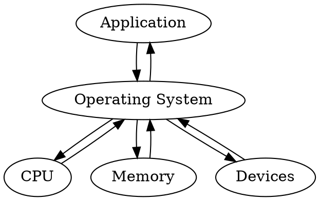

# 操作系统复习
## Introduction 1
### 什么是操作系统
* 在用户和计算机硬件之间的中介
* OS是个软件
——一个虚拟化计算机的程序

OS的作用：
* 物理机层面（CPU Memory Devices）：分配资源
* 虚拟机层面（Application）：控制程序

### History of OSs
No OS->Simple Batch Systems->Batch System->Multiprogramming systems->Time sharing system->Modern System

### 系统类型
#### 分布式系统 Distributed System
优点：**loosely-coupled 松耦合**
- 资源共享
- 提高计算速度
- 更可靠
- 交互性强

#### 并行系统 Parallel Operating System
多处理器 **紧耦合**
- 所有处理器共享时钟、总线、内存

两类
- 对称并行 Symmetric multiprocessing
    * 每个CPU没有差别
- 非对称并行 Asymmetric multiprocessing
    * 每个CPU有特定功能

优点
- 提高吞吐量
- 提高可靠性
- 规模经济

#### 集群系统 Clustered Systems
- 和并行系统不同
    * 由多个独立系统组成
- 和分布式系统不同
    * 共享存储

#### 实时系统 Real time System
硬实时：保证所有任务都在deadline之前完成
软实时：尽最大努力
#### 无处不在的系统 Ubiquitous Systems
未来
更关注人机交互
安全

## Introduction 2
### 计算机系统四大组成
User：使用系统的角色，不一定是人
Application programs
Operating system
Hardware

### 启动过程 Startup process
1. 打开电源
2. CPU通过系统时钟初始化
3. 在BIOS中找到启动程序的CPU的第一条指令
4. 执行开机自检(POST)，检查所有硬件设备

**Bootstrap program** 启动程序
很重要，在开机或重启的时候加载
-一般写在ROM或EPROM中，称为**固件 firmware**

### 运行过程 Running process
OS等待人去交互

多个任务如何共享一个CPU？
- **中断 interrupt**

### I/O操作
* IO设备可以和CPU同时执行
    - I/O在设备和控制器缓存（controller's buffer）之间转移数据
    - CPU在控制器和主存之间转移数据
* I/O设备访问
    - Memory Mapped I/O（CPU就像访问内存一样访问I/O）
    - Programmed I/O（每个控制寄存器都分配一个I/O端口号，CPU使用特定的I/O指令去读写寄存器）

### 轮询和中断 Polling or Interrupt
#### 轮询
CPU不断读状态寄存器直到有任务
-效率不高
#### 中断
谁有需要谁就主动通知CPU
-硬件触发通过**总线** 软件触发通过**系统调用**

**大部分OS都是中断的**

### 操作系统的服务
* 程序执行 Program execution
* I/O操作 I/O operations
* 文件系统的操作 File-system manipulation
* Communications 在进程间传递消息
* 错误检测 Error detection

额外的功能
* 资源分配 Resource allocation
* 账号管理 Accounting 
* 保护 Protection

### 所有操作系统共同的系统组件
* **Process Management**
* **Main Memory Management**
* **File Management**
* **I/O System Management**
* **Secondary Management**
* Networking
* Protection System
* Command-Interpreter System

### Process management 进程管理
一个进程是一个正在执行的程序

进程管理负责
- 进程的管理和删除
- 进程的暂停和恢复
- 提供机制为
    * 进程同步
    * 进程交流

### Main Memory Management 主存管理
主存管理负责
- 追踪哪部分内存正在被使用，被谁使用
- 决定当内存空间可用时哪个进程被加载
- 在需要时分配和收回内存空间

### File management 文件管理
一个文件是由它的创建者定义的一系列相关信息的集合

文件管理负责
- 文件的创建和删除
- 文件夹的创建和删除
- 支持基本的管理文件和文件夹
- 映射文件到辅助存储器
- 备份文件到稳定的存储介质

### I/O system management I/O系统管理
I/O系统包含
- 缓存系统
- 通用设备驱动接口
- 特定硬件设备的驱动

### Secondary-storage management 辅存管理
大部分计算机系统使用磁盘

磁盘管理负责
- 空闲空间管理
- 存储分配
- 磁盘调度

