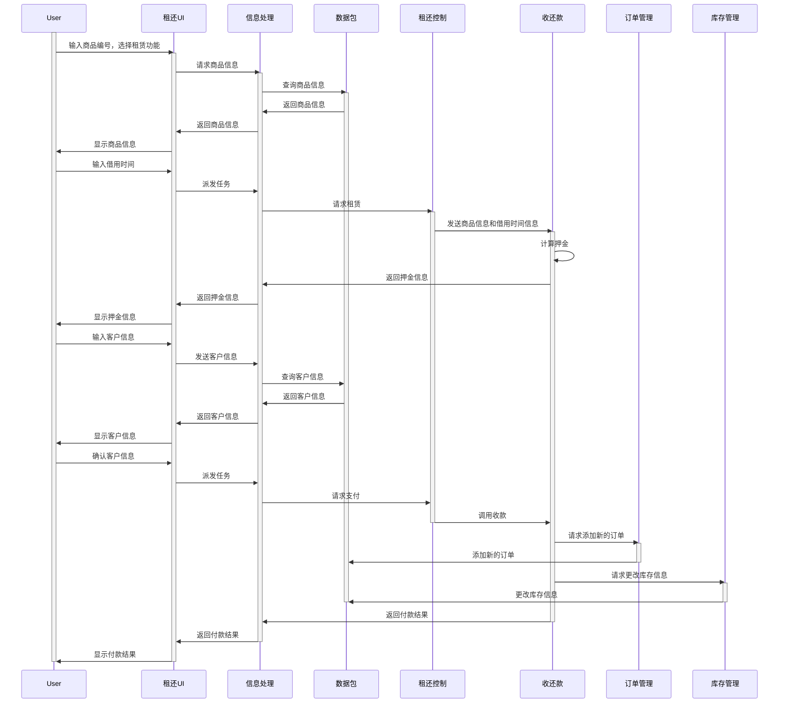
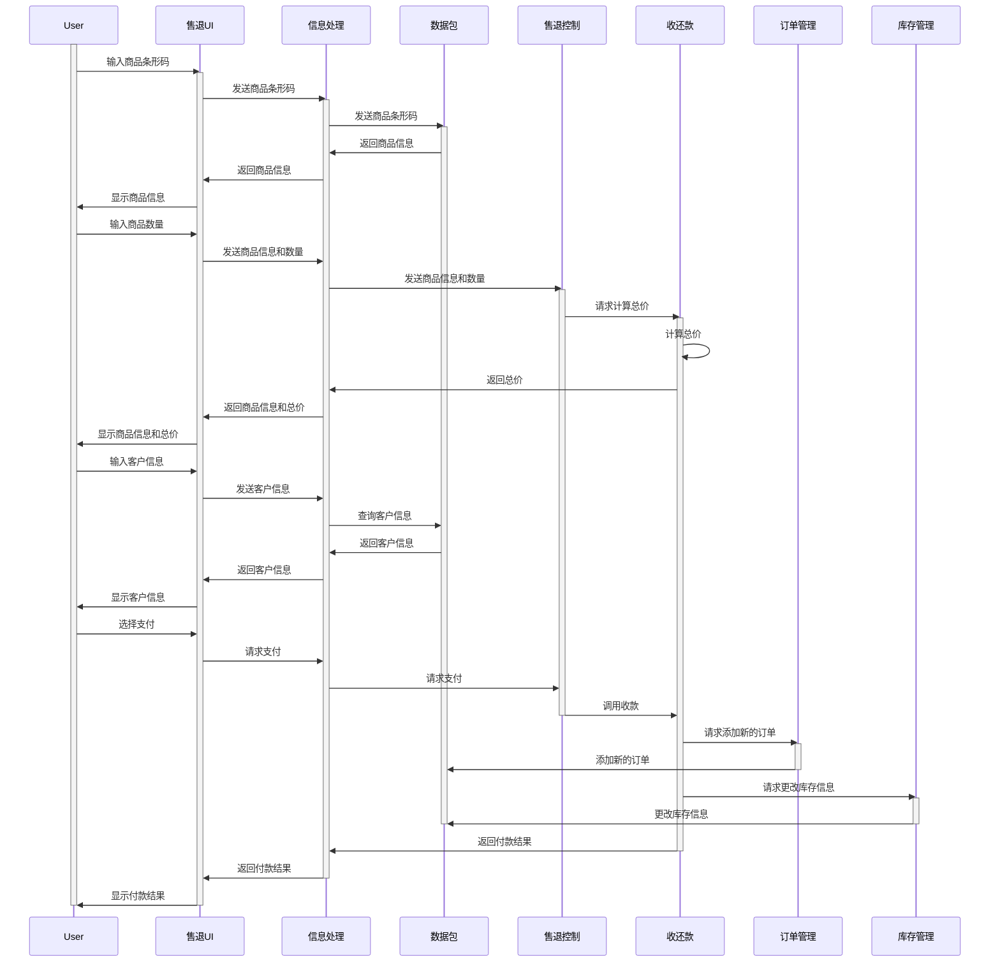
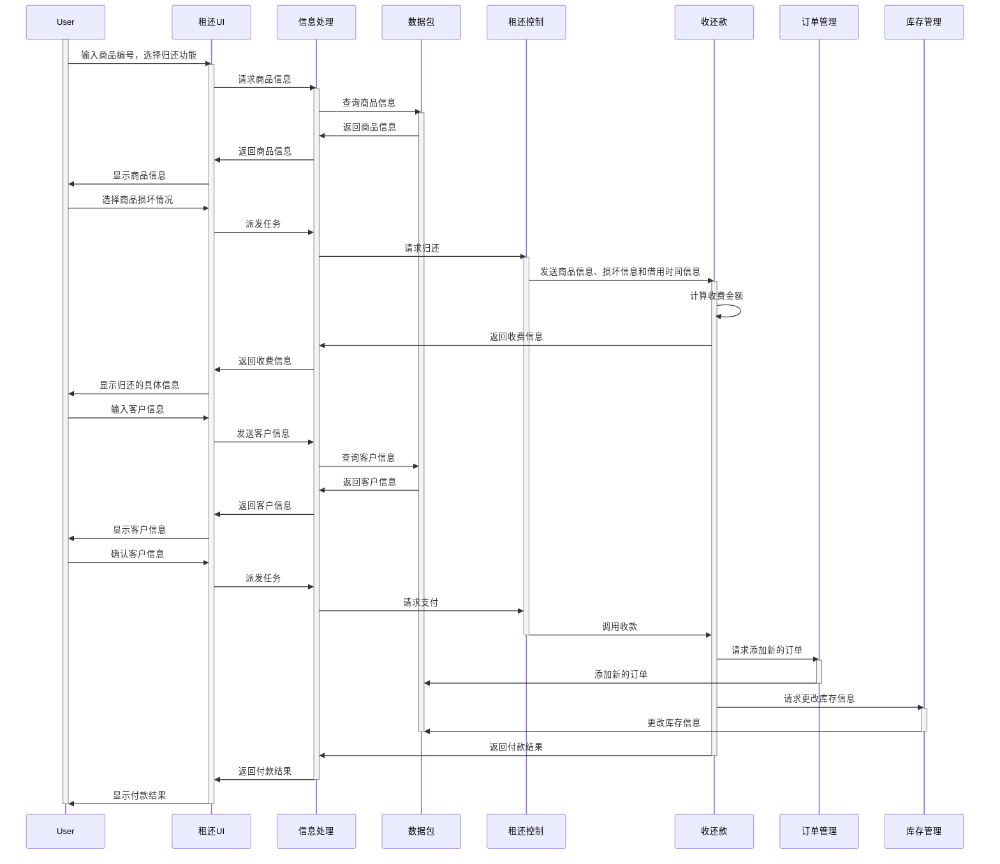
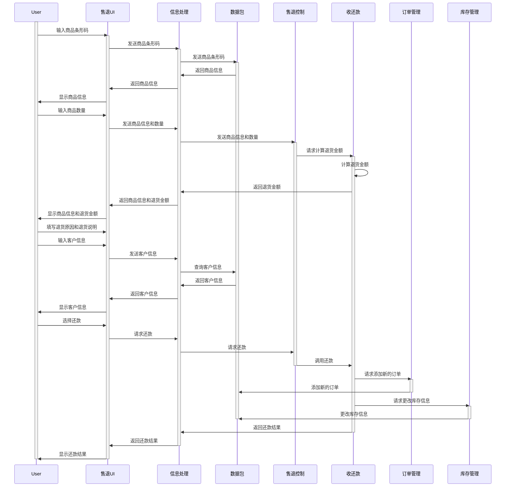
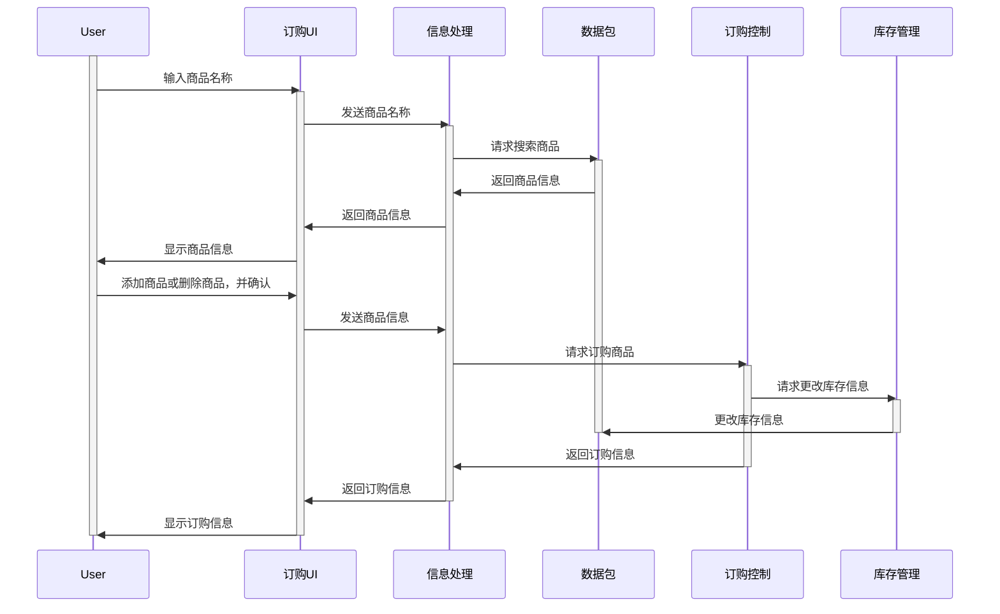

## 租赁

```mermaid
sequenceDiagram 
    activate User
    User->>租还UI: 输入商品编号，选择租赁功能
    activate 租还UI
    租还UI->>信息处理:请求商品信息
    activate 信息处理
    信息处理->>数据包:查询商品信息
    activate 数据包
    数据包->>信息处理:返回商品信息
    信息处理->>租还UI:返回商品信息
    租还UI->>User:显示商品信息
    User->>租还UI:输入借用时间
    租还UI->>信息处理:派发任务
    信息处理->>租还控制:请求租赁
    activate 租还控制
    租还控制->>收还款:发送商品信息和借用时间信息
    activate 收还款
    收还款->>收还款:计算押金
    收还款->>信息处理:返回押金信息
    信息处理->>租还UI:返回押金信息
    租还UI->>User:显示押金信息
    User->>租还UI:输入客户信息
    租还UI->>信息处理:发送客户信息
    信息处理->>数据包:查询客户信息
    数据包->>信息处理:返回客户信息
    信息处理->>租还UI:返回客户信息
    租还UI->>User:显示客户信息
    User->>租还UI:确认客户信息
    租还UI->>信息处理:派发任务
    信息处理->>租还控制:请求支付
    租还控制->>收还款:调用收款
    deactivate 租还控制
    收还款->>订单管理:请求添加新的订单
    activate 订单管理
    订单管理->>数据包:添加新的订单
    deactivate 订单管理
    收还款->>库存管理:请求更改库存信息
    activate 库存管理
    库存管理->>数据包:更改库存信息
    deactivate 库存管理
    deactivate 数据包
    收还款->>信息处理:返回付款结果
    deactivate 收还款
    信息处理->>租还UI:返回付款结果
    deactivate 信息处理
    租还UI->>User:显示付款结果
    deactivate 租还UI
    deactivate User
```
## 出售

```mermaid
sequenceDiagram
    activate User
    User->>售退UI: 输入商品条形码
    activate 售退UI
    售退UI->>信息处理:发送商品条形码
    activate 信息处理
    信息处理->>数据包:发送商品条形码
    activate 数据包
    数据包->>信息处理:返回商品信息
    信息处理->>售退UI:返回商品信息
    售退UI->>User:显示商品信息
    User->>售退UI:输入商品数量
    售退UI->>信息处理:发送商品信息和数量
    信息处理->>售退控制:发送商品信息和数量
    activate 售退控制
    售退控制->>收还款:请求计算总价
    activate 收还款
    收还款->>收还款:计算总价
    收还款->>信息处理:返回总价
    信息处理->>售退UI:返回商品信息和总价
    售退UI->>User:显示商品信息和总价
    User->>售退UI:输入客户信息
    售退UI->>信息处理:发送客户信息
    信息处理->>数据包:查询客户信息
    数据包->>信息处理:返回客户信息
    信息处理->>售退UI:返回客户信息
    售退UI->>User:显示客户信息
    User->>售退UI:选择支付
    售退UI->>信息处理:请求支付
    信息处理->>售退控制:请求支付
    售退控制->>收还款:调用收款
    deactivate 售退控制
    收还款->>订单管理:请求添加新的订单
    activate 订单管理
    订单管理->>数据包:添加新的订单
    deactivate 订单管理
    收还款->>库存管理:请求更改库存信息
    activate 库存管理
    库存管理->>数据包:更改库存信息
    deactivate 库存管理
    deactivate 数据包
    收还款->>信息处理:返回付款结果
    deactivate 收还款
    信息处理->>售退UI:返回付款结果
    deactivate 信息处理
    售退UI->>User:显示付款结果
    deactivate 售退UI
    deactivate User
```

## 归还

```mermaid
sequenceDiagram
    activate User
    User->>租还UI: 输入商品编号，选择归还功能
    activate 租还UI
    租还UI->>信息处理:请求商品信息
    activate 信息处理
    信息处理->>数据包:查询商品信息
    activate 数据包
    数据包->>信息处理:返回商品信息
    信息处理->>租还UI:返回商品信息
    租还UI->>User:显示商品信息
    User->>租还UI:选择商品损坏情况
    租还UI->>信息处理:派发任务
    信息处理->>租还控制:请求归还
    activate 租还控制
    租还控制->>收还款:发送商品信息、损坏信息和借用时间信息
    activate 收还款
    收还款->>收还款:计算收费金额
    收还款->>信息处理:返回收费信息
    信息处理->>租还UI:返回收费信息
    租还UI->>User:显示归还的具体信息
    User->>租还UI:输入客户信息
    租还UI->>信息处理:发送客户信息
    信息处理->>数据包:查询客户信息
    数据包->>信息处理:返回客户信息
    信息处理->>租还UI:返回客户信息
    租还UI->>User:显示客户信息
    User->>租还UI:确认客户信息
    租还UI->>信息处理:派发任务
    信息处理->>租还控制:请求支付
    租还控制->>收还款:调用收款
    deactivate 租还控制
    收还款->>订单管理:请求添加新的订单
    activate 订单管理
    订单管理->>数据包:添加新的订单
    deactivate 订单管理
    收还款->>库存管理:请求更改库存信息
    activate 库存管理
    库存管理->>数据包:更改库存信息
    deactivate 库存管理
    deactivate 数据包
    收还款->>信息处理:返回付款结果
    deactivate 收还款
    信息处理->>租还UI:返回付款结果
    deactivate 信息处理
    租还UI->>User:显示付款结果
    deactivate 租还UI
    deactivate User
```

## 退货

```mermaid
sequenceDiagram
    activate User
    User->>售退UI: 输入商品条形码
    activate 售退UI
    售退UI->>信息处理:发送商品条形码
    activate 信息处理
    信息处理->>数据包:发送商品条形码
    activate 数据包
    数据包->>信息处理:返回商品信息
    信息处理->>售退UI:返回商品信息
    售退UI->>User:显示商品信息
    User->>售退UI:输入商品数量
    售退UI->>信息处理:发送商品信息和数量
    信息处理->>售退控制:发送商品信息和数量
    activate 售退控制
    售退控制->>收还款:请求计算退货金额
    activate 收还款
    收还款->>收还款:计算退货金额
    收还款->>信息处理:返回退货金额
    信息处理->>售退UI:返回商品信息和退货金额
    售退UI->>User:显示商品信息和退货金额
    User->>售退UI:填写退货原因和退货说明
    User->>售退UI:输入客户信息
    售退UI->>信息处理:发送客户信息
    信息处理->>数据包:查询客户信息
    数据包->>信息处理:返回客户信息
    信息处理->>售退UI:返回客户信息
    售退UI->>User:显示客户信息
    User->>售退UI:选择还款
    售退UI->>信息处理:请求还款
    信息处理->>售退控制:请求还款
    售退控制->>收还款:调用还款
    deactivate 售退控制
    收还款->>订单管理:请求添加新的订单
    activate 订单管理
    订单管理->>数据包:添加新的订单
    deactivate 订单管理
    收还款->>库存管理:请求更改库存信息
    activate 库存管理
    库存管理->>数据包:更改库存信息
    deactivate 库存管理
    deactivate 数据包
    收还款->>信息处理:返回还款结果
    deactivate 收还款
    信息处理->>售退UI:返回还款结果
    deactivate 信息处理
    售退UI->>User:显示还款结果
    deactivate 售退UI
    deactivate User
```

## 订购 

```mermaid
sequenceDiagram
    activate User
    User->>订购UI:输入商品名称
    activate 订购UI
    订购UI->>信息处理:发送商品名称
    activate 信息处理
    信息处理->>数据包:请求搜索商品
    activate 数据包
    数据包->>信息处理:返回商品信息
    信息处理->>订购UI:返回商品信息
    订购UI->>User:显示商品信息
    User->>订购UI:添加商品或删除商品，并确认
    订购UI->>信息处理:发送商品信息
    信息处理->>订购控制:请求订购商品
    activate 订购控制
    订购控制->>库存管理:请求更改库存信息
    activate 库存管理
    库存管理->>数据包:更改库存信息
    deactivate 数据包
    deactivate 库存管理
    订购控制->>信息处理:返回订购信息
    deactivate 订购控制
    信息处理->>订购UI:返回订购信息
    deactivate 信息处理
    订购UI->>User:显示订购信息
    deactivate 订购UI
    deactivate User

```