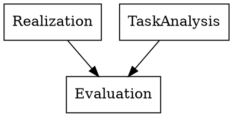

---
toc:
  depth_from: 1
  depth_to: 6
  ordered: false
---

## 参考书
About Face 4交互设计精髓

## Chapter 1 Introduction
### 关键词
* HCI: Human-Computer Interaction
* GUI: Graphical User Interface
* User Centered Design
* User Experience
* Usability

### HCI
交叉学科领域

### User interface
人和机器交互的空间

* 更有效率地操作和控制机器

### What's GUI
Graphical user interface 图形用户界面（而不是纯文本界面），是UI的一种

#### GUI之父
Douglas Engelbart

### HCI和SE的关系

### 可用性的定义
可用性：评估用户能多好地使用系统功能

* 易学习性
* 效率
* 可记忆性
* 容错性
* 满意性

#### 取决于用户
* 新手用户需要易学习性
* 专家需要效率

### 以用户为中心的设计
不分散用户过多的精力，没必要的内容可以删除

### 错误的代价

### 用户界面难以设计
* 你不是用户
* 用户通常是对的
* 用户不总是对的
用户不是设计者

用户界面设计会消耗软件开发相当一部分的时间
相当于整个编码时间的一半

## Chapter 2 交互设计过程
### 基本活动和特征
#### 什么是设计
* 在一定约束下到达某种目的
#### 关注
* 目的
* 约束

#### 目标

### 设计过程中的问题
* 如何选择用户
* 如何确定需求
* 如何提出备选设计方案
* 如何选择一个合适的设计方案

#### 如何选择用户
* 利益相关者$\neq$用户
* 客户可能不是用户
* 用户应当分类
  * 主要用户 Primary
    经常使用系统的
  * 二级用户 Secondary
  * 三级用户 Tertiary
  * 促进用户 Facilitating

#### 知道用户
* 交谈
* 观察
* 想象

#### 怎样提供备选设计方案
* 思考其他类似设计
* 考虑到设计约束

#### 如何选择设计方案
* 外部因素
* 内部因素

考虑用户的体验和改进建议  
考虑质量

### 交互设计生命周期模型
IxD
#### 瀑布模型（传统的）
最开始的瀑布模型没有用户参与，没有验证环节
#### 螺旋模型（传统的）
#### RAD（传统的）
极速开发
#### 原型法（传统的）
最早的以用户为中心设计
* 抛弃型
* 改进型
#### Star life cycle model(IxD)

### Interaction Design Process
需要什么

让用户选择设计方案
### 基本特征
* 用户为中心
* 稳定性
* 迭代

## Chapter 3 User Analysis & Task Analysis
### 定量研究 vs 定性研究 Quantitative versus Qualitative
像物理这样的硬核科学通常是定量的，人文学科通常是定性的

定量研究只能研究有限的范围内 how much 或 how many的问题

定性研究可以告诉你怎么做

### 定性研究的价值

### 目标导向设计研究
#### 启动会 Kickoff meeting
问题
* 产品是什么
* 谁使用
* 用户需要什么
... 

#### Literature Review 文献综述
内部文档
产业报告
网络搜索

#### 利益相关者访谈
特定类型的信息

#### 主题专家访谈 Subject Matter Expert Interviews

#### 客户访谈

#### 用户访谈

#### 用户观察
大多数用户不能准确描述自己的行为

#### 观察和访谈用户相结合