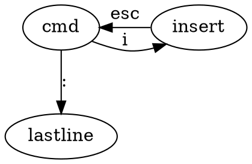

## Find answers:Man

## Basic Commands
CMD OPTION ARGS

ls -l /home 

ls --all 两横加全称

ls -a -l 两个都使用
### ls 列出目录信息
* ls -l (列出完整信息)
* ls -a （列出隐藏文件）

### cd

### pwd（列出工作目录的绝对路径）
print working directory
* pwd

### ~
该用户的主目录

### which
定位命令位置
which java

### whereis 

### locate
定位文件

### rpm

### find

### echo

### cat
查看一个纯文本

### cp
复制粘贴

cp 源目录 目标目录

cp haha .  (.代表当前目录)

### mv
剪切粘贴

### mkdir
创建一个目录

### rm
删除

* rm 文件名 （不能删除目录）
* rm -R 目录 （递归删除）
* rm -Rf （强制删除，不会报错）

rm -Rf / （危险）

### tar

## Vi

* 命令模式
* 编辑模式
* last line 模式

:wq 保存退出

# Chapter 2 用户管理
## Add an account

/etc存放着配置文件

/etc/passwd

tom:x :501:502::/home/tom:/bin/bash

### useradd 新用户名

在/etc/passwd增加一行，在home增加目录。但这是不能登录，因为没有设置密码

### passwd 用户名
设置密码

/etc/shadow 保存密码。不能用明文存储密码