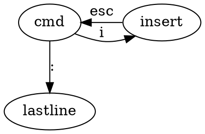

## Find answers:Man

## Basic Commands
CMD OPTION ARGS

ls -l /home 

ls --all 两横加全称

ls -a -l 两个都使用
### ls 列出目录信息
* ls -l (列出完整信息)
* ls -a （列出隐藏文件）

### cd

### pwd（列出工作目录的绝对路径）
print working directory
* pwd

### ~
该用户的主目录

### which
定位命令位置
which java

### whereis 

### locate
定位文件

### rpm

### find

### echo

### cat
查看一个纯文本

### cp
复制粘贴

cp 源目录 目标目录

cp haha .  (.代表当前目录)

### mv
剪切粘贴

### mkdir
创建一个目录

### rm
删除

* rm 文件名 （不能删除目录）
* rm -R 目录 （递归删除）
* rm -Rf （强制删除，不会报错）

rm -Rf / （危险）

### tar

## Vi

* 命令模式
* 编辑模式
* last line 模式



:wq 保存退出

# Chapter 2 用户管理
## Add an account

/etc存放着配置文件

/etc/passwd

tom:x :501:502::/home/tom:/bin/bash

### useradd 新用户名

在/etc/passwd增加一行，在home增加目录。但这是不能登录，因为没有设置密码

### passwd 用户名
设置密码

/etc/shadow 保存密码。不能用明文存储密码

## 删除一个用户
###  userdel 用户名
只删除用户条目
### userdel -r 用户名
把用户目录也删除

用户在已登录时无法直接删除

## /etc/shadow
冒号作分割，Windows下一般用分号

.csv文件用逗号分割

共有9个域

* 用户名
* 加密过的密码
* 上一次密码修改日期
* 两次修改密码的最短时间
* 两次修改密码的最大时间
* 多少天之后警告密码过期
* 多少天之后密码过期
* 过期日期
* 保留域

一般情况下只有用户名和密码就够了

### usermod
修改用户配置

usermod -e 修改账户过期时间，日期格式是YYYY-MM-DD

usermod -L 锁定用户，在加密密码之前加!

### Root 账户
UID为0

密码一定要保护好

尽量不要用root用户，在需要时使用su切换用户

使用sudo，用别的用户权限做一件事

kill -9 进程号 杀死进程

### root权力下放
修改 /etc/sudoers  
visudo命令

# shell编程
把重复的命令放到文件

一定要先写#!/bin/sh

“#” 代表注释
## 一般变量和环境变量
fork 由父进程生成子进程

执行脚本时会有新进程，新进程会有变量。环境变量是变量的一个子集。进程创建子进程时，环境变量会传给子进程，一般变量不会

### 变量使用
不用声明，直接赋值就可以

shell里面赋的值只有string类型，等号左右都不能有空格


#### 引用变量
* echo $变量名  
* 完整的写法：echo ${变量名}
* echo ${变量名:开始索引:结束索引} 截取子字符串

set命令显示出所有变量

set|grep 变量名 选取特定变量

unset 变量名 删除变量名

### 特殊的变量
$# 参数的数量
$数字 具体参数
$$ 显示PID
$? 上一条命令状态：0代表没有错，其他数字代表出错

### 字符串合并
直接写在一起就行

### 路径用变量名存
必须使用绝对路径

### 环境变量设置
配置环境变量的方法
* export 变量名 该变量就变成环境变量，父进程直接用就可以（env命令可以看环境变量）

删除环境变量
* unset

### 测试条件
语法：  
* test condition 
* [ condition ] 方括号前后要加空格

#### 退出状态
$?   
0代表正常

### 字符串判断
* =
* !=
* -z 为空

### 数字判断
* -eq
* -ne
* -gt
* -lt

### 流程控制
#### for
##### for each
```bash
for i in 结果集
do
语句
done
```

反引号``可以表示命令的结果集，比如\`ls\`

##### for

#### while & until 循环
##### while
``` bash
while [ 条件 ] 
do
echo $i
i=$(($i+1))
echo $i
done
```

#### if
```bash
if [ $score -ge 60 ];
then
echo "pass"
elif [];then

fi
```

#### case

## I/O
### read
相当于scanf

read 变量名

### 文件重定向
把终端上显示的结果写入文件
需要写入的内容 > 写入的文件名

## 引号
单引号内的内容会直接打出

双引号会进行变量解释

反引号等价于$()，相当于变量的结果

反斜杠转义特殊字符

## 函数
```bash
message(){

}
message
# 调用的时候直接输函数名就行
```
如果要加参数，不需要在()内加形参，直接在{}中使用$1,$2即可

引用其他sh文件
```bash
. ./fun.sh #.相当于include

message
```

# 启动和关闭
## 启动过程
```dot
digraph g{
    KI [label="Kernel Initialization"]
    BL [label="Boot Loader"]
    Run [label="Runs scripts from /etc/rc[0-6].d/"]
    Sp [label="Spawns get tty processes"]
    Sp1 [label="Spawns Xdm/gdm processes"]
    BIOS->BL->KI->init
    init->Run
    init->Sp->login
    init->Sp1
}