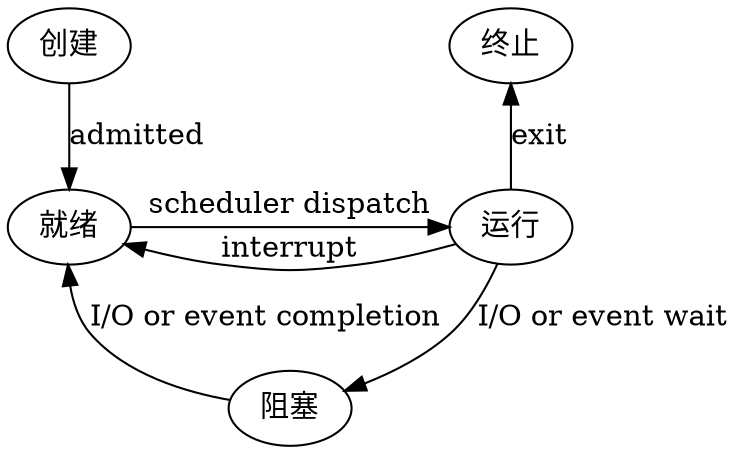

# 第一章
## 操作系统的特征
* 并发
* 共享
* 虚拟
* 异步

并发和共享是最基本的特征，二者互为存在条件

### 并行和并发的区别
并行是指多个事件在同一时刻同时发生，并发是指多个事件在同一时间间隔内发生

## 操作系统提供的接口
* 命令接口（用户直接使用）
    * 联机命令接口（用户说一句，系统做一句）
    * 脱机命令接口（用户说一堆，系统做一堆）
* 程序接口（即“系统调用”，用户通过程序间接使用）
* 图形用户界面

## OS运行机制
* 两种指令
    * 特权指令
    * 非特权指令
* 两种处理器状态
    * 核心态
    * 用户态
* 两种程序
    * 内核程序
    * 应用程序

## 用户态与核心态
CPU上会执行两种程序，内核程序和普通应用程序

正在执行内核程序，说明此时是操作系统正在控制CPU

正在执行应用程序，说明此时是应用程序正在控制CPU

核心态与用户态的切换，本质上是操作系统与普通应用程序对CPU控制权的切换

### 用户态转向核心态的例子
1. 用户程序要求操作系统的服务，即系统调用
2. 发生一次中断
3. 用户程序中产生了一个错误状态（内中断、异常）
4. 用户程序中企图执行一条特权指令（非法操作，需要操作系统介入处理）

## 中断和异常
* 内中断（也称异常、例外、陷入）
    * 中断信号来自CPU内部，与当前执行的指令有关
* 外中断（中断）
    * 中断信号来自CPU外部，与当前执行指令无关。每个指令周期末尾检查

中断的本质作用：将CPU的控制权交给操作系统，因此中断发生后操作系统转向核心态

### 中断处理和子程序调用的区别
子程序调用是程序设计者事先在主程序中安排一条调用指令CALL，子程序的调用时间是固定的。主程序调用子程序的过程完全属于软件处理过程，不需要专门的硬件电路

有中断请求时，先由**中断隐指令**完成中断前程序的状态保存，主要工作有
1. 关中断
2. 保存PC、PSW（**硬件完成**）
3. 根据中断向量引出对应的中断服务程序（即中断处理程序，属于操作系统内核），**通用寄存器的保护由中断服务程序完成**。当中断服务程序运行结束后再**开中断**

调用类型|中断|子程序调用
-------|----|---------
入口地址|由中断隐指令根据中断向量得到|由调用程序根据寻址方式得到
保存环境|保存PC、PSW、通用寄存器|保存PC、通用寄存器
进程状态|从用户态转换为核心态|没有状态变化

## 系统调用
与资源相关的操作，可能会影响其他进程的操作，都必须通过系统调用方式向操作系统提出服务请求，并由操作系统代为完成
* 设备管理
* 文件管理
* 进程控制
* 进程通信
* 内存管理

执行系统调用的过程
1. 传递系统调用参数（存到寄存器）
2. 执行陷入（trap）指令
3. 执行相应的服务程序
4. 返回用户态

**陷入指令**，又称**访管指令、trap指令**。用于实现系统调用，用户程序通过陷入指令主动将CPU控制权还给操作系统。执行陷入之后，CPU状态从用户态转为核心态

## 微内核和宏内核
微内核操作系统中内核本身只包含最基本的一些功能，其他部分放在外层模块中。外层模块出问题不会导致操作系统的崩溃。可靠性和可扩展性高，但各模块之间无法直接调用，需要通过消息传递的方式来间接通信，性能较差

宏内核中包含所有的操作系统功能，各模块之间可以直接调用

# 第二章
## 进程与线程
特性    |进程               |线程
--------|------------------|---
资源分配|进程是资源分配和拥有的基本单位|线程自己不拥有资源，但可访问所属进程拥有的全部资源
调度    |在没有引入线程的操作系统中，进程是调度的基本单位|引入线程后的操作系统中，线程是调度的基本单位
通信    |PV操作；共享存储；消息传递；管道通信|统一进程的个线程直接读写进程数据段，不同进程的线程之间通信属于进程间通信
系统开销|进程切换时设计当前CPU环境的保存及新进程CPU环境的设置，开销较大|线程切换时只需保存和设置少量寄存器内容，开销很小
地址空间|进程的地址空间之间互相独立|同一进程的各线程间共享进程的地址空间

## 进程的地址空间
* 代码段：存放二进制代码
* 数据段：包含全局变量和常量
* 堆：存放动态分配的空间
* 栈：存放局部变量、函数参数等

## 用户级线程、内核级线程
### 用户级线程
用户级线程由应用程序通过线程库实现。
所有的线程管理工作都由应用程序负责
用户级线程中，线程切换可以在用户态下完成，无需操作系统干预
在用户看来有多个线程，但在操作系统内核看来，意识不到线程的存在（用户级线程对用户不透明，对操作系统透明）

用户级线程就是“从用户视角能看到的线程”

当一个线程被阻塞，同一进程内的所有线程都会被阻塞
### 内核级线程

内核级线程的管理工作由操作系统内核完成，内核级线程的切换必须要在核心态下才能完成

内核级线程就是从操作系统内核视角能看到的线程

**内核级线程才是处理机分配调度的单位**

在多处理器系统中，内核能够同时调度同一进程中多个线程并行执行

一个线程被阻塞了，内核可以调度该进程中的其他线程或其他进程中的线程运行

线程切换时，需要从用户态转到核心态，系统开销较大

## 进程状态与进程控制


进程控制：实现进程状态的转换

进程存在的唯一标志：PCB

特性|进程阻塞|进程唤醒
----|-------|-------
引发事件|请求系统服务；启动某种操作；新数据尚未到达；无新工作可做|引发阻塞的事件完成
特点|进程通过调用阻塞原语block把自己阻塞，进程的阻塞是进程自身的一种主动行为|由完成相关事件的进程调用wakeup原语将被阻塞的进程唤醒，是被动完成的

## 处理机调度
可以分为三个层次
* 作业调度（高级调度）
* 中级调度
* 进程调度（低级调度）

高级调度将作业从外存转入内存，分配资源，建立进程，只发生一次

中级调度将内存中闲置的进程挂起到外存，或将外存中被挂起的进程转入内存激活

低级调度为内存中的进程分配处理器

带权周转时间：周转时间/作业实际运行时间，越小越好

### 进程调度的优先级
1. 静态优先级：在进程投入运行前就确定一个优先级，并且之后一直不变
2. 动态优先级：在进程运行过程中，根据进程情况的变化动态调整优先级

系统进程优先级高于用户进程
I/O型进程的优先级高于计算型进程

### 不能进行处理机调度的情况
1. 处理中断的过程中
2. 进程在操作系统**内核程序临界区**中（并非普通临界区）
3. 其他需要完全屏蔽中断的原子操作过程中：如加锁、解锁、中断现场保护、恢复等原子操作

### 典型的调度算法
1. 先来先服务
2. 短作业优先
3. 高响应比优先
    响应比=(等待时间+要求服务时间)/要求服务时间
4. 优先级调度算法
5. 时间片轮转调度算法
6. 多级反馈队列调度算法

## 同步和互斥
实现互斥的原则
1. 空闲让进
2. 忙则等待
3. 有限等待
4. 让权等待

## 锁和条件变量
锁实现互斥，条件变量只能实现同步

### 1. 单标志法

同一时刻只允许一个进程访问临界区

如果刚开始允许进入临界区的是P0进程，但是P0进程一直不访问临界区，从而导致P1进程也一直无法访问临界区。所以单标志法存在的问题就是：**违背了空闲让进原则**

### 2. 双标志先检查


算法思想：设置一个布尔类型的数组flag，数组中的各个元素用来标记各进程想进入临界区的意愿，每个进程进入临界区之前先检查当前有没有别的进程想进入临界区，如果没有，则把自己对应的标志flag[i]设为true，之后开始访问临界区。

进程并发访问时，如果按照①⑤②⑥⑦...的顺序执行，P0和P1进程将会同时访问临界区。所以双标志先检查法的主要问题是：违反了**忙则等待**的原则
原因在于：进入区的检查和上锁两个处理不是一气呵成的。检查后和上锁前可能发生进程切换

### 3. 双标志位后检查


算法思想：双标志先检查法的改版。前一个算法先检查后上锁，该算法先上锁后检查。

如按照①⑤②⑥...顺序执行，P0和P1进程都无法进入临界区。因此，双标志后检查法虽然解决了忙则等待的问题，但是又违背了**空闲让进**和**有限等待**的原则，会因各进程长期无法访问临界资源而产生**饥饿**现象。

### 4. 皮特森算法：
算法思想：对于双标志后检查法中，如果两个进程都争着进入临界区，那可以让进程尝试“孔融让梨”，主动让对方先使用临界区

Peterson算法可以很好的解决了前面3中算法的问题，无论何种顺序都可以保证同一个时刻只有一个进程访问临界区,且不会出现“饥饿”现象。但是当一个进程访问临界区时，另一个进程不会释放处理机，会一直循环等待条件满足访问临界区，违背了“**让权等待**”的原则。

### 信号量机制
整型信号量表示资源个数的整型量S。当进程发现S<=0时，就会不断测试，因此进程处于忙等状态，未遵循“让权等待”原则

记录型信号量遵循了人“让权等待”原则，拥有一个整型值value表示资源数目，以及一个等待队列保存正在等待资源的进程

信号量的PV操作实质是加减操作，PV操作又是原语操作

记录型信号量S中value值的意义：
* value的初值表示系统中某类资源的总数
* value<0表示当前系统中已经没有可用的该类资源
* value<0时，其绝对值表示进程等待队列中因等待该资源而阻塞的进程个数

## 经典同步问题
### 1. 生产者消费者问题
初始化变量：
```c
semaphore mutex=1; //临界区互斥信号量
semaphore empty=n;  //空闲缓冲区空间
semaphore full=0;  //缓冲区初始化为空
```

生产者进程：
```c
producer ()
{
    while(1)
    {
        produce an item in nextp;  //生产数据
        P(empty);  //获取空单元
        P(mutex);  //进入临界区.
        add nextp to buffer;  //将数据放入缓冲区
        V(mutex);  //离开临界区,释放互斥信号量
        V(full);  //满缓冲区数加1
    }
}
```

消费者进程：
```c
consumer ()
{
    while(1)
    {
        P(full);  //获取缓冲区数单元
        P(mutex);  // 进入临界区
        remove an item from buffer;  //从缓冲区中取出数据
        V (mutex);  //离开临界区，释放互斥信号量
        V (empty) ;  //空闲缓冲区数加1
        consume the item;  //消费数据
    }
}
```
### 2. 读写者问题
#### 前提条件
1. 写者、读者互斥访问文件资源。
2. 多个读者可以同时访问文件资源。
3. 只允许一个写者访问文件资源。
4. 写者执行写操作前，应该让所有读者和写者退出；写者完成写操作前，不允许其他读者或写者工作

#### 两种情况
##### 1. 读者优先
* 当存在读进程时，写操作将被延迟
* 除非有一个写者在访问临界区，其他情况下，读者不应该等待
##### 2. 写者优先
如果一个写者等待访问对象，那么不会有新读者开始读操作

#### 读者优先的实现
初始化变量
```c
BINARY_SEMAPHORE wrt=1;
BINARY_SEMAPHORE mutex=1;
int readcount=0;
```

读者:
```c
reader() {
    P(mutex);    //互斥访问readcount变量
    if(readcount==0) //当第一个进程读共享文件时
        P(wrt);  //阻止写进程写
    readcount=readcount+1;   //读者计数器加1
    V(mutex);  //释放互斥变量count
    reading;   // 读取
    P(mutex);  //互斥访问count变量
    readcount=readcount-1; //读者计数器减1
    if(readcount==0) //当最后一个读进程读完共享文件
        V(wrt);    //允许写进程写
    V(mutex);  //释放互斥变量count
}
```

写者:
```c
writer() {
    P(wrt); // 互斥访问共享文件
    writing;   //写入
    V(wrt); // 释放共享文件
}
```

#### 写者优先的实现
若希望写进程优先，即当有读进程正在读共享文件时，有写进程请求访问，这时应禁止后续读进程的请求，等到已在共享文件的读进程执行完毕，立即让写进程执行。只有在无写进程执行的情况下才允许读进程。
```c
// 初始化变量
BINARY_SEMAPHORE read=1;    //使有写者进行操作时读者等待
BINARY_SEMAPHORE file=1;    //使多个写操作之间以及读写操作之间互斥
BINARY_SEMAPHORE mutex1=1;  //使改变readcount的方法互斥
BINARY_SEMAPHORE mutex2=1;  //使改变writecount的方法互斥
int readcount=0;
int writecount=0;
```

读者:
```c
reader() {
    P(read); //等待直至读者队列没有阻塞，即全部写者都退出，同时自身进入后再次上锁，使后来的读者等待，因为接下来要进行一系列互斥的操作
    P(mutex1);
    readcount++;
    if(readcount==1)    //第一个读者进入
        P(file);     //后来的写者无法操作文件，但对后来的读者的文件操作不造成影响
    V(mutex1);
    V(read);   //释放
        //read operation
    P(mutex1);
    readcount--;
    if(readcount==0)
        V(file);
    V(mutex1);
}
```

写者:
```c
writer() {
    P(mutex2);
    writecount++;
    if(writecount==1)   //第一个写者进入
        P(read); //阻塞读者队列
    V(mutex2);
    P(file);
        //write operation
    V(file);
    P(mutex2);
    writecount--;
    if(writecount==0)   //最后一个写者退出
        V(read);   //释放读者队列
    V(mutex2);
}
```
### 3. 哲学家就餐问题
解决方法：一是让他们同时拿起两根筷子；二是对每名哲学家的动作制定规则

使用制定规则的方法来解决问题：

初始算法（错误算法）：
```c
semaphore chopstick[5]={1,1,1,1,1};
Pi(){
   do{
      P(chopstick[i]);  //取左边筷子
      P(chopstick[(i+1)%5]);  //取右边筷子
      eat;  //进餐
      V(choptick[i]);   //放回左边筷子
      V(chopstick[(i+1)%5]);  //放回右边筷子
      think;   //思考
   } while(1);
}
```
当5名哲学家同时拿起左边的筷子时，筷子已被拿光，当他们再想拿右边的筷子时，就全被阻塞，因此出现了死锁

制定正确的规则如下：同时最多只有一个哲学家正在拿筷子，即最多只有一个哲学家处于“请求和保持”状态，别的哲学家要么手里没有筷子，要么有两支筷子

```c
semaphore chopstick[5]={1,1,1,1,1}; //初始化信号量
semaphore mutex=1;   //设置取筷子的信号量
Pi(){
   do{
      P(mutex);   //在取筷子前获得互斥量
      P(chopstick[i]);  //取左边筷子
      P(chopstick[(i+1)%5]);  //取右边筷子
      V(mutex);   //释放取筷子的信号量
      eat;  //进餐
      V(chopstick[i]);  //放回左边筷子
      V(chopstick[(i+1)%5]);  //放回右边筷子
      think;   //思考
   } while(1);
}
```

## 死锁
### 死锁的四个必要条件
1. **互斥条件**
2. **不剥夺条件**：进程获得的资源在未使用之前，不能被其他进程强行夺走，只能主动释放
3. **请求并保持条件**：进程已经保持了至少一个资源，但又提出了新的资源请求，而该资源已被其他进程占有，此时请求进程被阻塞，但对自己已获得的资源保持不放
4. **循环等待条件**

### 死锁的处理方法
* 死锁预防
* 死锁避免
* 死锁的检测和解除

### 死锁预防
1. 破坏互斥条件
2. 破坏不剥夺条件
3. 破坏请求并保持条件
4. 破坏循环等待条件

### 死锁避免
#### 系统安全状态
系统在进行资源分配之前，应当先计算此次分配的安全性。若此次分配不会导致系统进入不安全状态，则允许分配；否则让进程等待


并非所有的不安全状态都是死锁状态；只要系统处于安全状态，系统即可避免进入死锁状态

#### 银行家算法
* 每个新进程必须声明它所需每种资源的最大实例数
* 进程请求时，系统必须确认是否分配资源会让系统不安全
* 当一个进程得到所有所需资源后，它必须在有限时间内归还

例子：

问：
1. 该状态是否安全？
2. 若进程P2提出请求Request（1，2，2，2）后，系统能否将资源分配给它？

答：
1. 利用安全性算法对上面的状态进行分析（见下表），找到了一个安全序列{P0,P3,P4,P1,P2}，故系统是安全的。

2. P2发出请求向量Request(1,2,2,2),系统按银行家算法进行检查：
    1. Request2(1,2,2,2)<=Need2(2,3,5,6)
    2. Request2(1,2,2,2)<=Available(1,6,2,2)
    2. 系统先假定可为P2分配资源，并修改Available，Allocation2和Need2向量：
    Available=(0,4,0,0)
    Allocation2=(2,5,7,6)
    Need2=(1,1,3,4)
    此时再进行安全性检查，发现	Available=(0,4,0,0) 不能满足任何一个进程，所以判定系统进入不安全状态，即不能分配给P2相应的Request(1,2,2,2)。

### 死锁检测和解除
#### 资源分配图
用圆圈表示一个进程，用框代表一个一类资源，用框中的一个圆代表一类资源中的一个资源。从进程到资源的有向边称为**请求边**，表示该进程申请一个单位的该类资源；从资源到进程的边称为**分配边**，表示该类资源已有一个资源分配给了进程


#### 从资源分配图上找是否会有死锁
无环一定没有死锁，有环不一定有死锁  
**<font color=darkblue>如果有环，且环上有资源只有一个实例，则必有死锁；有多个实例，可能有死锁，可以用化简的方法看</font>**

如果化简能消去图中所有的边，则称该图是**可完全简化**的

S为死锁的条件是当且仅当S状态的资源分配图是不可完全简化的，该条件为**死锁定理**

#### 死锁解除
1. 资源剥夺法：挂起某些死锁进程，并抢占它的资源，将这些资源分配给其他的死锁进程
2. 撤销进程法：强制撤销部分甚至全部死锁进程并剥夺这些进程的资源
3. 进程回退法：让一个或多个进程回退到足以回避死锁的地步，进程回退时自愿释放资源而非被剥夺

# 第三章 内存管理
## 程序运行的基本原理
* 编译：将源代码编译成若干个目标模块，每个模块具有各自的逻辑地址空间
* 链接：由链接程序将上述目标模块，以及所属库函数链接，形成具有完整的逻辑地址空间的装入模块
* 装入：由装入程序将装入模块装入内存

在链接完成之后形成完整的逻辑地址，在装入后形成了最终的物理地址

## 连续分配方式
### 1. 单一连续分配
内存分为系统区和用户区。内存中永远只有一道程序。只能用于单用户、单任务的操作系统，有内部碎片，利用率低

采用**覆盖**技术解决空间不足

### 2. 固定分区分配
将用户内存空间划分为固定大小的区域，每个分配只装入一道作业。当有空闲分区时，从外存的后备作业队列中选择适当大小的作业装入该分区

分区内的碎片称为**内部碎片**

采用**覆盖**或**交换**技术解决空间不足

覆盖是将一个进程中的一部分换入换出内存，交换是将整个进程换入换出内存
### 3. 动态分区分配
根据进程的大小动态地建立分区，分区的大小和数目是可变的

因为分区的大小正好适合进程的需要，所以不产生内部碎片，分区外的碎片称为**外部碎片**

#### 动态分区分配算法
1. 首次适应（First Fit）算法：顺序查找内存，找到大小能满足要求的第一个空闲分区。
2. 最佳适应（Best Fit）算法：找到最小的能满足要求的空闲分区
3. 最坏适应（Worst Fit）算法。又称最大适应（Largest Fit）算法：找到最大的能满足要求的空闲分区
4. 邻近适应（Next Fit）算法。又称循环首次适应算法，由首次适应算法演变而成，分配内存时从上次查找结束的位置开始继续查找

**首次适应算法最简单、最快、最好，碎片多出现于低地址空间**

**最佳适应算法最容易产生内存碎片**

**最大适应法效果最差，使系统缺少大的连续地址空间**

## 非连续分配管理方式
### 分页

页：进程中的块（进程被分成许多大小相同的块）
页框：内存中的块（内存被分成许多大小相同的块）
页的大小=页框大小
页表：存储进程中的每一页所对应的页框的位置（进程中的每一块对应在内存中的位置）

页表项： 页号（标记） | 页框号（虚页号）

页表项地址：指向页表中的元素（即页表项）

### 分段

段的大小不固定

段表寄存器：存储了段表起始地址和段表长度（段表项个数）

段表项地址：指向段表中的元素（即段表项）

#### 段表
段表项包含：标志位、段号、段起点（段基址）和段长度

每个段表项的长度相同

问题求段地址，答案可能是越界

### 分页和分段比较
分页从计算机的角度考虑设计的，以提高内存的利用率，页对用户是不可见的；分段对用户是可见的，用户编程时需要给出段名

页的大小固定，段的大小不固定

分页的地址空间是一维的，只要给出一个记忆符即可表示一个地址；分段地址空间是二维的，既要给出段名，也要给出段内地址；段页式也是二维的

分段比分页更容易实现信息的共享和保护

程序正在运行时，由**操作系统**完成地址映射

## 虚拟页式存储管理
三种实现方式
* 请求分页
* 请求分段
* 请求段页式

三个主要特征
* 多次性
* 对换性
* 虚拟性

## 请求分页
页表项中增加
* 状态位：指示该页是否已调入内存
* 访问字段：记录本页在一段时间内的访问次数
* 修改位：该页在调入内存后是否被修改过
* 外存地址：该页在外存上的地址

缺页中断属于内部中断，与一般的中断相比，区别如下
1. 在指令执行期间产生和处理中断信号，而非一条指令执行完后
2. 一条指令在执行期间，可能产生多次缺页中断

###  TLB（快表）

**放在主存中的页表叫做慢表**

TLB采用全相联映射，采用SRAM实现

TLB是页表的子集，相当于页表的cache。TLB命中，页表一定命中；页表命中，TLB不一定命中

TLB每行都有有效位，有效位为1才能用

TLB命中，访问某个逻辑地址只需要一次访问内存；TLB没有命中，访问某个逻辑地址需要两次访问内存

页面调出内存时，不仅需要删除页表中的页表项，也要删除快表中的页表项
### 请求分页和基本分页的区别
请求分页只要求将当前需要的一部分页面装入内存，便可以启动作业运行，同时还可以通过页面置换功能将暂时不用的页面换出到外存上

###  虚拟地址结构
虚页号 | 页内地址

虚页号又可分为：页目录号 | 页号

### 单级页表的问题
页表必须连续存放，当页表很大时，需要占用很多个连续的页框
解决方案：多级页表

没有必要让整个页表中指向的所有页常驻内存，因为进程在一段时间内可能只需要访问几个特定的页面
解决方案：在需要访问的时候才把页面调入内存，为此在页表项中增加**标志位**表示页表项对应的页是否在内存中
### 两级页表
把页表项分组，变成多个小页表，存在内存不同的位置

对不同的小页表也要建立一张表用来检索，称为**页目录表**

地址结构：
一级页号+两级页号+页内地址

需要多一次访存

#### 多级页表
如果采用多级页表，那么各级页表的大小不能超过一个页面所能存储的最多页表项的数量。
原因：本来多级页表就是为了解决当页表很大时，需要占用很多个连续的页框的问题。如果一个页表超过了一个页框的空间，就失去了采用多级页表的意义

例题：
字节编址，40位逻辑地址，页面大小4KB，页表项大小4B，需要采用（3）级页表

解：页内地址12位
页号位数=40-12=28位
一页最多能存2^10^个页表项。所以每级页表的页表项地址的最大位数为10

28=10+10+8
所以采用3级页表

### 页面置换算法
### 最佳（OPT）置换算法
被淘汰页面是以后永不使用的页面，或是在最长时间内不再被访问的页面。但人们无法预知未来的使用情况，因此该算法无法实现。

最佳置换算法可用来评估其他算法

#### 范例
假定系统为某进程分配了三个物理块， 并考虑有以下的页面号引用串： 
7，0，1，2，0，3，0，4，2，3，0，3，2，1，2，0，1，7，0，1 
进程运行时，先将7，0，1三个页面装入内存。以后，当进程要访问页面2时，将会产生缺页中断。此时OS根据最佳置换算法，将选择页面7予以淘汰。


### 先进先出（FIFO）页面置换算法
#### 范例
假设最小物理块数为3块。页面引用序列如下：   
7，0，1，2，0，3，0，4，2，3，0，3，2，1，2，0，1，7，0，1


**<font color=red>注意最开始还未填满时也算作页错误</font>**

会产生所分配的物理块数增大而页故障数不减反增的异常现象，称为Belady异常。

只有FIFO会出现Belady异常

### 最近最久未使用（LRU）置换算法
选择最近最长时间未被访问过的页面予以淘汰。它认为过去一段时间内未访问过的页面，在最近的将来可能也不会被访问


对应，每个页面进入后的栈（栈的深度与物理块数量一致）


### 简单的CLOCK置换算法
需要一个**附加位**，也叫**使用位**

主要思想：当某一页装入主存时，将使用位置成1；如果该页之后又被访问到，使用位也还是标记成1。对于页面置换算法，候选的帧集合可以看成是一个循环缓冲区，并且有一个指针和缓冲区相关联。遇到页面替换时，指针指向缓冲区的下一帧。若所有页面的使用位均为1，那么这时候从指针开始循环一个缓冲区，将之前的使用位都清0，并且留在最初的位置上，换出该帧对应的页。若存在使用位为0的元素，则当有新元素要进入时，置换离指针最近的使用位为0的元素。


### 改进型CLOCK置换算法
在之前的CLOCK算法上面除了使用位(used bit)，还增加了一个**修改位**(modified bit)，有些地方也叫做**脏位**（dirty bit）。现在每一页有两个状态，分别是(使用位，修改位)，可以分以下四种情况：

* (0,0)：最近没有使用使用也没有修改，最先被置换
* (0,1)：修改过但最近没有使用，将会被写
* (1,0)：使用过但没有被修改，下一轮将再次被用
* (1,1)：使用过也修改过，下一轮页面置换最后的选择

页面替换的顺序：  
从指针当前的位置开始寻找主存中满足(使用位，修改位)为(0,0)的页面；
如果第1步没有找到满足条件的，接着寻找状态为(0,1)页面，选则遇到的第一个这样的帧用于替换。在这个扫描过程中，对每个跳过的帧，把它的使用位设置成0
如果依然没有找到，指针回到最初的位置，将集合中所有页面的使用位设置成0。重复第1步，并且如果有必要，重复第2步，这样一定可以找到将要替换的页面。

改进型算法的优点：替换时首选没有修改过的页，因为修改过的页在被替换之前必须写回，所以这样做会节省时间

### 页面分配策略
#### 驻留集
给一个进程分配到物理页框的集合就是这个进程的驻留集

### 工作集
工作集是指在某段时间间隔内，进程要访问的页面集合

工作集可由时间和工作集窗口大小来确定

对于局部性好的程序，工作集大小一般会比工作集窗口小很多

分配给进程的物理块数（即驻留集大小）要大于工作集大小


目标：更低的页错误率  
评估方法：通过一个特定的页置换顺序(reference string)来评估


#### 三种置换策略
1. **固定分配局部置换**：为每个进程分配一定数目的物理块，在整个运行期间都不改变。若进程在运行中发生缺页，则只能从该进程在内存的页面中选出一页换出，然后调入需要的页面
2. **可变分配全局置换**：为系统中的每个进程分配一定数目的物理块，操作系统自身也保持一个空闲物理块队列。进程发生缺页时，系统从空闲物理块队列中取出一个物理块分配给进程
3. **可变分配局部置换**：每个进程分配一定数目的物理块，某个进程发生缺页时，只允许从该进程在内存的页面中选出一页换出。若进程在运行中频繁地缺页，则系统再为该进程分配若干物理块，直至该进程缺页率趋于适当程度；反之，若进程运行中的缺页率特别低，则可适当减少分配给该进程的物理块

#### 调入页面的时机
1. 预调页策略：一次调入若干相邻的页。主要用于进程的首次调入，由程序员指出应先调入哪些页
2. 请求调页策略：进程在运行中需要访问的页面不在内存时提出请求，由系统将所需页面调入内存。每次只调入一页

预调入实际上是运行前的调入，请求调页实际上是运行期间调入

#### 从何处调入页面
外存分为两部分：用于存放文件的文件区和用于存放对换页面的对换区。对换区采用连续分配，文件区采用离散分配，因此对换区的速度更快

1. 系统拥有足够的对换区空间时，可以全部从对换区调入所需页面。为此，在进程运行前，需要将与该进程有关的文件从文件区复制到对换区
2. 系统缺少足够的对换区空间。凡不会被修改的文件都直接从文件区调入，换出时因为未修改所以不必换出。对于那些可能被修改的部分，在将它们换出时须调到对换区，以后需要时再从对换区调入
3. UNIX方式：与进程有关的文件都放在文件区，未运行过的页面都应从文件区调入，曾经运行过但又被换出的页面，由于放在对换区，因此下次从对换区调入。进程请求的共享页面若被其他进程调入内存，则无须再从对换区调入

### 抖动
刚刚换出的页面马上又要换入主存，刚刚换入的页面马上又要换出主存，这种频繁的页面调度行为称为**抖动或颠簸**

主要原因：**某个进程频繁访问的页面数量高于可用的物理帧数**

# 第四章 文件管理

## 目录结构
绝对路径与相对路径

## 文件控制块
FCB是用来存放控制文件需要的的各种信息的数据结构，以实现“按名存取”。FCB的有序集合称为文件目录，一个FCB就是一个文件目录项。为了创建一个新文件，系统将分配一个FCB并存放在文件目录中，成为目录项

FCB主要包含以下信息：
* 基本信息：文件名、文件的物理位置、文件的逻辑结构、文件的物理结构
* 存取控制信息：文件存取权限等
* 使用信息：文件建立时间、修改时间等

## 文件共享和文件保护
### 文件共享
#### 1 硬链接文件共享
采用索引结点方式。在索引结点中有一个链接计数count，用于表示链接到本索引结点上的用户目录项的数目

优点：实现了异名共享
缺点：文件拥有者不能删除与他人共享的文件

#### 2 符号链（软链接）
只有文件的拥有者才拥有指向其索引结点的指针。其他用户共享时，在用户目录下生成一个只包含被共享文件路径名的LINK类型文件

优点：文件拥有者可以删除被他人共享的文件
缺点：当其他用户读共享文件时，需要根据路径名的各个分量逐个查找，访问开销大

### 文件的打开
首次使用文件时，使用系统调用open。操作系统维护打开文件表，当需要一个文件操作时，可通过该表的一个索引指定文件，省略了搜索环节

open操作返回一个指向打开文件表中的一个条目的指针。通过使用该指针（而非文件名）进行所有I/O操作，以简化步骤并节省资源

### 文件实现
#### 1. 文件分配方式
##### 1）连续分配
每个文件在磁盘上占有一组连续的块，其为文件的FCB包含第一块的磁盘地址和连续块的数量
1. 支持顺序访问和直接访问
2. 实现简单、访问文件时需要的寻道数和寻道时间最小，存取速度快
3. 文件长度不宜动态增加
4. 反复增删文件后会产生外部碎片，只适用于长度固定的文件


##### 2）隐式链接分配
每个文件对应一个磁盘块的链表；磁盘块离散分布，除最后一个盘块外，每个盘块都有指向下一个盘块的指针。目录包括文件第一块的指针和最后一块的指针
1. 只能顺序访问文件，如果要访问中间一部分，需要读取所有它之前的磁盘块，效率极其低下
2. 消除了外部碎片，显著地提高了外存空间的利用率
3. 可动态地按需分配盘块，无须事先知道文件的大小
4. 对文件的增删改很方便
5. 稳定性存在问题，一旦断链将导致后续所有文件数据的丢失

##### 3）显式链接分配
把用于链接文件各物理块的指针，显式地存放在内存的一张链接表中。该表在整个磁盘仅设置一张，在每个表项中存放链接指针，即下一个盘块号。在该表中，凡是属于某一文件的第一个盘块号，或者说是每一条链的链首指针所对应的盘块号，均作为文件地址被填入相应的FCB的“物理地址”字段中。由于查找记录的过程是在内存中进行的，因而不仅显著地提高了检索速度，而且大大减少了访问磁盘的次数。由于分配给文件的所有盘块号都放在该表中，故把该表称为文件分配表**FAT**

##### 4）索引分配
把每个文件的所有的盘块号都集中放在一起构成**索引块（表）**。每个文件都有其索引块，这是一个磁盘块地址的数组。索引块的第i个条目指向文件的第i个块。目录条目包括索引块的地址。
1. 索引分配支持直接访问，且没有外部碎片问题
2. 增加了系统存储空间的开销


## 磁盘组织与管理
扇区是磁盘可寻址的最小存储单位

###  磁盘调度算法
#### FCFS
先来先服务
#### SSTF 最短寻道时间优先  

#### SCAN 扫描
先按一个方向走完，再换另一个方向走

在访问局部性方面不如FCFS和SSTF算法好
#### C-SCAN
先向一个方向，回来直接到边界，再按同一方向走
#### C-LOOK
先向一个方向，回来到最远的访问点，再按同一方向走
