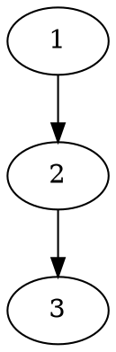
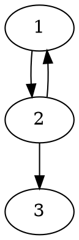

## 数据库设计过程
1. 需求分析
2. 概念设计
    E-R模型设计
3. 逻辑设计
    将E-R模型转化为关系数据库模式
4. 模式求精
5. 物理设计
6. 应用与安全设计

## 数据表的组成
* 关系：一个关系对应一张表
* 元组：表中一行称为一个元组
* 属性：表中一列称为一个属性
* 关系模式：通过关系名和属性名列表对关系进行描述，相当于表的标题和表头

## 数据库系统组成
* 数据库（DB）
* 数据库管理系统（DBMS）
* 数据库应用（DBAP）
* 数据库管理员（DBA）
* 计算机基本系统

## 数据库中的语言
* DDL：数据定义语言
* DML：数据操纵语言
* DCL：数据控制语言。安全保密控制、存储权限控制等

## 模式和数据
模式：对数据库中数据所进行的一种结构性描述，仅仅设计型的描述，不涉及具体的值

视图/数据：某一种表现形式下表现出来的数据库中的数据

## 三级模式
外模式/子模式/用户模式：数据库用户能够看到和处理的局部数据的**结构描述**

逻辑模式/模式/概念模式：从全局角度理解的数据库中全体数据数据的**结构描述**

内模式/存储模式：数据的物理结构和存储方式的描述，含存储路径、存储方式、索引方式等

**三级模式分别对应三级视图，外部视图、概念视图和内部视图**

单说**模式**指的是**概念模式/逻辑模式**，单说**视图**指的是**外部视图/用户视图**

## 两层映像
### 1. 外模式/模式映像（E-C映像）
* 将外模式映射为模式，从而支持实现数据概念视图向外部视图的转换
* **便于用户观察和使用**

### 2. 模式/内模式映像（C-I映像）
* 将模式映射为内模式，从而支持实现数据概念视图向内部视图的转换
* **便于计算机进行存储和处理**

**用户定义三级模式，系统自动实现两层映像**

## 两个独立性
### 1. 逻辑数据独立性
当逻辑模式变化时，可以不改变外模式，只需改变外模式/模式映像，从而无需改变应用程序

### 2. 物理数据独立性
当内部模式变化时，可以不改变逻辑模式，只需改变模式/内模式映像，从而不改变外部模式

## 数据模型
**数据模型**用来描述**模式**，**模式**用来描述**数据**

数据模型由
* **数据结构**
* **数据操作**
* **数据完整性约束**

3部分组成

数据模型是对模式本身结构的抽象，模式是对数据本身结构形式的抽象

数据模型的例子：
**关系模型**：所有模式都可抽象为表的形式（**数据结构**），每一个具体的模式都是拥有不同列名的具体的表。对这种表形式的数据有哪些**操作**和**约束**

#### 三大数据模型
* 层次模型：**树**的形式组织数据
* 网状模型：**图**的形式组织数据
* 关系模型：**表**的形式组织数据。消除了层次模型和网状模型的指针


## 关系模型
一个关系对应一个表

关系模型就是处理表的，由三个部分组成
* 描述DB各种数据的基本结构形式
* 描述Table与Table之间所可能发生的各种操作（关系运算）
* 描述这些操作所应遵循的约束条件（完整性约束）

### 关系模型的三个要素
* 基本结构：关系/表
* 基本操作：
    基本的：并、差、乘积、选择、投影
    扩展的：交、连接、除
* 完整性约束：实体完整性、参照完整性、用户自定义完整性
### 关系运算
关系运算：关系代数和关系演算

关系演算：元组演算和域演算

关系代数示例：基于集合的运算

元组演算示例：基于逻辑的运算

域演算：基于示例的演算

### 域
表中列的取值范围

一组值的集合，这组值具有相同的数据类型

集合中元素的个数称为域的**基数**

### 笛卡尔积
一组域$D_1,D_2,...,D_n$的笛卡尔积为：
$D_1\times D_2\times ...\times D_n=\{(d_1,d_2,...,d_n)|d_i \in D_i,i=1,...,n\}$

笛卡尔积的每个元素$(d_1,d_2,...,d_n)$称作一个n-元组

元组$(d_1,...,d_n)$的每一个值$d_i$叫做一个**分量**

笛卡尔积是由n个域形成的**所有可能**的n-元组的集合

若$D_i$的基数为$m_i$，则笛卡尔积的**基数**，即元组个数为
$m_1\times m_2\times ...\times m_n$

### 关系
一组域$D_1,D_2,...,D_n$的笛卡尔积的子集

**笛卡尔积中具有某一方面意义的那些元组被称作一个关系**

关系的不同列可能来自同一个域，为区分，需要为每一列起一个名字，该名字即为**属性名**

### 关系模式
关系的描述称为**关系模式**

关系模式通常被简记为$r(U)$或$r(A_1,A_2,...,A_n)$，其中r为关系名，U为属性名的集合，n是关系的**目**或**度**，关系中元组的数目称为关系的**基数**

域名及属性向域的映像常常直接说明为属性的类型、长度

### 关系模式与关系
同一关系模式下，可有很多的关系

关系模式是关系的结构，关系是关系模式在某一时刻的数据

关系模式是稳定的，关系是某一时刻的值，是随时间可能变化的

### 关系的特性
#### 列是同质
每一列中的分量来自同一域，是同一类型的数据

不同的列可以来自同一个域，所以不同的列要给与不同的属性名

#### 关系和行、列的位置无关：
列位置互换性：区分哪一列是靠列名
行位置互换性：区分哪一行是靠某一或某几列的值（关键字/键字/码字）

关系是以内容（名字或值）来区分的，而不是属性在关系的位置来区分

如下面两个关系是完全相同的关系

丈夫|妻子|儿女
----|---|---
李一|王二|张三
赵四|孙五|周六

丈夫|儿女|妻子
----|---|---
赵四|周六|孙五
李一|张三|王二

#### 不能完全相同
理论上，**关系**的任意两个元组不能完全相同（集合的要求）

现实应用中，**表**可能并不完全遵守此特性

#### 属性不可再分
属性不可再分特性：又被称为关系**第一范式**

### 关系上的一些重要概念
#### 超码
能唯一标识一个元组的属性集
#### 候选码
最小的超码
##### 主属性和非主属性
包含在任何一个候选码中的属性称作主属性

其他属性称作非主属性

最极端的：所有属性构成这个关系的候选码，称为**全码**关系

#### 主码
用户选定候选码的其中一个作为主码

DBMS以**主码**为主要线索管理关系中的各个元组

#### 外码
关系R中的一个属性组，是另一个关系S的主码，这个属性组称为R的**外码**

两个关系通常是靠**外码**连接起来的

### 关系模型的完整性
完整性约束条件作用的对象可以是**关系、元组、列**三种

完整性约束，其状态可以说**静态的**，也可以是**动态的**

静态约束：数据库每一确定状态时的数据对象所应满足的约束条件
动态约束：数据库从一种状态转变为另一种状态时的新、旧值之间所应满足的约束条件

完整性约束又分为立即执行的约束和延迟执行的约束

立即执行约束：检查约束的时机是在一条语句执行完后立即检查
延迟执行约束：需要延迟到整个事务执行结束后再进行检查

#### 1. 实体完整性
关系的主码中的属性值不能为空值

空值：不知道、不存在或无意义的值

#### 2. 参照完整性
若关系r的外码F参照关系s的主码，则关系r中的每一个元组在属性F上的取值，要么为空值null，要么等于关系s中某个元组的主码值

#### 3. 用户自定义完整性
用户针对具体的应用环境定义的完整性约束条件

## 关系代数
基本思维：一个集合，施加一个操作得到一个集合，一次施加关系代数操作，进而得到所需结果。以集合为中心

两类操作
1. 集合操作：
    * 并
    * 交
    * 差
    * 笛卡尔积
2. 纯关系操作
    * 投影
    * 选择
    * 连接
    * 除

### 并相容性
并、差、交等，需满足并相容性

定义：
R与S存在相容性，当且仅当
1. 关系R和关系S的属性数目相同
2. 对于任意i，关系R的第i个属性的域必须和关系S的第i个属性的域相同

### 并
记作$R\cup S$，它由或者出现在关系R中，或者出现在S中的元组构成

数学描述：$R\cup S=\{t|t\in R\lor t\in S\}$

将两个关系的元组合并成一个关系，在合并时去掉重复的元组

### 差
记作R-S，由出现在R中但不出现在S中的元组构成

数学描述：$R-S=\{t|t\in R\land t\notin S\}$

### 笛卡尔积
由关系R中的元组与关系S的元组进行所有可能的拼接构成

### 选择
给定一个关系R，同时给定一个选择的条件con，选择运算结果也是一个关系，记作$\sigma_{con} (R)$，它从关系R中选择出满足给定条件con的元组构成

数学描述：$\sigma_{con}(R)=\{t|t\in R\land con(t)='真'\}$

### 投影
给定一个关系R，A为R的属性集，从关系R中选出属性包含在A中的列构成，记作$\Pi_A(R)$

如果投影后有重复元组，应该**去除**

### 交
假设关系R与S是并相容的，则关系R与关系S的交运算结果也是一个关系，记作$R\cap S$

交运算可以通过差运算来实现
$R\cap S=R-(R-S)=S-(S-R)$

### $\theta$-连接
涉及多个表之间的操作

从关系r和关系s的笛卡尔积中，选取r关系中属性A与S中属性B之间满足$\theta$条件的所有元组

数学描述
$r\bowtie_{\theta}s=\sigma_\theta(r\times s)$

#### 等值连接
$\theta$为等值比较谓词的连接运算
##### 自然连接
一种特殊的等值连接，要求两个参与连接的关系具有公共的属性集，即$R\cap S\neq \empty$，并在这个公共属性集上进行等值连接；同时，还要求将连接结果中的重复属性列去除掉，即在公共属性集中的列只保留一次（**$\theta$连接不去除重复列**）

R:
A|B
-|-
a|1

S:
B|C
-|-
1|x

$R\times S$
A|B|B|C
-|-|-|-
a|1|1|x

$R\bowtie S$
A|B|C
-|-|-
a|1|x

### 除
用于求解“查询全部的、所有的”问题

前提条件：给定关系$R(A_1,A_2,...,A_n)$为n度关系，关系$S(B_1,B_2,...,B_m)$为m度关系。当且仅当：属性集$\{B_1,...,B_m\}$是属性集$\{A_1,...,A_m\}$的真子集时，可以进行关系R与关系S的除运算

$R\div S$的结果关系是k=m-n度关系，由$\{C_1,...,C_m\}$属性构成

$R\div S$的元组和S中的每一个元组相组合构成的新元组，都得在R当中

数学描述：
$R\div S=\{t|t\in\Pi_{R-S}(R)\land\forall u\in S(tu\in R)\}$

### 外连接
把不能连接的元组也保留到结果关系中，如关系r中不能连接的元组在结果元组中的关系s的属性上可以全部置为空值null

只把左关系中不能连接的元组保留到结果关系中，则称为**左外连接**，反正称为**右外连接**，左右都保留称为**全外连接**

## SQL
集DDL,DML和DCL于一体的数据库语言

DDL语句引导词：create（建立）,alter（修改）,drop（撤销）

DML语句引导词：insert,delete,update,select

DCL语句引导词：grant,revoke
授权和撤销授权

### DDL
#### 创建数据库
```sql
create database 数据库名
```

#### 创建表
```sql
create table 表名（列名 数据类型[Primary key|Unique][Not null][,列名 数据类型[Not null],...])
```
Primary key：主码约束。每个表只能创建一个主码约束。

Unique：唯一性约束（即候选键）。可以有多个唯一性约束

Not null：非空约束。是指该列允许不允许有空值出现

示例：
定义学生表Student
```sql
create table Student(S# char(8) not null,Sname char(10),Ssex char(2), Sage integer,D# char(2),Sclass char(6))
```

#### 修正数据库
修正数据库的定义，主要是修正表的定义
``` sql
alter table tablename
[add {colname datatype,...}]    #增加新列
[drop {完整性约束名}]   #删除完整性约束
[modify {colname datatype,...}] #修改列定义
```
#### 撤销基本表
drop table 表名

delete语句只是删除表中的元组，而drop语句是撤销包含表格式、表中所有元组、由该表导出的视图等相关的所有内容

#### 撤销数据库
drop database 数据库名

### DML
#### 向表中追加元组
```sql
insert into 表名[(列名[,列名]...)] values (值[,值],...)
```

示例，追加学生表中的元组
```sql
insert into student(S#,Sname,Ssex,Sage,D#,Sclass)
values('9803','张四','女',20,'03','98')
```

#### 简单单表查询
select - from - where

默认select是有重复元组的，select distinct可以去重

#### 检索结果排序
select - from -where - order by

order by 列名 [asc|desc]

#### 模糊查询
select - from - where like

列名 [not] like '字符串'
给定字符串中可以出现匹配符

匹配规则：
%:匹配零个或多个字符
_:匹配任意单个字符
\:转义字符

#### 多表联合查询
通过广义笛卡尔积后再进行选择运算来实现
```sql
select 列名 [[,列名]...]
from 表名1,表名2,...
where 检索条件
```
相当于$\Pi_{列名,...,列名}(\sigma_{检索条件}(表名1\times 表名2\times ...))$

检索条件中要包含连接条件，通过不同的连接条件可以实现等值连接、不等值连接及各种$\theta$-连接

如果连接的两个表重名，as可以用来给表起别名。as也可以用来给列起别名

#### 批量数据新增
```sql
insert into 表名 [(列名[,列名]...)]
子查询
```

#### 删除命令
```sql
delete from 表名
[where 条件表达式]
```
如果where条件省略，则删除所有的元组

#### 更新命令
```sql
update 表名
set 列名=表达式|（子查询）
[where 条件表达式]
```
如果where条件省略，则更新所有的元组

### 子查询
#### （Not）IN
表达式 [not] in (子查询)

#### 非相关子查询和相关子查询
带有子查询的语句区分为外层查询和外层查询

**非相关子查询**：内层查询独立进行，没有涉及任何外层查询相关信息的子查询

**相关子查询**：内层查询需要依靠外层查询的变量
外层向内层传递的参量需要使用外层的表名或表别名来限定

相关子查询只能由外层向内层传递参数，而不能反之；这也成为变量的作用域原则

#### $\theta$-some/$\theta$-all子查询

表达式 $\theta$ some (子查询)
表达式 $\theta$ all (子查询)


$\theta$是比较运算符：<,>,>=,<=,=,<>

表达式的值与子查询结果的某一个值相比较满足$\theta$关系，则用some
表达式的值与子查询结果的所有值相比较满足$\theta$关系，则用all

##### 等价性变换
如下两种表达方式含义是相同的
```sql
表达式 = some (子查询)
表达式 in (子查询)
```

```sql
表达式 not in (子查询)
表达式 <> all (子查询)
```

#### (not)exists 子查询
子查询结果中有无元组存在

不加not的exists可以不同

not exists更有用，可以查询所有、全部的情况，相当于关系代数中的除运算

示例：检索学过001号老师主讲的所有课程的所有同学的姓名
```sql
select Sname from Student
where not exists # 不存在
    (select * from Course   // 有一门001教师主讲课程
    where Course.T#='001' and not exists    // 该同学没学过
        (select * from SC
        where S#=Student.S# and C#=Course.C#))
```

### 结果计算
可以计算两个属性的差、和、乘积等

### 聚集函数
五个内置聚集函数：
* count
* sum
* avg
* max
* min

#### 分组查询
求每一门课程的平均成绩

```sql
select 列名
from 表名
[where 检索条件]
[group by 分组条件]
```

分组条件可以是
列名1，列名2，...
##### 分组过滤
```sql
select 列名
from 表名
[where 检索条件]
[group by 分组条件 [having 分组过滤条件]]
```

### 并-交-差
并运算：union，交运算：intersect，差运算：except
```sql
子查询 {union [all]|intersect [all]|except [all] 子查询}
```
通常情况下自动删除重复元组，相当于集合操作：不带ALL。若要保留重复的元组，则要带ALL

假设子查询1的一个元组出现m次，子查询2的一个元组出门n次，则结果为
union all 出现m+n次
intersect all 出现min(m,n)次
except all 出现max(0,m-n)次

### 空值的处理
is [not] null

null值参与算术运算，则该算术运算的值为null

null值参与比较运算，结果可视为false

null值参与聚集运算，除count(*)之外，其他聚集函数都忽略null

### 连接运算
表1 join 表2 {on 连接条件|using (colname)}

inner join：$\theta$-连接

left outer join,right outer join,full outer join：外连接

natural join：自然连接，公共属性只出现一次（很多DBMS不支持）

### 视图
对应逻辑模式的数据在SQL中被称为**基本表**，对应外模式的数据称为**视图**。视图不仅包含外模式，而且包含其外模式/模式映像

视图是虚表，是从一个或几个基本表（或视图）中导出的表，在系统的数据字典中仅存放了视图的定义，不存放视图对应的数据。当基本表中的数据发生变化时，从视图中查询出的数据也随之改变

视图的主要作用：
1. 简化用户的操作
2. 使用户能以多种角度看待同一数据
3. 对重构数据库提供了一定程度的逻辑独立性
4. 能够对机密数据提供安全保护
5. 适当地利用视图可以更清晰地表达查询

#### 定义视图
```sql
create view view_name [(列名,..)]
as 子查询 [with check option]
```

#### 更新视图
```sql
update 视图名
set ...
[where]
```
对视图数据的更改最终要反映到对基本表的更改上。

如果视图的定义中包含了表达式，或聚合运算，或消除重复值运算，则不能对视图进行更新操作

#### 撤销视图
```sql
drop view 视图名
```

## 数据库完整性
* **关系约束/表约束**：对若干元组间、关系集合上以及关系之间的联系的约束
* **列约束**：对列的类型、取值范围、精度、是否允许控制等的约束条件
* **元组约束**：元组中属性间的联系的约束

### 列约束
```sql
{NOT NULL|
    [CONSTRAINT constraintname]
        {UNIQUE
        |PRIMARY KEY    # 主键
        |CHECK(search_cond) # 列值满足用户自定义条件
        |FOREIGN KEY(colname) REFERENCES tablename[(colname)]   # 外键
            [ON DELETE {CASCADE|SET NULL}]
        }
}
```
只能应用在单一列上，后面的约束只能是单一列非空、单一列唯一、单一列为主键或单一列相关

### 关系约束
对多列或元组的值进行约束
```sql
[CONSTRAINT constraintname]
    {UNIQUE
    |PRIMARY KEY    # 主键
    |CHECK(search_cond) # 列值满足用户自定义条件
    |FOREIGN KEY(colname) REFERENCES tablename[(colname)]   # 外键
        [ON DELETE {CASCADE|SET NULL}]
    }
```

create table中定义的表约束或列约束可以在之后撤销或追加。撤销或追加约束的语句是alter table
```sql
alter table tablename
    add colname 列约束条件,    #新增一列
    drop column columnname, #删除一列
    modify columnname data-type 列约束条件, #修改一列
    add constraint constrain_name,   #新增一个表约束条件
    drop constraint constraint_name,    #删除一个表约束条件
    drop primary key    #删除主码约束
```
### 实体完整性
单个属性的主码定义，可以定义为列级约束，也可以定义为表级约束

列约束定义示例
```sql
create table class(
    classNo char(6) not null primary key,
    ...
)
```

关系约束定义示例
```sql
create table class(
    classNo char(6) not null,
    constraint ClassPK primary key (classNo)
)
```

多个属性的主码定义只能定义为关系约束，主码定义可以不写约束名

```sql
create table sc(
    studentNo char(6) not null,
    courseNo char(3) not null,
    PRIMARY KEY(studentNo,courseNo)
)
或者
create table sc(
    studentNo char(6) not null,
    courseNo char(3) not null,
    CONSTRAINT scPK PRIMARY KEY(studentNo,courseNo)
)
```

### 触发器
用户定义在关系表上的一类由事件驱动的存储过程，由服务器自动激活
```sql
CREATE TRIGGER triggerName
ON tableName
FOR {INSERT|UPDATE|DELETE}
AS SQL语句
```

## 数据库安全性
### DBMS的安全机制
* 自主存取控制
* 强制存取控制

### 自主存取控制
* 授权者：决定用户权利的人
* 授权：授予用户访问的权利

访问规则通常存放在**数据字典**中

自助存取控制通过SQL的GRANT和REVOKE语句实现

```sql
GRANT {all|<command_list>} TO {public|<username_list>}
REVOKE {all|<command_list>} FROM {public|<username_list>}
```

## 游标
对SELECT语句返回的结果值进行逐行处理。可对游标的当前位置进行更新、查询和删除

## 数据库建模
表达计算机世界的模型称为**数据模型**，如关系模型、网状模型、层次模型；表达信息世界的模型称为**概念模型**，如E-R模型，信息世界是对现实世界的抽象

数据建模是抽象，抽象是**理解-区分-命名-表达**

数据库设计过程可分为如下6个步骤
1. 需求分析
2. 概念设计
    E-R模型在这个阶段行程
3. 逻辑设计
    将E-R模型转化为关系数据库模式
4. 模式求精
5. 物理设计
6. 应用与安全设计

### E-R模型
* 实体
* 属性
* 联系
* 关键字/码

### 实体
**实体**是客观世界中可区别于其他事物的“事物”或“对象”

**实体集**是指具有相同类型及相同性质（或属性）的实体集合

#### 属性
实体是通过一组属性来描述的，**属性**是实体集中每个实体都具有的特征描述

**简单属性**是指不能再分为更小部分的属性，**复合属性**是指可以进一步划分为更小部分的属性

**单值属性和多值属性**：每个实例的该属性值是一个还是多个

关键字、码：能与其他实体唯一区分开的属性

派生属性：某属性的值可以从其他相关属性派生出来，如年龄

### 联系
多个实体间的相互关联

**联系集**是同类联系的集合

#### 联系的度
参与发生联系的实体的数目，称为联系的**度**或**元**

一元联系：构成，包含
二元联系
三元联系：供货商、零件、工程项目

#### 多联系
给定的各实体之间可以有多种不同的联系，如教师和学生实体集之间存在授课联系和指导联系

#### 实体的角色
实体在联系中的作用称为**实体的角色**

#### 联系的基数
在二元联系中，有4种
1. 一对一（1:1）
2. 一对多（1:m）
3. 多对一（m:1）
4. 多对多（m:n）

联系的基数还要区分是0个、1个、不定数目的多个还是固定数目的多个

通常以实体参与联系的最小基数和最大基数来标记

**完全参与联系**：该端实例至少有1个参与联系，最小基数为1（1...m）
**部分参与联系**：该端实例可以不参与联系，最小基数为0（0...m）

### Chen方法
* 实体：矩形框
    * 弱实体集：双线矩形
* 属性：椭圆
    * 多值属性：双线椭圆
    * 导出属性：虚线椭圆
* 关键字、码：下划线
    * 弱实体集关键字：下划虚线
* 联接实体和属性：直线
* 联系：菱形框
    * 与弱实体集的联系：双线菱形框
* 连接联系和属性：直线
* 连接实体与联系：直线
* 复合关键字：下划线下面标有相同数字
* 多组关键字：下划线下面标有不同数字

* 1:1联系：双箭头直线，由联系指向实体
* 1:m联系：指向1端为箭头，指向多端没有箭头
* m:n联系：无箭头直线
* 弱实体集参与联系：双直线

### 弱实体集
其属性不足以形成主码，必须依赖于其他实体集的存在而存在，称这样的实体集为**弱实体集**

弱实体集中用来表示弱实体的属性集称为该弱实体集的**部分码**

## 函数依赖
X上的值相等时，Y的值一定相等，则称X决定Y，或Y函数依赖于X

### 完全函数依赖和部分函数依赖
在R(U)中，若X决定Y并且对于任何X的真子集X'都有X'不能决定Y，则称Y完全函数依赖于X，否则称Y部分函数依赖于X

### 传递函数依赖
在R(U)中，若$X\to Y,Y\to Z$且$Y\not\subset X,Z\not\subset Y,Z\not\subset X,Y\not\to X$，则称Z传递函数依赖于X

### 候选键
设K为R(U)中的属性或属性组合，若K完全决定U，则称K为R(U)上的候选键

#### 超键
只要包含候选键就是超键。候选键是最小的超键

#### 外键
R(U)中的属性或属性组合X是另一个关系的候选键，则称X为R(U)的外键

### 逻辑蕴涵
设F为一个函数依赖集合，从F能够推导出$X\to Y$，则称F逻辑蕴涵$X\to Y$

### 闭包
被F逻辑蕴涵的所有函数依赖集合称为F的闭包，记作F^+^

若F^+^=F，则说F是一个全函数依赖族（函数依赖完备集）

### 函数依赖的Armstrong公理
设R(U)为属性集$U=\{A_1,A_2,...,A_n\}$上的一个关系模式，F为R(U)的一组函数依赖，记为R(U,F)，则有如下规则成立
1. **自反律**：若$Y\subseteq X\subseteq U$，则$X\to Y$被F逻辑蕴涵。
一个属性组可以决定它自身的每个属性
2. **增广律**：若$X\to Y\in F$，且$Z\subseteq U$，则$XZ\to YZ$。
一个函数依赖两端加上相同的属性，则这个函数依赖仍然成立
3. **传递律**：若$X\to Y\in F$，且$Y\to Z$，则$X\to Z$被F逻辑蕴涵

由公理引出的引理
1. 合并律：若$X\to Y$且$X\to Z$，则$X\to YZ$
证明：由$X\to Y$和增广律，可以推出$X\to XY$。由$X\to Z$和增广律，可以推出$XY\to YZ$。再由传递律，可得：$X\to YZ$
2. 伪传递律：若$X\to Y$且$WY\to Z$，则$XW\to Z$
证明：由$X\to Y$和增广律可得$XW\to WY$。再由传递律即可得$XW\to Z$
3. 分解律：若$X\to Y$且$Z\subseteq Y$，则$X\to Z$
证明：由$Z\subseteq Y$和自反律，可得$Y\to Z$，再由$X\to Y$及传递律，可以推出$X\to Z$

### 属性集闭包
由Armstrong公理从F推导出X可以决定的所有属性，则该属性集为X关于F的属性集闭包

### 正则覆盖
正则覆盖$F_c$是一个函数依赖集，使得F逻辑蕴涵$F_c$中的所有函数依赖，$F_c$逻辑蕴涵F中的所有函数依赖，而且必须具有下列特性
1. $F_c$中的任何函数依赖都不包含无关属性
2. $F_c$中函数依赖的左半部都是唯一的，即$F_c$中不存在两个函数依赖$\alpha\to\beta_1$和$\alpha\to\beta_2$

## 关系范式
### 第一范式（1NF）
R(U)中每个分量都是不可分的数据项，则称R(U)属于第一范式，记为$R(U)\in 1NF$

### 第二范式（2NF）
若$R(U)\in 1NF$且U中的每一个非主属性完全函数依赖于候选键，则称R(U)属性第二范式，记为$R(U)\in 2NF$

消除非主属性的部分依赖

### 第三范式（3NF）
若$R(U,F)\in 2NF$，且R中所有非主属性都直接函数依赖于候选码（即不存在非主属性传递依赖于候选码），则称R(U)属于第三范式，记为$R(U)\in 3NF$

消除非主属性的传递依赖

### BC范式（BCNF）
若$R(U,F)\in 1NF$，对于任何$X\to Y\in F$，当$Y\not\subset X$时，X必含有候选键，则称R(U)属于Boyce-Codd范式，记为$R(U)\in BCNF$

即在关系模式R中，F^+^中的每一个非平凡函数依赖的决定属性集$\alpha$都包含候选码（必须考虑F^+^而不是F中的每个函数依赖）

消除了主属性对码的部分和传递依赖

## 模式分解
### 模式分解的定义
R(U)的分解是指用R的一组子集$\rho=\{R_1(U_1),...,R_k(U_k)\}$来代替它。其中$U=U_1\cup U_2\cup ...\cup U_k;U_i\not\subset U_J(i\neq j)$

模式分解需要关注：
* $R与\rho$在数据内容方面是否等价：分解的**无损连接性**
* $R与\rho$在数据依赖方面是否等价：分解的**保持依赖性**

### 无损连接分解
若对于R的任何满足函数依赖集F的关系r，有
$r=\Pi_{R_1}(r)\Join ...\Join \Pi_{R_k}(r)$，则称分解为无损连接分解

分解后通过自然连接和投影操作可以还原

### 保持依赖分解
$\Pi_{R_i}(r)$中的所有依赖的并集（i=1,...,k）逻辑蕴涵F的每个依赖，即$(F_1\cup F_2\cup ...\cup F_n)^+=F^+$，则称分解$\rho$为保持依赖分解

有关系模式R(A,B,C)，存在函数依赖A->B,B->C，如果分解成R1(A,B),R2(B,C)，就是保持了函数依赖，如果分解成R3(A,C)，就是破坏了函数依赖。

但如果存在函数依赖A->B,B->C,A->C，如果分解成R1(A,B),R2(B,C)，还是保持了函数依赖

### 关系模式分解成BCNF
将左侧不含候选码的函数依赖每个单独组成一个关系，将包含候选键的全部组成一个关系

该分解是无损连接分解，但不一定保持依赖
### 关系模式分解成3NF
对F中每个函数依赖生成一个关系模式$R_i$，不出现在F中的属性单独组成一个模式，去除重复和被包含的模式，如果任意$R_i$都不包含R的候选码，再添加一个由候选码构成的$R_i$

该分解既是无损连接分解，也是保持依赖分解
## 事务
### 三种典型的不一致现象
#### 1. 脏读（读脏数据）
T2读取了T1修改但未提交的数据后，T1由于某种原因中止而撤销，这时T2就读取了不一致的数据。数据库中将这种读取未提交且被撤销的数据为读脏数据

#### 2. 不可重复读
事务T2两次从数据库中读取的结果不同，分为3种情况
1. T2读取一数据后，T1对该数据进行了更改，当T2再次读取该数据时，会读到和前一次不同的值
2. T2按某条件读取数据库中某些记录后，T1删除了其中部分记录。当T2再次按相同条件读取时，发现记录数变少了
3. T2按某条件读取数据库中某些记录后，T1插入了新的纪录。当T2再次按相同条件读取时，发现记录数变多了

2和3这两种情况也称为**幻读**
#### 3. 丢失更新
两个或多个事务都读取了同一数据值并修改，最后提交的事务执行结果覆盖了前面事务提交的执行结果，从而导致前面事务的更新被丢失

### 事务的隔离级别
#### 1. 读未提交
未提交读，允许事务读取未提交的数据，脏读、不可重复读和幻读都可能发生
#### 2. 读已提交
只允许读取已经提交的数据，避免脏读，但不可重复读仍可能发生
#### 3. 可重复读
保证在同一个事务中多次读取同样数据的结果是一样的，避免脏读和不可重复读（除幻读外），但幻读仍可能发生
#### 4. 可串行化
保证事务串行化执行，避免脏读、不可重复读和幻读，但执行效率低


### 事务的ACID特性
* 原子性：事务的所有操作要么全部都被执行，要么都不被执行
* 一致性：事务执行前、执行中、执行后，数据库中的状态都是稳定且一致的，可以精准判断数据变化。模拟现实世界，从一个正确的状态到另一个正确的状态
* 隔离性：当多个事务并发执行时，一个事务的执行不能影响另一个事务，即并发执行的各个事务不能相互干扰
* 持久性：一个事务成功提交后，它对数据库的改变必须是永久的，即使随后系统出现故障也不会受到影响
### 原子性的实现
undo log

增删改时都要记录undo log，出现异常时反向执行undo log

### 隔离性的实现
#### 写-写隔离
锁实现

共享锁、排它锁

表锁、行锁

#### 写-读隔离
MVCC实现

连接undo log形成版本链

### 持久性的实现
redo log

故障后，重新执行


### 事务调度
多个事务操作组成的随机执行序列称为一个**调度**。由一组事务操作组成的调度序列而言，应满足下列条件：
1. 该调度包含该组事务的全部操作
2. 属于同一个事务的操作应保持在原事务中的执行顺序

#### 串行调度
在调度中，如果属于同一事务的操作都是相邻的，称为**串行调度**

#### 并发调度
同一事务的操作可交错执行

当且仅当并发调度下所得到的新数据库结果与分别串行地运行这些事务所得的新数据库结果完全一致，则说调度是正确的

**可串行性**：不管数据库初始状态如何，一个调度对数据库状态的影响都和某个串行调度相同，则说这个调度具有**可串行性**

可串行化的调度一定是正确调度，但正确调度不一定是可串行化的调度。

并行调度的正确性是指内容上结果正确性，而可串行性是指形式上结果正确性

可串行化的等效串行序列不一定唯一

### 冲突操作
不同事务在相同数据对象上的操作，至少有一个是写操作，则这两个操作是**冲突操作**

### 冲突等价
如果一调度S可以经过交换一系列非冲突操作执行的顺序而得到一个新的调度S'，则称S和S'是**冲突等价**的

### 冲突可串行化
如果一调度S与一串行调度是冲突等价的，则称S是**冲突可串行化**的

* **冲突可串行性**是比**可串行性**更严格的概念
* 满足冲突可串行性，一定满足可串行性，反之不然

例子：
调度：w1(Y);w2(Y);w2(X);w1(X);w3(X)
和
串行调度：w1(Y);w1(X);w2(Y);w2(X);w3(X)
等价，因为最终都是w3去写X的值，所以它是可串行化调度，
但它不是冲突可串行化调度，因为不能和串行调度冲突等价

#### 冲突可串行化判别算法
* 构造一个有向图，称为**优先图** 
* 顶点是每一个事务Ti，如果Ti的一个操作与Tj的一个操作发生冲突，且Ti在Tj前执行，则绘制一条边，由Ti指向Tj
* 如果优先图中无环，则是冲突可串行化的，如果有环，则是非冲突可串行化的

示例
r2(A);r1(B);w2(A);r3(A);w1(B);w3(A);r2(B);w2(B)



r2(A);r1(B);w2(A);r2(B);r3(A);w1(B);w3(A);w2(B)


### 基于封锁的并发控制方法
共享锁、读锁（S锁）：一个事务对数据对象A加上S锁之后，只允许该事务可读，但不可写，其他事务只能再对A加S锁
排他锁、写锁（X锁）：一个事务对数据对象A加上X锁之后，只允许该事务可读可写，其他事务不能再对A加任何锁