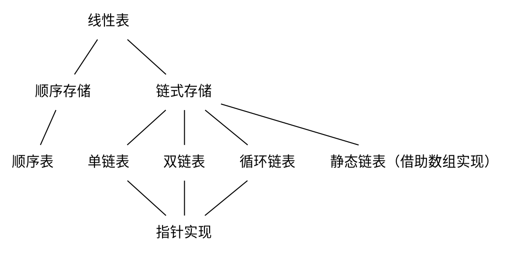

## Chapter 1
数据元素    数据对象

### 逻辑结构
* **线性结构**
* **集合结构**
* **树形结构**
* **图形结构**

### 物理结构（存储结构）
* 数组（顺序存储结构）
* 链表（链式存储结构）

### ADT-abstract data type 抽象数据类型
#### 定义
一个数学模型以及定义在该模型上的一组操作
#### 一般描述形式
ADT 抽象数据类型名称 {
    数据对象：
    ……
    数据关系：
    ……
    操作集合：
    操作名1：
    ……
    ……
    操作名n：
}

#### 例子 
ADT 自然数
* Objects: 从0到无穷大的整数
* Functions: + - * / =
#### 关键
使用它的人可以只关心它的逻辑特征，不需要了解它的存储方式。定义它的人同样不必要关心它如何存储。
#### ADT的两个步骤
1. 实现ADT（封装）
2. 使用ADT

实现和使用隔离

### 算法
#### 算法满足
* 输入
* 输出
* 确定性
* 有穷性
* 有效性

#### 衡量算法的标准
* Correctness 正确性
* Readability 可读性
* Robustness 健壮性
* Usability 可用性
* Simplicity 简洁性
* **Efficiency 效率**（核心的）

#### 衡量效率的指标
* 时间
* 内存空间

#### 时间复杂度
##### 大O表示法
一个语句的频度是指该语句在算法中被重复执行的次数。算法中所有语句的频度之和记为**T(n)**，它是该算法问题规模n的函数，时间复杂度主要分析T(n)的数量级。算法中基本运算（*最深层循环内*的语句）的频度与T(n)同数量级，因此通常采用算法中基本运算的频度f(n)来分析算法的时间复杂度。因此，算法的时间复杂度记为$$T(n)=O(f(n))$$
O的含义是T(n)的数量级，其严格的数学定义是：若T(n)和f(n)是定义在正整数集合上的两个函数，则存在正常数C和$n_0$，使得当$n\geqslant n_0$时，都满足$0\leqslant T(n)\leqslant Cf(n)$.图示如下：

可以总结为: 
**T(n)增长率小于等于f(n)**

##### 除此之外的表示法
* $T(n)=\Omega(g(n))$
T(n)增长率大于等于g(n)
* $T(n)=\Theta(b(n))$
T(n)增长率等于b(n)
* $T(n)=o(p(n))$
T(n)增长率小于p(n)

---

* **最坏时间复杂度**是指在最坏情况下，算法的时间复杂度
* **平均时间复杂度**是指所有可能输入实例在等概率出现的情况下，算法的期望运行时间
* **最好时间复杂度**是指在最好情况下，算法的时间复杂度

一般总是考虑最坏时间复杂度，以保证算法的运行时间不会比它更长

##### 加法规则
$$T(n)=T_1(n)+T_2(n)=O(f(n))+O(g(n))=O(max(f(n),g(n)))$$

##### 乘法规则
$$T(n)=T_1(n)\times T_2(n)=O(f(n))\times O(g(n))=O(f(n)\times g(n))$$

##### 常见的时间复杂度
$$O(1)<O(\log_2 n)<O(n)<O(n\log_2 n)<O(n^2)<O(n^3)<O(2^n)<O(n!)<O(n^n)$$

#### 空间复杂度
算法的空间复杂度S(n)定义为该算法所耗费的存储空间，它是问题规模n的函数。记为$S(n)=O(g(n))$

## 第二章 线性表

### 定义和基本操作
#### 定义
**线性表**是具有**相同**数据类型的n个数据元素的**有限**序列，其中n为表长，当n=0时该线性表是一个空表。若用L命名线性表，则其一般表示为
$$L=(a_1,a_2,...,a_i,a_{i+1},...,a_n)$$

#### 特点
* 表中元素个数有限
* 表中元素具有逻辑上的顺序性，在序列中各元素排序有其先后次序
* 表中元素都是数据元素，每个元素都是单个元素
* 表中元素的数据类型都相同，这意味着每个元素占有相同大小的存储空间
* 表中元素具有抽象性，即仅讨论元素间的逻辑关系，而不考虑元素究竟表示什么内容

**注意：线性表是一种逻辑结构，表示元素之间一对一的相邻关系。顺序表和链表是指存储结构，两种属于不同层面的概念，因此不要将其混淆**

#### 基本操作
* InitList(&L): 初始化表。构造一个空的线性表
* Length(L): 求表长。返回线性表的长度
* LocateElem(L,e): 按值查找操作。在表中查找具有给定关键字值的元素
* GetElem(L,i): 按位查找操作。获取表中的第i个位置的元素的值
* ListInsert(&L,i,e): 插入操作。在表中的第i个位置上插入指定元素e
* ListDelete(&L,i,&e): 删除操作。删除表中第i个位置的元素，并用e返回删除元素的值
* PrintList(L): 输出操作。按前后顺序输出线性表的所有元素值
* Empty(L): 判空操作。若L为空表，则返回true，否则返回false
* DestroyList(&L): 销毁操作。销毁线性表，并释放线性表L所占用的内存空间