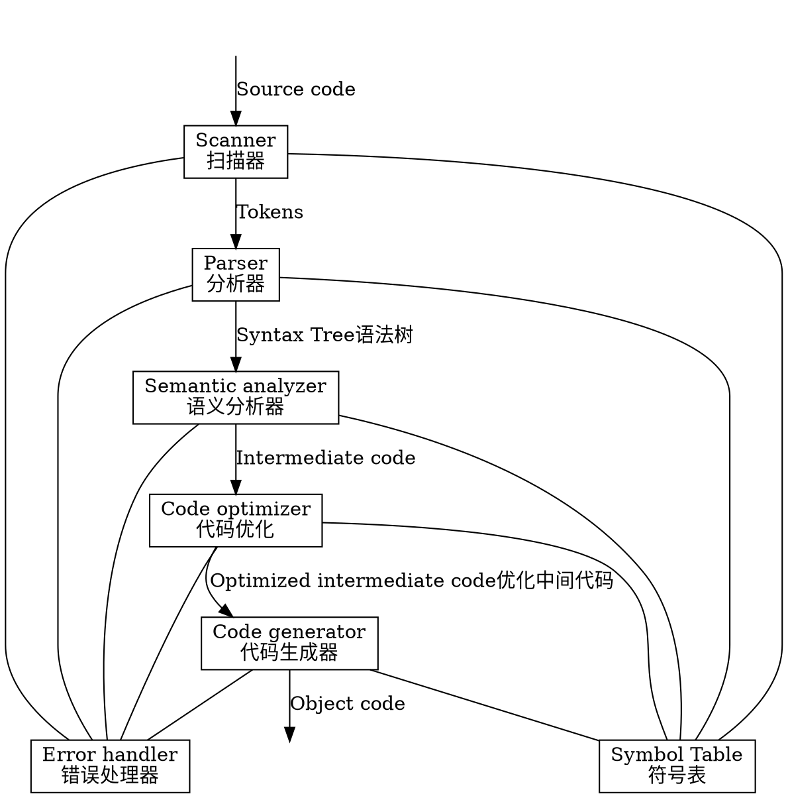
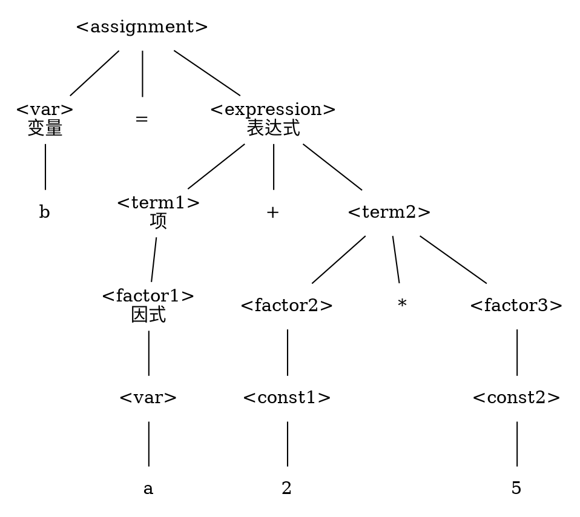
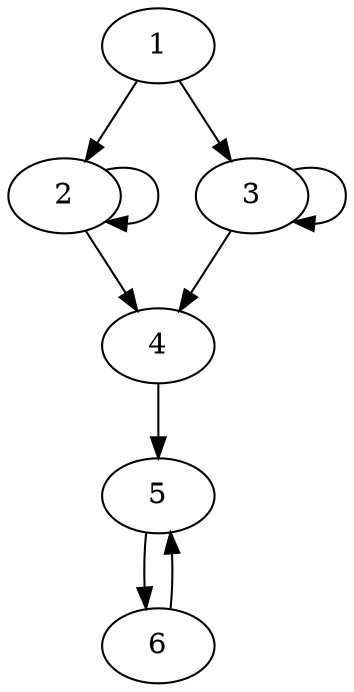
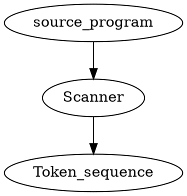
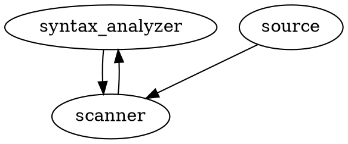

# 总过程


## Scanner
1. keyword 关键词 k
2. identifier 标识符 i
3. const 常量 c
4. delimiter 界符 p

## Parser





# Chapter 4 词法分析
词法分析器也叫扫描器  
两个任务
1. 识别单词——把单词从源程序中分离开
2. 翻译单词——吧识别出的单词翻译成相应的token
##识别单词
### 单词分类
根据语法功能分类
* 标识符Identifier——变量名、函数名、类名等
* 关键字Keywords——由系统定义好的，用来区分不同的语法单元
* 常量Constant——以它自身的形式存在
* 界符Delimiter——
    * 单字——+ -
    * 双字——<> ==
### 单词识别
1. 以字母开头——关键字或标识符
2. 以数字开头——数字型常量
3. 以‘或“开头——字符型常量或字符串常量
4. 其他的——以它自身形式显示

**如何区分关键字和标识符？
大多数语言的关键字是**保留的**，标识符不能和关键字同名
去关键字表中查找，找到了就是关键字

### Token
单词长度不一样，格式不一样
token能实现
1. 长度一致
2. 语法信息和语义信息分离开
token二元组 type|value
type存储语法信息，比如单词类型
value存储语义信息，比如数组维数、上界、数据类型

用指针设计token
四个指针分别指向一个表

## 设计词法分析器
###词法分析器可以分为两种类型
1. 一个单独的扫描器

2. 将扫描器作为语法分析器的子程序来调用

通常是第二种方式

扫描器内部通常是一样的

识别器——一个识别单词的有限自动机

翻译器——将单词翻译成token


1. 识别器——返回已识别的单词
2. 常数处理——把字符型转换成数值型

## 算术常数处理机的设计

带有翻译功能的自动机称为处理机，包含两个部分
1. 识别器（有限自动机），主程序
2. 翻译机，子程序，插入到有限自动机的结点之中

**功能是把字符串型变换成数值型**

### 识别器
算术常量的基本形式
ddddd...d e(+|-)ddd...d

### 翻译器
1. 算法：下列参数
初始值：n=p=m=t=0;e=1
n:拼尾数值变量
    每当读入尾数数字d时，n=10*n+val(d);
p:拼指数值变量
    每当读入指数数字p时，p=10*p+val(d);
m:小数位数变量
    读到小数点后，每当读入小数数字d时，m=m+1
e:指数的符号变量（+为1，-为-1）
t:类型变量(整型为0，实型为1)
Result: $num= n*10^{e*p-m}$

2. 每个结点的功能
q1: Initialization,n=p=m=t=0;e=1;num=0;
q2:n=10*n+val(d);
q3:t=1;
q4:n=10*n+val(d); m=m+1;
q5:t=1;
q6:if'-' then e=-1;
q7:p=10*p+val(d);
δ
```flow
st=>start: 开始
op1=>operation: state=1
op2=>operation: Semfun(state)
op3=>operation: getchar(ch)
op4=>operation: 查变换表：δ(state,ch)=?
con1=>condition: δ=empty
con2=>condition: δ=ok
op5=>operation: state=δ
io=>inputoutput: reject
op6=>operation: Result:num=n*10^{e*p-m}
ed=>end: 结束

st->op1->op2->op3->op4->con1
con1(yes)->io->ed
con1(no)->con2(no)->op5(top)->op2
con2(yes)->op6->ed
```
# Chapter 5 语法分析

识别语法结构，检查语法错误，输出语法树作为结果

##语法分析的分类
推导和规约都行
1. 自顶向下：语法树从根结点开始构造，采用**最左推导**
2. 自底向上：语法树从叶子节点开始构造，采用**最左规约**

以算术表达式为例

自底向上方法的关键是如何确定当前句子的句柄
##递归子程序
###递归子程序的规则
1. 对于每个非终结符都设定一个子程序，用来识别它定义的符号串
2. 每个子程序以相应的非终结符命名
3. 子程序的内容由产生式右部组成

[^_^]:
    ```flow
    st=>start: 入口
    ed=>end: 出口
    a=>condition: a?
    b=>condition: b?
    e=>condition: e?
    c=>condition: c?
    e1=>inputoutput: err1
    e2=>inputoutput: err2
    n1=>operation: NEXT(w)
    n2=>operation: NEXT(w)
    n3=>operation: NEXT(w)
    n4=>operation: NEXT(w)
    A=>subroutine: A
    B=>subroutine: B
    D=>subroutine: D
    st->a
    a(yes)->n1->B->e
    e(yes)->n2->D->ed
    e(no)->e1
    a(no)->b
    b(yes)->n3->A->c
    c(yes)->n4->ed
    c(no)->e2
    b(no)->ed
    ```


1. 扩展文法
    添加一个产生式Z`->Z作为主方法
2. 进入和退出
    子程序入口时，其**首符号**已经读来！
    子程序出口时，其**后继符**应该读来!
3. 设计子程序
    * 遇到终结符，判断与当前单词是否相符，确认是后读取下一单词
    * 遇到非终结符，调用该非终结符表示的子程序，返回后不读取下一单词
    * 遇到空串，直接转出口

### 限制文法
递归子程序将产生式的第一个符号与当前单词相匹配，以便决定用哪个产生式进行推导

限制：
1. 具有相同左部的产生式右部首符号不同
2. 不能有左递归

错误例子
1.  A->aA|aB
2.  A->Ab|a

即要求文法是LL(1)文法

通过等价变化消除左递归