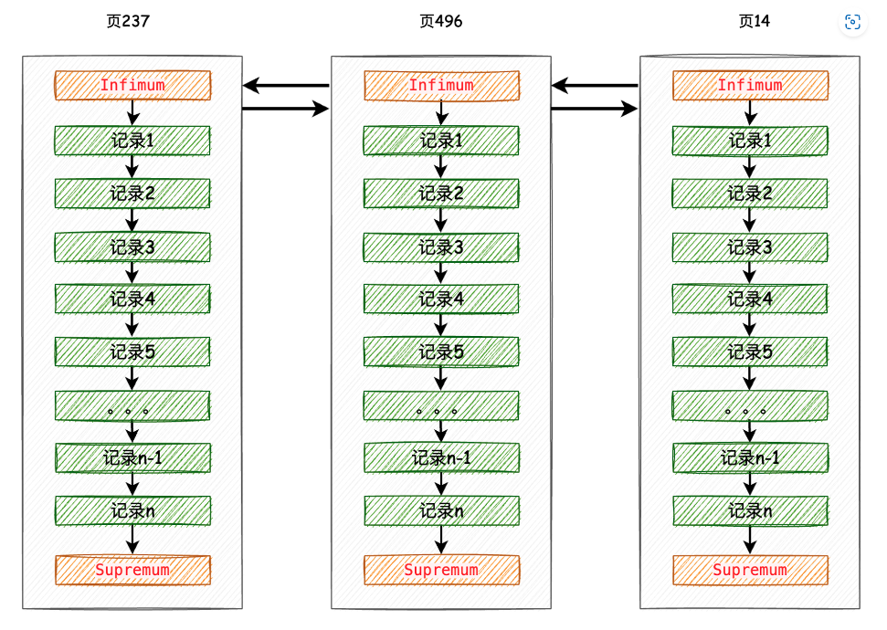

# select poll epoll

# 事务
### 三种典型的不一致现象
#### 1. 脏读（读脏数据）
T2读取了T1修改但未提交的数据后，T1由于某种原因中止而撤销，这时T2就读取了不一致的数据。数据库中将这种读取未提交且被撤销的数据为读脏数据

#### 2. 不可重复读
事务T2两次从数据库中读取的结果不同，分为3种情况
1. T2读取一数据后，T1对该数据进行了更改，当T2再次读取该数据时，会读到和前一次不同的值 **（狭义的不可重复读）**
2. T2按某条件读取数据库中某些记录后，T1删除了其中部分记录。当T2再次按相同条件读取时，发现记录数变少了
3. T2按某条件读取数据库中某些记录后，T1插入了新的纪录。当T2再次按相同条件读取时，发现记录数变多了

2和3这两种情况也称为**幻读**
#### 3. 丢失更新
两个或多个事务都读取了同一数据值并修改，最后提交的事务执行结果覆盖了前面事务提交的执行结果，从而导致前面事务的更新被丢失

### 事务的隔离级别
#### 1. 读未提交
未提交读，允许事务读取未提交的数据，脏读、不可重复读和幻读都可能发生
#### 2. 读已提交
只允许读取已经提交的数据，避免脏读，但不可重复读仍可能发生
#### 3. 可重复读
保证在同一个事务中多次读取同样数据的结果是一样的，避免脏读和不可重复读（除幻读外），但幻读仍可能发生。

MySQL InnoDB 存储引擎的默认支持的隔离级别
#### 4. 可串行化
保证事务串行化执行，避免脏读、不可重复读和幻读，但执行效率低


## 事务的ACID特性
### 原子性
事务的所有操作要么全部都被执行，要么都不被执行
### 一致性
一个单独执行的事务应保证其执行结果的一致性，即总是将数据库从一个一致性状态转化到另一个一致性状态。比如银行转账，一边账户的钱少了，另一边账户的钱必须多，不能丢失
### 隔离性
当多个事务并发执行时，一个事务的执行不能影响另一个事务，即并发执行的各个事务不能相互干扰
### 持久性
一个事务成功提交后，它对数据库的改变必须是永久的，即使随后系统出现故障也不会受到影响

# MySQL
MySQL中常用的索引结构（索引底层的数据结构）有：B-TREE ，B+TREE ，HASH 等

## B-TREE
B-树就是B树，多路搜索树，树高一层意味着多一次的磁盘I/O

B树的特征：

* 关键字集合分布在整颗树中；
* 任何一个关键字出现且只出现在一个结点中；
* 搜索有可能在非叶子结点结束；
* 其搜索性能等价于在关键字全集内做一次二分查找；
* 自动层次控制
## B+TREE
B+树是B-树的变体，也是一种多路搜索树

B+树的特征：

* 所有关键字都出现在叶子结点的链表中（稠密索引），且链表中的关键字恰好是有序的；
* 不可能在非叶子结点命中；
* 非叶子结点相当于是叶子结点的索引（稀疏索引），叶子结点相当于是存储（关键字）数据的数据层；
* 每一个叶子节点都包含指向下一个叶子节点的指针，从而方便叶子节点的范围遍历。
* 更适合文件索引系统；

## InnoDB采用B+树作为索引的原因

1. B+树的磁盘读写代价更低：B+树的内部节点并没有指向关键字具体信息的指针，因此其内部节点相对B树更小，如果把所有同一内部节点的关键字存放在同一盘块中，那么盘块所能容纳的关键字数量也越多，一次性读入内存的需要查找的关键字也就越多，相对IO读写次数就降低了。

2. B+树的查询效率更加稳定：由于非终结点并不是最终指向文件内容的结点，而只是叶子结点中关键字的索引。所以任何关键字的查找必须走一条从根结点到叶子结点的路。所有关键字查询的路径长度相同，导致每一个数据的查询效率相当。

3. 由于B+树的数据都存储在叶子结点中，分支结点均为索引，方便扫库，只需要扫一遍叶子结点即可，但是B树因为其分支结点同样存储着数据，我们要找到具体的数据，需要进行一次中序遍历按序来扫，所以B+树更加适合在区间查询的情况，所以通常B+树用于数据库索引。B+树只需要去遍历叶子节点就可以实现整棵树的遍历。而且在数据库中基于范围的查询是非常频繁的，而B树不支持这样的操作或者说效率太低。

自平衡的多路搜索树，查询效率高

多路层数少，跨磁盘扇区操作就少

同层的节点有指针连接，减少跨扇区

叶子结点存储数据，方便扫库
### 为什么不用哈希索引
1. Hash 索引仅仅能满足”=”,”IN”和”<=>”查询，不能使用范围查询。
由于 Hash 索引比较的是进行 Hash 运算之后的 Hash 值，所以它只能用于等值的过滤，不能用于基于范围的过滤，因为经过相应的 Hash 算法处理之后的 Hash 值的大小关系，并不能保证和Hash运算前完全一样。
2. Hash 索引无法被用来避免数据的排序操作。
由于 Hash 索引中存放的是经过 Hash 计算之后的 Hash 值，而且Hash值的大小关系并不一定和 Hash 运算前的键值完全一样，所以数据库无法利用索引的数据来避免任何排序运算；
Hash 索引不能利用部分索引键查询。
对于组合索引，Hash 索引在计算 Hash 值的时候是组合索引键合并后再一起计算 Hash 值，而不是单独计算 Hash 值，所以通过组合索引的前面一个或几个索引键进行查询的时候，Hash 索引也无法被利用。
3. Hash 索引在任何时候都不能避免表扫描。
前面已经知道，Hash 索引是将索引键通过 Hash 运算之后，将 Hash运算结果的 Hash 值和所对应的行指针信息存放于一个 Hash 表中，由于不同索引键存在相同 Hash 值，所以即使取满足某个 Hash 键值的数据的记录条数，也无法从 Hash 索引中直接完成查询，还是要通过访问表中的实际数据进行相应的比较，并得到相应的结果。
4. Hash 索引遇到大量Hash值相等的情况后性能并不一定就会比B+Tree索引高。
对于选择性比较低的索引键，如果创建 Hash 索引，那么将会存在大量记录指针信息存于同一个 Hash 值相关联。这样要定位某一条记录时就会非常麻烦，会浪费多次表数据的访问，而造成整体性能低下


# MySQL
## 底层如何组织存储
### 行结构

我们平时是以记录为单位来向表中插入数据的，这些记录在磁盘上的存放方式也被称为 行格式 或者 记录格式 


#### 变长字段长度列表
以compact格式为例：一行数据结构如上图，分为额外信息和真实的列值数据两部分，额外信息中需要记录变长列的长度，因为是变长的无法提前知道长度，所以需要随着每条记录做标记；null值列表主要是null不会在数据部分做任何存储，只在这里存储列名；记录头信息内容比较多，比如有指向下一条记录的指针，deleted标等。

一行数据不能太长，最长是768个字节，超出的部分就算溢出，当前数据记录一个指针，超出的部分单独放到溢出页，指针指过去，可能有多个溢出的列。

MySQL 版本 5.7 之后默认行格式是 Dynamic ，这俩行格式和 Compact 行格式挺像，只不过在处理行溢出数据时不同，它们不会在记录的真实数据处存储字段真实数据的前 768 个字节，而是把所有的字节都存储到其他页面中，只在记录的真实数据处存储其他页面的地址
### 页结构
每一行数据是一个record，record是通过页的方式管理起来的，一个页是16KB，一页中存放多行数据。这是页的组成，数据就是放在User Records部分。


最小最大记录，这两个分别是标志着这一页的最小和最大的记录，是虚拟的记录，并不真正存储数据，可以认为是dummy指针，最小记录的next指向页中的第一条有效数据，而最后一条数据的next指向最大记录。

页与页之间也通过文件头中的prev、next连接成双链表。所以页面的整体组织方式如下图。


* PageHeader则记录数据页内的元数据信息，非数据页就不需要这个字段，例如Index_id(当前页属于哪个索引)，B+树层级等等
* FileTailer是一个校验信息的位置
* PageDirectory是比较重要的数据，首先将Inf作为一个分组，Sup和往前最多8条数据为一个分组，中间的数据最多4条为一个分组，通过此方式将页内数据进行分组，每一组最后一条数据的记录头中n_owned字段记录了该组一共多少条数据，并且PageDirectory存储每个分组最后一条数据的地址，因为分组数取决于数据量，这部分的大小=地址长度x分组数，所以也是不确定大小的。通过这个目录，再查询当前分页的数据时就可以实现二分查找。
## 日志
### bin log
MySQL server级别

Binlog是记录所有数据库表结构变更以及表数据修改的二进制日志，不会记录SELECT和SHOW这类操作，主要用于数据恢复和主从同步。写入时机是事务提交的时候。
记录写操作
### redo log
innodb级别

redo log也是用来记录执行的数据变动的，但是他是innodb存储引擎级别的，并且存储的是数据页的变动，并且是顺序写，性能更好。

binlog是逻辑日志，记写操作的sql；redolog是数据页的变动情况，物理日志，记录的是一些二进制数据；binlog会不断累积，redolog会循环利用文件组覆盖；binlog的目的是记录所有的写sql，用于归档，可以恢复到任意时间，redolog的目的是**故障恢复**（保证事务的持久性），所以只需要保证记录了所有脏页即可。

### undo log
innodb级别

undo log与**事务回滚**和mvcc的版本链都有关系，mvcc我们后续介绍，undo log本质是为了记录对数据的操作历史记录。

一行数据3个隐藏字段row_id，trx_id，roll_pointer。其中事务id就是当前的事务的id，roll_pointer则是指向上一次事务修改的数据，这个数据就在undo log中。因而当事务中修改数据的时候，需要将老的数据扔到undo_log的数据页中新的数据通过指针指向老的数据。这样如果事务回滚的话，只需将老的数据恢复回来即可。

# MVCC
Multi-Version Concurrency Control，即多版本并发控制

无锁的事务隔离实现方法，仅在读已提交和可重复读使用

使用undo log实现

## MySQL如何保证ACID
### 原子性
回滚日志 undo log

当事务对数据库进行修改时，InnoDB会生成对应的 undo log；如果事务执行失败或调用了 rollback，导致事务需要回滚，便可以利用 undo log 中的信息将数据回滚到修改之前的样子。

* 对于每个 insert，回滚时会执行 delete；
* 对于每个 delete，回滚时会执行insert；
* 对于每个 update，回滚时会执行一个相反的 update，把数据改回去。

### 一致性

一致性是事务追求的最终目标，前文所诉的原子性、持久性和隔离性，其实都是为了保证数据库状态的一致性。 当然，上文都是数据库层面的保障，一致性的实现也需要应用层面进行保障。 也就是你的业务，比如购买操作只扣除用户的余额，不减库存，肯定无法保证状态的一致。

### 隔离性
#### 锁
从粒度上来说就是表锁、页锁、行锁

表锁有意向共享锁、意向排他锁、自增锁等

行锁是在引擎层由各个引擎自己实现的。但并不是所有的引擎都支持行锁，比如 MyISAM 引擎就不支持行锁

在 InnoDB 事务中，行锁通过给索引上的索引项加锁来实现。 这意味着只有通过索引条件检索数据，InnoDB才使用行级锁，否则将使用表锁。 行级锁定同样分为两种类型：共享锁 和 排他锁，以及加锁前需要先获得的意向共享锁和意向排他锁

行锁是在需要的时候才加上的，但并不是不需要了就立刻释放，而是要等到事务结束时才释放。这个就是两阶段锁协议

有了锁，当某事务正在写数据时，其他事务获取不到写锁，就无法写数据，一定程度上保证了事务间的隔离

### 持久性
Innnodb有很多 log，持久性靠的是 redo log。

当有一条记录要更新时，InnoDB 引擎就会先把记录写到 redo log（并更新内存），这个时候更新就算完成了。在适当的时候，将这个操作记录更新到磁盘里面，而这个更新往往是在系统比较空闲的时候做

当数据修改时，会在redo log记录这次操作；如果MySQL宕机，重启时可以读取redo log中的数据，对数据库进行恢复。

## MySQL引擎
* MyISAM

* InnoDB

### 两者的特点和区别
|特性|InnoDB|MyISAM|
|:---|:------|:-----|
|事务|支持  |不支持  |
|外键|支持  |不支持  |
|锁级别|行级锁|表级锁|
|MVCC|支持  |不支持 |
|全文索引|不支持（新版本支持）|支持|
|在线热备份|支持|不支持|
#### 事务
MyISAM：不支持事务
InnoDB：支持事务，并支持4个事务隔离级别
#### 锁定类型
MyISAM：表级锁定形式，数据在更新时锁定整个表
InnoDB：行级锁定，但是全表扫描仍然会是表级锁定
#### 读写过程
MyISAM：数据库在读写过程中相互阻塞
会在数据写入的过程阻塞用户数据的读取
也会在数据读取的过程中阻塞用户的数据写入

InnoDB：读写阻塞与事务隔离级别相关
#### 外键约束
MyISAM：MyISAM存储引擎它不支持外键约束

InnoDB：支持外键约束
#### 读写性能
MyISAM：读取性能优越，但是写入性能差
如果执行大量的select，MyISAM是更好的选择

InnoDB：写入性能较强
如果执行大量的insert或者update，InnoDB是更好的选择
#### 全文索引
MyISAM存储引擎支持全文索引
InnoDB存储引擎在 MySQL 5.6.4 版本中也开始支持全文索引。


## 索引
### 索引类型
1. 主键索引
数据列不允许重复，不允许为NULL，一个表只能有一个主键。
ALTER TABLE table_name ADD PRIMARY KEY (column);
2. 普通索引
MySQL中基本索引类型，没有什么限制，允许在定义索引的列中插入重复值和NULL值。一个表允许多个列创建普通索引。
ALTER TABLE table_name ADD INDEX index_name (column);
3. 唯一索引
索引列中的值必须是唯一的，但是允许NULL值。建立唯一索引的目的大部分时候都是为了该属性列的数据的唯一性，而不是为了查询效率。一个表允许多个列创建唯一索引。
ALTER TABLE table_name ADD UNIQUE (column);
4. 全文索引
主要是为了快速检索大文本数据中的关键字的信息。字段长度比较大时，如果创建普通索引，在进行like模糊查询时效率比较低，这时可以创建全文索引，基于倒排索引，类似于搜索引擎。MyISAM存储引擎支持全文索引，InnoDB 存储引擎在 MySQL 5.6.4 版本中也开始支持全文索引。
ALTER TABLE table_name ADD FULLTEXT (column);
5. 前缀索引
在文本类型如BLOB、TEXT或者很长的VARCHAR列上创建索引时，可以使用前缀索引，数据量相比普通索引更小，可以指定索引列的长度，但是数值类型不能指定。
ALTER TABLE table_name ADD KEY(column_name(prefix_length));

### 索引失效的情况
1. 查询条件中有or,即使有部分条件带索引也会失效
2. like查询是以%开头
3. 如果列类型是字符串，那在查询条件中需要将数据用引号引用起来，否则不走索引
4. 索引列上参与计算会导致索引失效
5. 违背最左匹配原则 
explain select * from student where age =18
的索引是和建立在(name,age)组合索引的基础上，当查询条件中没有第一个组合索引的字段(name)会导致索引失效
正例：explain select * from student where age =18 and name ="张三"
6. 如果mysql估计全表扫描要比使用索引要快，会不适用索引
### B+树索引


# Redis
## redis的作用

## 数据类型
### String（字符串）
使用 String 来缓存对象有两种方式：

1. 直接缓存整个对象的 JSON，命令例子： SET user:1 '{"name":"xiaolin", "age":18}'。
2. 采用将 key 进行分离为 user:ID:属性，采用 MSET 命令存储，用 MGET 获取各属性值，命令例子： MSET user:1:name xiaolin user:1:age 18 user:2:name xiaomei user:2:age 20。

### Hash（哈希）
Hash 是一个键值对（key - value）集合，其中 value 的形式如： value=[{field1，value1}，...{fieldN，valueN}]。Hash 特别适合用于存储对象。

Hash 类型的底层数据结构是由压缩列表或哈希表实现的：

#### 存储一个哈希表key的键值
HSET key field value   
#### 获取哈希表key对应的field键值
HGET key field

### List（列表）
List 列表是简单的字符串列表，按照插入顺序排序，可以从头部或尾部向 List 列表添加元素。
#### 将一个或多个值插入到列表头部
LPUSH key value1 [value2]
#### 移出并获取列表头部的第一个元素
LPOP key
#### 将一个或多个值插入到列表头部
RPUSH key value1 [value2]
#### 移出并获取列表尾部的第一个元素
RPOP key

应用：消息队列
消息队列在存取消息时，必须要满足三个需求，分别是消息保序、处理重复的消息和保证消息可靠性。
### Set（集合）

Set 类型是一个无序并唯一的键值集合，它的存储顺序不会按照插入的先后顺序进行存储。

Set 类型和 List 类型的区别如下：

List 可以存储重复元素，Set 只能存储非重复元素；
List 是按照元素的先后顺序存储元素的，而 Set 则是无序方式存储元素的。

Set 类型的底层数据结构是由哈希表或整数集合实现的：

命令：
#### 往集合key中存入元素，元素存在则忽略，若key不存在则新建
SADD key member [member ...]
#### 从集合key中删除元素
SREM key member [member ...] 

### Zset（有序集合）
Zset 类型（有序集合类型）相比于 Set 类型多了一个排序属性 score（分值），对于有序集合 ZSet 来说，每个存储元素相当于有两个值组成的，一个是有序结合的元素值，一个是排序值。

Zset中的元素值同样不能重复

Zset 类型的底层数据结构是由压缩列表或跳表实现的：

命令：
```sql
# 往有序集合key中加入带分值元素
ZADD key score member [[score member]...]   
# 往有序集合key中删除元素
ZREM key member [member...]   
# 返回有序集合中指定成员的索引
ZRANK key member              
# 返回有序集合key中元素member的分值
ZSCORE key member
# 返回有序集合key中元素个数
ZCARD key 
# 通过分数返回有序集合指定区间内的成员
ZRANGEBYSCORE key min max [WITHSCORES] [LIMIT]

# 为有序集合key中元素member的分值加上increment
ZINCRBY key increment member 

# 正序获取有序集合key从start下标到stop下标的元素
ZRANGE key start stop [WITHSCORES]
# 倒序获取有序集合key从start下标到stop下标的元素
ZREVRANGE key start stop [WITHSCORES]
```
## zset的的底层实现
查找时间复杂度

ZSet集合是通过哈希表实现的，添加、删除、查找的复杂度都是 O (1) 

## 缓存穿透

什么是缓存穿透？缓存穿透说简单点就是大量请求的 key 是不合理的，根本不存在于缓存中，也不存在于数据库中 。这就导致这些请求直接到了数据库上，根本没有经过缓存这一层，对数据库造成了巨大的压力，可能直接就被这么多请求弄宕机了。缓存穿透举个例子：某个黑客故意制造一些非法的 key 发起大量请求，导致大量请求落到数据库，结果数据库上也没有查到对应的数据。也就是说这些请求最终都落到了数据库上，对数据库造成了巨大的压力

### 如何解决缓存穿透
最基本的就是首先做好参数校验，一些不合法的参数请求直接抛出异常信息返回给客户端。比如查询的数据库 id 不能小于 0、传入的邮箱格式不对的时候直接返回错误消息给客户端等等。

#### 1）缓存无效key
如果缓存和数据库都查不到某个 key 的数据就写一个到 Redis 中去并设置过期时间，具体命令如下：SET key value EX 10086 。这种方式可以解决请求的 key 变化不频繁的情况，如果黑客恶意攻击，每次构建不同的请求 key，会导致 Redis 中缓存大量无效的 key 。很明显，这种方案并不能从根本上解决此问题。如果非要用这种方式来解决穿透问题的话，尽量将无效的 key 的过期时间设置短一点比如 1 分钟。
#### 2）布隆过滤器

布隆过滤器是一个非常神奇的数据结构，通过它我们可以非常方便地判断一个给定数据是否存在于海量数据中。我们可以把它看作由二进制向量（或者说位数组）和一系列随机映射函数（哈希函数）两部分组成的数据结构。相比于我们平时常用的 List、Map、Set 等数据结构，它占用空间更少并且效率更高，但是缺点是其返回的结果是概率性的，而不是非常准确的。理论情况下添加到集合中的元素越多，误报的可能性就越大。并且，存放在布隆过滤器的数据不容易删除。

Bloom Filter 会使用一个较大的 bit 数组来保存所有的数据，数组中的每个元素都只占用 1 bit ，并且每个元素只能是 0 或者 1（代表 false 或者 true），这也是 Bloom Filter 节省内存的核心所在。这样来算的话，申请一个 100w 个元素的位数组只占用 1000000Bit / 8 = 125000 Byte = 125000/1024 KB ≈ 122KB 的空间。

具体是这样做的：把所有可能存在的请求的值都存放在布隆过滤器中，当用户请求过来，先判断用户发来的请求的值是否存在于布隆过滤器中。不存在的话，直接返回请求参数错误信息给客户端，存在的话才会走下面的流程。

#### 3）接口限流

根据用户或者 IP 对接口进行限流，对于异常频繁的访问行为，还可以采取黑名单机制，例如将异常 IP 列入黑名单

## 缓存击穿
### 什么是缓存击穿？
缓存击穿中，请求的 key 对应的是 热点数据 ，该数据 存在于数据库中，但不存在于缓存中（通常是因为缓存中的那份数据已经过期） 。这就可能会导致瞬时大量的请求直接打到了数据库上，对数据库造成了巨大的压力，可能直接就被这么多请求弄宕机了。

举个例子：秒杀进行过程中，缓存中的某个秒杀商品的数据突然过期，这就导致瞬时大量对该商品的请求直接落到数据库上，对数据库造成了巨大的压力。

### 有哪些解决办法？
1. 设置热点数据永不过期或者过期时间比较长
2. 针对热点数据提前预热，将其存入缓存中并设置合理的过期时间比如秒杀场景下的数据在秒杀结束之前不过期。
3. 请求数据库写数据到缓存之前，先获取互斥锁，保证只有一个请求会落到数据库上，减少数据库的压力

### 缓存穿透和缓存击穿有什么区别？
缓存穿透中，请求的 key 既不存在于缓存中，也不存在于数据库中。缓存击穿中，请求的 key 对应的是 热点数据 ，该数据 存在于数据库中，但不存在于缓存中（通常是因为缓存中的那份数据已经过期） 

## 缓存雪崩
### 什么是缓存雪崩？
缓存在同一时间大面积的失效，导致大量的请求都直接落到了数据库上，对数据库造成了巨大的压力。 这就好比雪崩一样，摧枯拉朽之势，数据库的压力可想而知，可能直接就被这么多请求弄宕机了。

另外，缓存服务宕机也会导致缓存雪崩现象，导致所有的请求都落到了数据库上

举个例子：数据库中的大量数据在同一时间过期，这个时候突然有大量的请求需要访问这些过期的数据。这就导致大量的请求直接落到数据库上，对数据库造成了巨大的压力

### 有哪些解决办法？
1. 针对 Redis 服务不可用的情况：采用 Redis 集群，避免单机出现问题整个缓存服务都没办法使用。
2. 限流，避免同时处理大量的请求。
3. 多级缓存，例如本地缓存+Redis 缓存的组合，当 Redis 缓存出现问题时，还可以从本地缓存中获取到部分数据。

#### 针对热点缓存失效的情况
1. 设置不同的失效时间比如随机设置缓存的失效时间。
2. 缓存永不失效（不太推荐，实用性太差）。
3. 缓存预热，也就是在程序启动后或运行过程中，主动将热点数据加载到缓存中。
##### 缓存预热如何实现？
常见的缓存预热方式有两种：
1. 使用定时任务，比如 xxl-job，来定时触发缓存预热的逻辑，将数据库中的热点数据查询出来并存入缓存中。
2. 使用消息队列，比如 Kafka，来异步地进行缓存预热，将数据库中的热点数据的主键或者 ID 发送到消息队列中，然后由缓存服务消费消息队列中的数据，根据主键或者 ID 查询数据库并更新缓存。

### 缓存雪崩和缓存击穿有什么区别？
缓存雪崩和缓存击穿比较像，但缓存雪崩导致的原因是缓存中的大量或者所有数据失效，缓存击穿导致的原因主要是某个热点数据不存在与缓存中（通常是因为缓存中的那份数据已经过期）。


## redis如何保证与数据库的一致性？
### 方法一：采用事务
MySQL 支持事务，在需要保证一致性的操作中使用事务。通过将 Redis 和 MySQL 操作放在同一个事务中，并使用 ACID（原子性、一致性、隔离性和持久性）的特性，可以保证 Redis 和 MySQL 数据的一致性。

### 方法二：订阅Mysql的Binlog文件(可借助Canal来进行)
CanalServer会伪装成MysqlServer从库，去订阅MysqlServer主库的Binlog文件
Canal启动的时候会配置对应的消息MQ(RabbitMQ, RocketMQ, Kafka), 监听到Binlog文件有变化是，会把变化的sql语句转换成json格式，并作为消息内容发送到MQ中
项目中只要监听对应MQ，就能拿到Binlog改动的内容，Json数据中有明确的操作类型(CURD), 以及对应的数据。把对应数据同步到redis即可

缺点1：canal订阅Binlog的整个操作过程是单线程的，所以面临超高并发的情况下，性能可能不太出色。当然可以部署多个Canal 与 多个消费者，但是要注意消息重复消费问题，做好幂等性校验
优点1：即使人为改数据库，也会监听到，并且也会同步
优点2：异步同步，不会对接口返回有格外延迟

### 方法三：基于消息队列的同步方案
基于消息队列的同步方案，通常是将 MySQL 的更新操作通过消息队列发送到一个或多个 Redis 服务器，然后 Redis 服务器根据消息队列中的消息更新缓存中的数据。这种方案相对较为灵活，可以根据实际需求选择合适的消息队列，比如 RabbitMQ、Kafka、RocketMQ 等。  
# Clickhouse
列式数据库。

对于聚合函数的计算非常快，因为每一列中所有行的数据都保存在一起

写入性能差，无法修改，宽表